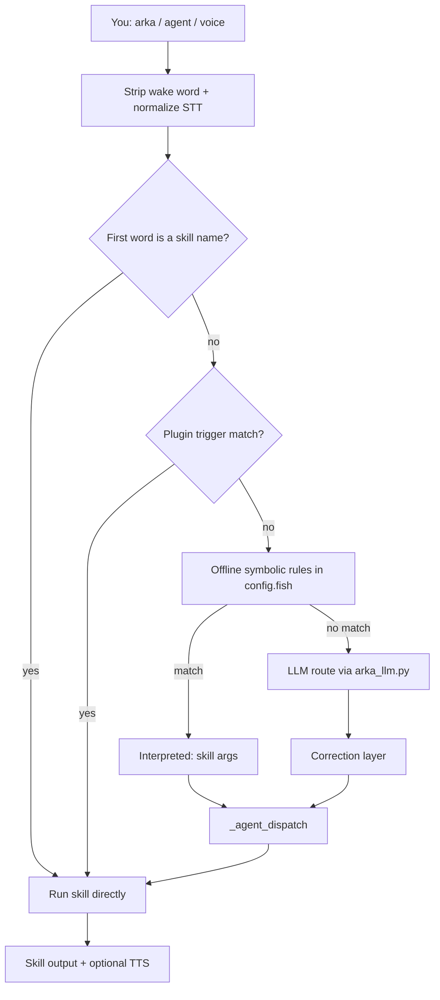
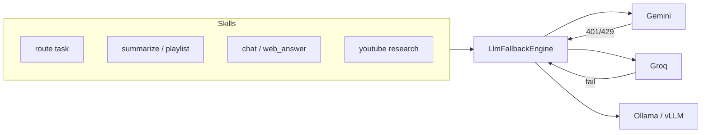

# Fish Shell Configuration (Arka)

A modern, AI-powered Fish shell setup with **Arka** — a voice-capable natural-language agent that routes requests to 70+ built-in skills, third-party plugins, cloud memory, deep web search, PDF RAG, and system automation.

> [!IMPORTANT]
> **Security (on by default)** — symbolic checks in `arka_security.py` before web search and risky actions:
>
> - **Web queries** — blocks prompt-injection and malicious instructions before DuckDuckGo search or LLM synthesis (`ARKA_SECURITY_WEB=1`)
> - **Scraped pages** — strips suspicious lines from web results before they reach the model (`ARKA_SECURITY_SANITIZE=1`)
> - **Risky actions** — prompts `[y/N]` before install, delete, download, WhatsApp send, browser automation, and scripts (`ARKA_SECURITY_ACTIONS=1`)
> - **Destructive shell** — hard-blocks patterns like `curl | bash`, `rm -rf /`, fork bombs
>
> Master switch: `SECURITY=1` in `.env`. Set any layer to `0` to disable it.

> [!TIP]
> **Lightweight & secure**: Commands run locally. LLM calls go through a **fallback orchestrator** (`arka_llm_fallback.py`) across Gemini, Groq, Ollama, and vLLM — no Docker required for daily use (PrivateGPT + Qdrant only for PDF ingest).

## Quick start

### Cross-platform (macOS, Windows, Linux)

Install Arka as a Python package — works on any OS:

```bash
git clone https://github.com/Sumit884-byte/arka.git
cd arka
./scripts/refetch.sh --install   # pull + sync bundle + pip install
cp .env.example ~/.config/arka/.env   # add API keys
arka doctor
arka ask "what is Rust?"
```

Install [fish shell](https://fishshell.com) for the full 70+ skill router on any OS (`brew install fish`, `apt install fish`, or `scoop install fish`). The pip package ships `config.fish` — you do not need a Linux machine or a fish login shell.

Already cloned on another machine — refresh from GitHub:

```bash
cd arka
arka refetch --install
# or: ./scripts/refetch.sh --install
```

```bash
# PyPI / pipx (no git clone)
pipx install "arka-agent[chat]"
arka setup
arka doctor
```


| Platform | Mode |
| ---------------------- | ------------------------------------------------------------------- |
| **All (macOS, Windows, Linux)** | Full 70+ skills via pip package + [fish shell](https://fishshell.com) (bundled `config.fish`) |
| **Without fish** | Portable Python skills: chat, web answers, passwords, calc, weather, sports, plugins |
| **Linux + fish as login shell** | Same 70+ skills plus voice autostart, systemd units, native desktop integration |


Config locations (when not using `~/.config/fish`):


| OS      | Config                                | Cache                    |
| ------- | ------------------------------------- | ------------------------ |
| Linux   | `~/.config/arka/`                     | `~/.cache/arka/`         |
| macOS   | `~/Library/Application Support/arka/` | `~/Library/Caches/arka/` |
| Windows | `%APPDATA%\arka\`                     | `%LOCALAPPDATA%\arka\`   |


Override with `ARKA_HOME`, `ARKA_CONFIG_DIR`, or `ARKA_CACHE_DIR`.

### How defaults work

Arka is **on by default** for safety, failover, and local-first routing. You only need a `.env` when you want to override something or add API keys.

**1. Where settings come from (precedence)**

| Layer | What it is | Wins when |
| ----- | ---------- | --------- |
| **Shell env** | `export GEMINI_API_KEY=…` before `arka` | Already set in the process |
| **User `.env`** | `~/.config/arka/.env` (macOS/Linux) or `%APPDATA%\arka\.env` | Fills unset vars at startup |
| **Dev checkout `.env`** | `arka/.env` in a git clone | Fills vars **not** already set (handy for `REMOTE_TOKEN`, local keys) |
| **Legacy fish `.env`** | `~/.config/fish/.env` | Still read by Python `load_env()` if present |
| **Code defaults** | Built into Python / `config.fish` | Used when a var is missing or a placeholder |

Fish loads `$_ARKA_CFG/.env` first (overwrites), then repo `.env` only for keys not yet set. Python `load_env()` merges the same files in order and **never overwrites** a non-empty value already in `os.environ`.

Placeholder values like `your_gemini_api_key_here` or `changeme` are **ignored** — Arka treats them as unset and falls through to the next layer.

**2. Key names — short form, legacy `ARKA_` still works**

Prefer short names in `.env` (no prefix):

```env
ROUTE_MODE=symbolic
LLM_AUTO_FALLBACK=1
AGENT_SPEAK=1
```

Legacy `ARKA_*` keys are stripped on load (`ARKA_ROUTE_MODE` → `ROUTE_MODE`). Exception: `ARKA_HOME` maps to `INSTALL_HOME` (package script directory). See `src/arka/env.example` for the canonical list.

**3. Built-in defaults (no `.env` required)**

| Area | Default | Override |
| ---- | ------- | -------- |
| **Security** | All layers on (`SECURITY=1`, web/action/sanitize/LLM checks) | Set any layer to `0` |
| **NL routing** | Offline rules first via `_agent_guess_route` + `_agent_offline_route_cmd` (120+ skills); LLM only when needed (`ROUTE_MODE=symbolic`) | `ROUTE_MODE=ai`, `symbolic_only`, `ai_only` |
| **LLM chain** | Preferred provider/model → live model lists → built-in chain (Gemini → Groq → Ollama) | `AI_PREFERRED_*`, `LLM_FALLBACK`, `LLM_FALLBACK_<TASK>` |
| **Failover** | Auto try next model/provider on 429/401/timeout (`LLM_AUTO_FALLBACK=1`) | `LLM_AUTO_FALLBACK=0` |
| **Key rotation** | Rotate backup keys before switching provider (`API_KEY_ROTATION=1`) | `API_KEY_ROTATION=0` |
| **Local LLM servers** | Auto-start/stop Ollama or vLLM when needed | `LLM_AUTO_START_SERVERS=0`, `LLM_AUTO_STOP_SERVERS=0` |
| **Voice TTS** | Speak replies when a TTS backend is available (`AGENT_SPEAK=1`) | `AGENT_SPEAK=0` |
| **Wake listener** | **Off** until you run `arka listen` | `AGENT_WAKE_AUTO=1` for shell autostart |
| **STT / listen** | Best available: AssemblyAI → Sarvam → Groq → Vosk (`STT=auto`, `LISTEN_ENGINE=auto`) | Set engine/key explicitly |
| **Memory** | Cloud Supermemory when keyed, else local cache (`MEMORY=auto`) | `MEMORY=local` or `supermemory` |
| **Memory autodetect** | Symbolic “remember that …” from chat/voice (`MEMORY_AUTODETECT=1`) | `MEMORY_AUTODETECT=0` |
| **Goal agent** | Built-in goal loop for `goal` / `agent loop` (`GOAL_ENGINE=auto`) | `GOAL_ENGINE=legacy`, `butterfish`, `off` |
| **Model label** | Show `Model: provider/name` under answers (`SHOW_MODEL=1`) | `SHOW_MODEL=0` |

**4. LLM fallback chain (when you don't set `LLM_FALLBACK`)**

The orchestrator builds a candidate list in order:

1. `AI_PREFERRED_PROVIDER` + `AI_PREFERRED_MODEL` (if set)
2. Live model lists from each provider API (when keys/reachability allow; `GEMINI_LIST=1`, `GROQ_LIST=1`, `OLLAMA_LIST=1` by default)
3. Built-in chain in `arka_llm_fallback.py`: Gemini 2.5/2.0 Flash → Groq Llama 3.3/3.1 → Ollama cloud/local models

Per-task overrides: `LLM_FALLBACK_ROUTE`, `LLM_FALLBACK_SUMMARIZE`, `LLM_FALLBACK_CHAT`, etc. Inspect at runtime:

```fish
python3 ~/.config/fish/arka_llm.py models
python3 ~/.config/fish/arka_llm.py models --task summarize
python3 ~/.config/fish/arka_llm.py active-model
```

**5. Skill-level defaults**

Some skills ship their own defaults when you don't pass flags:

- Gmail NL: **unread** requests fetch **all** unread mail (`--all`); header shows total unread (e.g. `10 unread emails`), not just the fetched batch. Summarize without “unread” still defaults to the last 2 days; day-window queries use `--limit 100`. Caps: `ARKA_GMAIL_MAX`, `ARKA_GMAIL_SUMMARIZE_MAX`.
- Charts: `chart line` pulls Yahoo Finance prices; `chart bar` / `chart pie` / `chart scatter` for comparisons. Saves PNG to `~/Pictures/arka-generated/`.
- Drawings: `drawing_ask plan.pdf "extract door schedule"` uses Gemini vision on blueprints, scans, and schedules (beyond text OCR).
- Images: `describe_image photo.jpg` / `arka describe …` — vision caption (Gemini, Ollama, or vLLM; auto on Mac).
- Routines: `routines add daily 9am "task"` schedules recurring tasks (launchd on macOS, systemd on Linux). Run `routines install` after adding.
- YouTube research: 2 videos (`YT_RESEARCH_MAX=2`)
- Goal agent: 25 steps (`GOAL_MAX_STEPS=25`)
- Reminders: 1 hour when no time given (`REMIND_DEFAULT=1h`)
- Image save: `~/Pictures/arka-generated` (`IMAGE_OUTPUT_DIR`)
- YouTube downloads: `~/Videos/YoutubeDownloads` (`YOUTUBE_BULK_DOWNLOAD_DIR`)

**6. Applying changes**

```fish
arka reload              # re-read .env + config.fish in current shell
arka reload --listen     # also restart wake listener after Python changes
```

`arka setup` seeds `~/.config/arka/.env` from the package template on first install.

### Fish shell (Linux — full agent)

```fish
# Reload config
exec fish

# Natural language (same as `agent`)
arka "what's the weather"
arka "ask Profile.pdf about main skills"
arka facing hair loss

# List skills
arka help
agent_route "summarize ENGLSH-2 weeks 1-3"   # preview routing, no run

# Reload after editing config or .env (no manual source needed on each arka call)
arka reload
arka reload --listen   # also restart wake listener after Python changes
```


## Arka — voice & NL agent


| Command                    | Description                                        |
| -------------------------- | -------------------------------------------------- |
| `arka <request>`           | Route NL to the best skill or shell command        |
| `agent <request>`          | Same router (alias)                                |
| `agent_route <q>`          | Preview routing without executing                  |
| `arka reload`              | Reload `config.fish` + `.env` in the current shell |
| `arka start` / `arka stop` | Wake listener + background services                |
| `arka serve`               | Remote server for phone STT/TTS (PC agent)         |
| `arka listen`              | Wake-word listener ("hey arka, …")                 |
| `arka speak-lang hi-IN`    | Voice language (Sarvam / Edge TTS)                 |
| `arka usage report`        | App + website screen time                          |
| `arka skills list`         | Installed third-party plugins                      |
| `supermemory status`       | Memory backend (cloud API vs local cache)          |
| `profession list`          | Profession domains and curated sources             |
| `profession ask <d> <q>`   | Source-backed answer with citations                |
| `arka google login`        | Sign in to Gmail + Google Calendar (OAuth)         |
| `arka google gmail`        | List or summarize mail (see below)                 |


Voice flow: say **"hey arka, …"** → STT → skill router → optional TTS reply (`AGENT_SPEAK=1` default). In voice mode, Arka speaks short acks while skills run and plain-language answers when done — usable without looking at the screen.

### How skills get activated

Every request goes through the same router whether you type `arka …`, say **"hey arka, …"**, or run `agent …`. A skill **activates** when the router picks a registered command and `_agent_dispatch` runs it.



**Activation paths (in order):**

1. **Direct skill name** — if the first token is a built-in skill, it runs immediately:
   ```fish
   arka weather
   arka play_spotify bohemian rhapsody
   demo_echo hello          # third-party plugin by name
   ```

2. **Natural language** — `arka "what's the weather"` or `arka install torch for cpu`:
   - **Offline routing** (fast, no LLM): `_agent_guess_route` maps 120+ skills via regex + Python parsers (`arka_chart.py parse`, `arka_drawing.py parse`, `arka_describe_image.py parse`, `arka_routines.py parse`, `arka_remind.py parse`, Gmail helpers, etc.). `_agent_offline_route_cmd` runs the full symbolic router before the LLM. You'll see `💡 [Offline routing]` and `→ Interpreted: …` when this fires.
   - **LLM routing** (fallback): when offline rules don't match, `arka_llm.py route` asks the **AI fallback orchestrator** (task=`route`) to pick a skill or safe shell command.
   - **Correction layer**: weak LLM picks are fixed (e.g. `search_web` → `web_answer` for factual questions, advisory → `agent_ask`, Gmail → `google gmail`).

The **skill router** (symbolic rules + optional LLM route + correction) decides *which skill runs*. The **orchestrator** is separate: it powers every LLM completion inside skills (summarize, chat, research, PDF, predictions, …) with provider/model failover.

3. **Third-party plugins** — folders under `~/.config/arka/skills/` with `skill.json` **`triggers`** are matched during routing (same NL path as built-ins). Refresh after install: `arka skills refresh`.

4. **Chat / Q&A fallback** — general questions route to `web_answer` (web + session memory) or `agent_ask` (gathers system context first). Prefix with `/` to force deep search: `arka "/who won IPL 2025"`.

5. **Voice** — wake listener (`arka listen`) → STT → `arka_stt_map.py` (Devanagari → Latin, skill phrase fixes) → same router as text. Multi-turn follow-ups work without re-waking until you say **"end conversation"**.

**Inspect without running:**

```fish
agent_route "play bohemian rhapsody on spotify"   # kind, action, why
agent_trace          # last routing decision
agent_why            # explain why that skill was chosen
arka help            # full skill list
arka tell your skills   # short voice-friendly summary + active LLM model
```

**Without Fish** (pip-only): `arka ask`, `arka route`, passwords, calc, weather, sports, remind, routines, charts, drawings, timer, search, agent skills, and plugins use the Python router in `src/arka/router.py` + `src/arka/routing/symbolic.py`. Install [fish](https://fishshell.com) for the full skill table and voice router.

### AI fallback orchestrator

Arka’s LLM layer is **not** a single model or a simple router. `arka_llm_fallback.py` implements **`LlmFallbackEngine`** — a session-scoped orchestrator that every skill uses via `arka_llm.py`:

| Concern | Behavior |
| ------- | -------- |
| **Provider chain** | Ordered candidates: preferred provider/model → env chain → defaults (Gemini → Groq → Ollama). Override globally or per task. |
| **Task profiles** | `route`, `summarize`, `chat`, `research`, `agent`, `pdf`, `predictions` — each can use `ARKA_LLM_FALLBACK_<TASK>` (e.g. `ARKA_LLM_FALLBACK_SUMMARIZE`). |
| **Failover** | On 401, 429, quota, decommissioned model, timeout, etc., marks provider/model exhausted and tries the next candidate (`ARKA_LLM_AUTO_FALLBACK=1` default). |
| **API key rotation** | Multiple keys per provider (`GEMINI_API_KEYS`, `GROQ_API_KEYS`, or `GEMINI_API_KEY_2`, …) rotate on 429/quota/key errors before switching provider (`ARKA_API_KEY_ROTATION=1` default). |
| **Local servers** | Auto-start/stop Ollama or vLLM when needed (`ARKA_LLM_AUTO_START_SERVERS`, `ARKA_LLM_AUTO_STOP_SERVERS`). |
| **Gemini model list** | With `GEMINI_API_KEY`, fetches live `generateContent` models via ListModels (`ARKA_GEMINI_LIST=1`, default). Merges with `ARKA_GEMINI_MODELS`; per-model 429 only exhausts that model, then tries the next Gemini before Groq/Ollama. |
| **Shared exhaustion** | One session cache — exhausted models are skipped across skills until `reset-exhaustion`. |



**Inspect the orchestrator (not the skill router):**

```fish
python3 ~/.config/fish/arka_llm.py models                    # default chain
python3 ~/.config/fish/arka_llm.py models --task summarize # per-task chain
python3 ~/.config/fish/arka_llm.py models --gemini-live      # live Gemini ListModels API
python3 ~/.config/fish/arka_llm.py active-model              # last success or preferred
python3 ~/.config/fish/arka_llm.py reset-exhaustion          # clear 429/401 exhaustion cache
```

Enable stderr when a later provider saves the call: `ARKA_LLM_FALLBACK_NOTIFY=1`. Debug attempts: `ARKA_LLM_VERBOSE=1`.

### How Arka optimizes any model with concise skills

Arka does **not** ask the LLM to memorize 70 skill manuals. Skills are **local programs and shell functions** — the model’s job is only to pick the right name (or a safe shell command) and get out of the way. That keeps prompts small, latency low, and behavior consistent: the **orchestrator** swaps providers when one fails; the **router** decides which skill runs.

**1. Most requests never touch the model**

| Layer | What happens | LLM tokens |
| ----- | ------------ | ---------- |
| Direct skill name | `arka weather` → runs `weather` | **0** |
| Symbolic routing | Regex/rules in `config.fish` map NL → `play_spotify …`, `system_info`, `pdf_ask …` | **0** |
| Plugin triggers | `skill.json` `triggers` matched before AI | **0** |
| LLM route (fallback) | One short `arka_llm.py route` call via orchestrator (`task=route`) | **small** |

Default mode is `ARKA_ROUTE_MODE=symbolic` (offline rules first, AI only when needed).

**2. When the model *is* used, skills are injected concisely at route time**

On an LLM route, Arka passes:

- A **compact skill catalog** — registered names only (e.g. `weather, pdf_ask, web_answer, system_info, …`), not full help text for every skill.
- **Curated routing rules** in the route prompt — high-signal patterns like “specs of my mac → `system_info`”, “factual question → `web_answer`”, “install torch → `install_uv`”.
- **Shell aliases** for your machine (via `ARKA_ROUTE_ALIASES`) so the model respects `eza`/`batcat` etc. without re-discovering them each turn.

The route task uses low temperature and a dedicated chain (`ARKA_LLM_FALLBACK_ROUTE` or `ARKA_LLM_FALLBACK`) so a fast/cheap model can handle classification; heavy lifting runs inside the skill (Python, ffmpeg, yt-dlp, RAG, …). Summarize/research/chat use their own task chains through the same orchestrator.

**3. Correction layer — fix bad picks without a second LLM call**

If the model returns `search_web` for a factual question, or `system_monitor` for “tell me my GPU”, deterministic rules in `_agent_correct_interpretation` rewrite the route before execution. You get better accuracy without paying for another completion.

**4. When symbolic rules collide, the model breaks the tie**

Offline rules are an ordered `else if` chain — a **single** clear match runs with zero tokens. When **two or more** patterns could apply (common with play/media), Arka detects the collision and asks the LLM to choose using the same concise skill catalog.

Example: *“play a film that has bohemian rhapsody music”* matches both `play_movie` (film) and `play_song` (music). You’ll see:

```text
💡 [AI routing — ambiguous play/media request]
→ Interpreted: play_movie bohemian rhapsody
```

The model picks based on intent (watch the film vs. hear the track only). Clear, one-sided requests still use offline routing — e.g. `play bohemian rhapsody on spotify` → `play_spotify` with no LLM call. Preview collisions with `agent_route "your phrase"`.

**5. Agent loop & multi-step work**

`goal` is the primary autonomous agent — Butterfish Goal Mode–style run/fix loop with shell history, file reads, 25-step budget, and security gates. `loop` / `agent_loop` delegate to `goal` when `ARKA_GOAL_ENGINE=auto` (default).

```fish
goal set up a venv, install requests, and run pytest
goal -y -n 30 debug why nginx fails
goal --butterfish refactor this module and run tests   # interactive Butterfish shell (!goal)
ARKA_GOAL_ENGINE=legacy agent_loop ...               # old JSON loop only
```

From **zsh/bash** (no fish required):

```bash
arka goal debug my nginx setup
arka goal -b -y set up venv and run pytest
# Optional ~/.zshrc wrappers: arka shell-init zsh
```

| Engine | Behavior |
|--------|----------|
| `auto` / `arka` | Built-in goal agent (`arka.agent.goal`) |
| `butterfish` | Asks to install via brew/go if missing, then launches Butterfish shell (`!goal`) |
| `legacy` | Original `agent_loop` JSON protocol only |
| `off` | Disables goal delegation |

**Env:** `ARKA_GOAL_MAX_STEPS`, `ARKA_GOAL_AUTO_CONTINUE=1`, `ARKA_GOAL_OUTPUT_LIMIT=8000`

`agent_plan` still does upfront JSON planning; `goal` is reactive step-by-step like Butterfish Goal Mode.

**6. Model-agnostic by design**

Because skills execute locally, swapping providers does not change *what* Arka can do — only which model the **orchestrator** reaches after failover. Any model in your chain gets the same short catalog and rules for routing; execution stays on your machine.

```fish
# Preview what the router would choose (no run)
agent_route "summarize my downloads folder"
agent_why                    # why that skill was picked

# Force offline-only routing (zero LLM)
set -x ARKA_ROUTE_MODE symbolic_only

# AI-first routing (still concise skill list in route prompt)
set -x ARKA_ROUTE_MODE ai
```

For humans (not the model), `arka help` is the full catalog; `arka tell your skills` is a short voice-friendly summary plus the active model label.

Answers from `web_answer` / chat show the model used at the bottom (`Model: provider/name`). Set `SHOW_MODEL=0` in `.env` to hide it.

**7. Profession domains — source registries, not role prompts**

Arka professions are **curated source lists** (RSS, trusted web, local repos, data bridges) — not “act as a lawyer” prompts. The agent gathers evidence first, then synthesizes with citations. Same sources regardless of which LLM model runs.

```fish
profession list
profession sources journalism
profession ask legal what is an NDA
arka "as a news anchor how do I open a breaking story"
profession setup nutrition    # clone + index local repo
```

Twelve domains: `health`, `nutrition`, `startup`, `investor`, `teacher`, `legal`, `engineer`, `journalism`, `marketing`, `finance`, `counselor`, `chef`. Routing is strict — generic questions like *symptoms of diabetes* stay on `web_answer`; professions activate on explicit role mention or saved memory + keywords. Verify: `python3 scripts/verify_features.py --live`

### Speech-to-text (listen)


| Setting                                       | Description                                                                        |
| --------------------------------------------- | ---------------------------------------------------------------------------------- |
| `ARKA_LISTEN_ENGINE=auto`                     | AssemblyAI streaming when key set; else Vosk (default `auto`)                      |
| `ARKA_STT=auto`                               | Command STT chain: AssemblyAI → Sarvam → Groq → Vosk                               |
| `ASSEMBLYAI_API_KEY`                          | Best wake + command accuracy (single streaming session)                            |
| `SARVAM_API_KEY` + `SARVAM_STT_MODE=translit` | Good for Hindi/English mix; Devanagari transcripts normalized to Latin for routing |
| `ARKA_SPEAK_LANG=hi-IN`                       | TTS language (independent of STT)                                                  |
| `ARKA_LISTEN_STT_LANG`                        | Optional: force STT locale while TTS stays on `ARKA_SPEAK_LANG`                    |


```fish
arka listen              # background wake listener
arka listen fg           # foreground with live STT log
arka listen debug        # STT debug logging
arka reload --listen     # pick up arka_wake.py changes
```


### Chat & web answers (`arka_chat.py`)

Intent routing, deep scrape RAG, location, weather, and calc (see `arka_chat.py`).


| Skill                             | Example                                       |
| --------------------------------- | --------------------------------------------- |
| `web_answer [--deep] <q>`         | Auto deep search when needed; session memory  |
| `deep_web_answer <q>`             | DDG → scrape pages → LLM synthesis            |
| `calc <expr>`                     | SymPy + explanation (`integrate sin(x) dx`)   |
| `hyperlocal_weather [q]`          | Open-Meteo + IP geolocation                   |
| `set_location [city|PIN]`         | Ground search queries locally                 |
| `nearby_places [city]`            | Offline POI map (OSM Overpass)                |
| `map_download <city>`             | Cache city map to `~/.cache/fish-agent/maps/` |
| `error_helper <text>`             | Explain tracebacks / fix steps                |
| `chat_reset`                      | Clear chat session + location context         |
| `deep_queue add|list|run|results` | Background deep-search queue                  |


Forced web search: prefix with `/` — e.g. `arka "/who won IPL 2025"`.

Answers are tagged `[FROM SEARCH]` or `[FROM MEMORY]` (stripped for TTS).

### Long-term memory (Supermemory + local)

Arka remembers facts across sessions. With a [Supermemory](https://supermemory.ai) API key, memories sync to the cloud; if the API is unavailable, Arka falls back to a local cache automatically.


| Command                            | Example                                          |
| ---------------------------------- | ------------------------------------------------ |
| `agent_remember <fact>`            | `agent_remember I prefer Hindi TTS`              |
| `agent_recall [query]`             | `agent_recall Hindi`                             |
| `supermemory status`               | Show backend mode (api / local)                  |
| `supermemory remember|recall|list` | Explicit Supermemory CLI                         |
| `semantic_memory reindex`          | Rebuild TurboQuant semantic index on local cache |


NL: *"remember that my dog is named Max"* · *"what do you remember about Max"* · *"I prefer Hindi TTS"* (auto-detected)

```env
SUPERMEMORY_API_KEY=...           # optional — cloud memory
ARKA_SUPERMEMORY_CONTAINER=arka   # container tag (defaults to AGENT_NAME)
ARKA_MEMORY=auto                  # auto | supermemory | local
ARKA_MEMORY_AUTODETECT=1          # symbolic autodetect from chat/voice (default on)
```

Recalled context is injected into `arka_ask`, research, and agent loops automatically.

### Third-party skills (plugins)

Install community or custom skills without editing `config.fish`. Each plugin is a folder with `skill.json` (or a standalone `*.fish` file).


| Command                         | Example                    |
| ------------------------------- | -------------------------- |
| `arka skills list`              | Show installed plugins     |
| `arka skills install <path>`    | Copy a local plugin folder |
| `arka skills install <git-url>` | Clone from GitHub          |
| `arka skills refresh`           | Rescan plugin directories  |
| `demo_echo hello`               | Run bundled demo plugin    |


Search paths: `~/.config/arka/skills/`, `$ARKA_HOME/skills/`, and `ARKA_SKILLS_PATH` (colon-separated).

Minimal `skill.json`:

```json
{
  "name": "my_skill",
  "description": "What it does",
  "type": "python",
  "entry": "run.py",
  "triggers": ["my skill", "do the thing"],
  "voice_ack": "Running my skill."
}
```

Supported types: `python`, `fish`, `shell`, `command`. Plugins participate in NL routing, voice acks, and `arka help`.

### PDF RAG (`arka_pdf_rag.py` + PrivateGPT)


| Skill                     | Example                                         |
| ------------------------- | ----------------------------------------------- |
| `pdf_ingest <file.pdf>`   | Ingest (auto-starts PrivateGPT + Qdrant Docker) |
| `pdf_list`                | List ingested documents                         |
| `pdf_ask [--doc DOC] <q>` | Q&A or summarize one or all PDFs                |


NL examples:

```fish
arka "ask Profile.pdf about main skills"
arka "summarize ENGLSH-2 weeks 1 to 3"
```


### Google Calendar + Gmail (`arka google`)

Read Gmail and Google Calendar after a one-time browser OAuth sign-in. On macOS, calendar NL can also merge **macOS Calendar.app** events when Google is unavailable.

**Setup (once):**

```fish
arka google setup          # print Cloud Console steps + redirect URI
# Add GOOGLE_OAUTH_CLIENT_ID + GOOGLE_OAUTH_CLIENT_SECRET to ~/.config/arka/.env
arka reload
arka google login          # opens browser; stores token locally
arka google status
```

Enable **Gmail API** and **Google Calendar API** in Google Cloud Console. Redirect URI (default): `http://127.0.0.1:8766/oauth2callback` — override with `GOOGLE_OAUTH_PORT` / `GOOGLE_OAUTH_REDIRECT_URI`.

| Command | Example |
| ------- | ------- |
| `google setup` | OAuth setup checklist |
| `google login` / `logout` / `status` | Sign-in lifecycle |
| `google gmail [--unread] [-n N]` | List messages (default limit 10; use `--all` for full match) |
| `google gmail --summarize [--unread]` | AI digest with Overview / Worth your attention / FYI / Next steps |
| `google gmail --today` / `--days N` / `--hours N` | Time-filtered mail |
| `google calendar --today` / `--week` | Events (Google + optional macOS merge) |

**Natural language (offline routing):**

```fish
arka give unread emails              # → google gmail --unread --all
arka show my unread gmail
arka summarize unread emails         # all unread, AI digest (no hidden 2-day cap)
arka summarize emails                # last 2 days by default
arka summarize unread emails within 3 days
arka what's on my calendar today
arka google login
```

**Unread counts:** Arka uses Gmail’s `resultSizeEstimate` for the header (`10 unread emails`). If a cap applies (summarize body limit or `ARKA_GMAIL_MAX`), you’ll see `10 unread emails (showing 7)`.

```env
GOOGLE_OAUTH_CLIENT_ID=....apps.googleusercontent.com
GOOGLE_OAUTH_CLIENT_SECRET=...
# ARKA_GMAIL_MAX=500                  # max messages when --all
# ARKA_GMAIL_SUMMARIZE_MAX=40         # max emails in one AI digest
# ARKA_GMAIL_SUMMARIZE_CHARS=120000   # model context budget for bodies
```


### Charts & graphs (`chart`)

Turn numbers into PNG charts (matplotlib). Supports line (stocks), bar, pie, and scatter — inspired by the [charts demo app](https://github.com/Sumit884-byte/charts).

```fish
pip install matplotlib   # once

chart line AAPL TSLA --range 3mo
chart line RELIANCE.NS --range 6mo
chart bar --data "Apple:230,Samsung:210,Xiaomi:140" --title "Phone sales (M units)"
chart pie --data "Organic:400,Direct:300,Referral:300,Social:200" --title "Traffic sources"
chart scatter --data "100:200,120:190,170:280" --xlabel "Ad spend" --ylabel "Revenue"
```

**Natural language (offline routing — same path as Gmail):**

Phrases are parsed by `arka_chart.py parse` (no LLM). You do **not** need the word “chart” if the request has clear numbers or stock names:

```fish
arka chart TSLA and NVDA last 3 months
arka graph apple microsoft stock prices
arka compare apple and tesla stock last year
arka phone sales Apple 230 Samsung 210 Xiaomi 140    # bar chart
arka pie chart traffic sources organic 400 direct 300 referral 300 social 200
arka scatter ad spend vs revenue 100 200 120 190 170 280 140 240
arka market share pie Apple 40 Samsung 30 Xiaomi 20
```

Preview routing without running:

```fish
agent_route "pie chart traffic sources organic 400 direct 300"
# → skill|chart pie --data Organic:400,Direct:300 …

agent_route "scatter ad spend vs revenue 100 200 120 190 170 280"
# → skill|chart scatter --data 100:200,120:190,170:280 …
```

Flow: your words → `_agent_build_chart_cmd` → `chart line|bar|pie|scatter …` → matplotlib PNG.

Charts save to `~/Pictures/arka-generated/` (or `CHART_OUTPUT_DIR` / `IMAGE_OUTPUT_DIR`) and open automatically on macOS/Linux.

```env
# CHART_OUTPUT_DIR=~/Pictures/arka-generated
# OPEN_CHART=1    # open PNG after save (default on)
```


### Drawings & blueprints (`drawing_ask`)

Analyze **visual** documents — floor plans, elevations, MEP schematics, door/window schedules, scanned contracts — using Gemini vision (not just text OCR from `pdf_ask`).

```fish
pip install Pillow pymupdf   # once, or: pip install 'arka-agent[drawings]'

drawing_ask plan.pdf extract door schedule and room dimensions
drawing_ask --pages 1-3 specs.pdf summarize payment terms and parties
drawing_ask floor-plan.png list all room names and areas
```

**Natural language (offline routing):**

Phrases are parsed by `arka_drawing.py parse` (no LLM). Include a file path and drawing-related words, or any `.pdf`/image path with an analysis question:

```fish
arka analyze blueprint.pdf extract grid lines and dimensions
arka review scanned contract.pdf payment terms and obligations
arka inspect floor plan.png room sizes and annotations
```

Preview routing:

```fish
agent_route "analyze plan.pdf door schedule and dimensions"
# → skill|drawing_ask ask plan.pdf door schedule and dimensions|Vision analysis …
```

Requires `GEMINI_API_KEY` or `GOOGLE_API_KEY`. PDFs render to images via PyMuPDF (first 8 pages by default).

```env
# DRAWING_MODEL=gemini-2.5-flash
# DRAWING_MAX_PAGES=8
# DRAWING_MAX_EDGE=2048
```


### Image description (`describe_image`)

Describe **photos, screenshots, and charts** with a **two-layer analysis**: OCR extracts exact text/numbers; vision describes layout and colors (Ollama, vLLM, or Gemini).

```fish
pip install Pillow   # once
brew install tesseract   # OCR layer — or: pip install ocrmac (macOS)

# Two layers: OCR (exact labels/%) + vision (colors/layout)
arka describe pie-chart-traffic-sources-organic-400-d-20260705-234731
describe_image photo.jpg

# Explicit vision backends:
export DESCRIBE_IMAGE_BACKEND=gemini   # needs GEMINI_API_KEY
export DESCRIBE_IMAGE_BACKEND=ollama   # ollama pull llava
export DESCRIBE_IMAGE_BACKEND=vllm     # Linux, or vLLM-Metal on Mac
```

**macOS options (pick one):**

```fish
# 1) Gemini (easiest)
export GEMINI_API_KEY=your-key

# 2) Ollama vision (local)
brew install ollama && ollama pull llava

# 3) vLLM-Metal (Apple Silicon GPU)
curl -fsSL https://raw.githubusercontent.com/vllm-project/vllm-metal/main/install.sh | bash
source ~/.venv-vllm-metal/bin/activate
export VLLM_START_CMD='vllm serve mlx-community/Qwen2-VL-2B-Instruct-4bit --port 8000'
export DESCRIBE_IMAGE_BACKEND=vllm
```

**Linux:** `pip install vllm` + auto-start (default). Use `drawing_ask` for blueprints/PDFs via Gemini.

```fish
arka describe photo.jpg
arka what's in ~/Downloads/image.png
agent_route "describe ~/Pictures/sunset.jpg"
```

```env
# DESCRIBE_IMAGE_TWO_LAYER=1
# DESCRIBE_IMAGE_OCR=1
# DESCRIBE_IMAGE_BACKEND=auto|gemini|ollama|vllm
# DESCRIBE_IMAGE_OLLAMA_MODEL=llava
# VLLM_HOST=127.0.0.1:8000
# VLLM_START_CMD='vllm serve Qwen/Qwen2-VL-2B-Instruct --port 8000'
# DESCRIBE_IMAGE_MAX_EDGE=2048
```


### Daily routines (`routines`)

Schedule any task to run **every day** (or hourly) — weather checks, Gmail summaries, daily brief, etc. Tasks run through `agent` so natural language works.

```fish
routines add daily 9am "check unread emails"
routines add 08:30 "daily brief"
routines add hourly "system monitor"
routines list
routines install          # launchd (macOS) or systemd user timers (Linux)
routines remove ROUTINE_ID
routines run ROUTINE_ID   # test once now
```

**Natural language:**

```fish
arka every day at 9am summarize my gmail
arka every morning daily brief
arka routine check unread emails at 8:30
list my routines
```

After adding routines, run `routines install` once so timers are registered. Set `ROUTINES_AUTO_INSTALL=1` to install immediately on add.

```env
# ROUTINES_DAILY=09:00       # default time when you say "every day"
# ROUTINES_MORNING=09:00
# ROUTINES_AUTO_INSTALL=1
```


### Other notable skills

**Media:** `play_spotify`, `play_youtube`, `play_movie`, `play_song`

**Spotify (`arka_spotify.py`):** Resolves songs via Spotify Web API (optional), iTunes + DuckDuckGo, then plays through the **Spotify desktop app** — AppleScript on macOS, `playerctl` on Linux. No Premium API needed for playback.

```fish
arka "play bohemian rhapsody on spotify"
play_spotify bohemian rhapsody
spotify_control pause
spotify_control status
```

| Platform | Requirement |
| -------- | ----------- |
| **macOS** | [Spotify.app](https://www.spotify.com/download/mac/) installed — auto-plays via `osascript` |
| **Linux** | Spotify desktop + `playerctl` (`sudo apt install playerctl`) |
| **Search quality** | Optional free [Spotify Developer](https://developer.spotify.com/dashboard) app → `SPOTIPY_CLIENT_ID` + `SPOTIPY_CLIENT_SECRET` in `.env` |

Without API keys, search still works via iTunes + web lookup; without the desktop app, Arka opens the Spotify web player.  
**System:** `weather`, `system_monitor`, `disk_breakdown`, `app_usage`, `screenshot`  
**Sports:** `sports_score`, `live_scores` — IPL, cricket, NFL, NBA, EPL via ESPN (no key)  
**Dev:** `install_uv`, `install_app`, `git_summary`, `lint_python`, `open_project`  
**Web:** `web_essay`, `search_web`, `browse_web`  
**Advisory:** `agent_ask` — gathers Linux context via shell, then answers  

Full list: `arka help` or say *"tell me all your skills"* (voice-friendly).

---


## Classic AI helpers

Built-in wrappers for Gemini, Groq, and Ollama (used by Arka and standalone):


| Command         | Purpose                                              |
| --------------- | ---------------------------------------------------- |
| `ask <prompt>`  | Get a Linux command for a task (copies to clipboard) |
| `talk <prompt>` | General chat                                         |
| `fix`           | Fix last failed command via AI                       |
| `ai <prompt>`   | Shortcut for local Ollama                            |
| `ai-models`     | List providers and models                            |


```fish
ask "find files larger than 100MB"
ask -p groq "check port 8080"
talk "explain fish universal variables"
fix   # after a failed command
```

---


## Python modules


| File                                | Role                                                   |
| ----------------------------------- | ------------------------------------------------------ |
| `arka_chat.py`                      | Deep web RAG, intent, weather, maps, calc, session     |
| `arka_pdf_rag.py`                   | PrivateGPT ingest / ask / list                         |
| `arka_agent.py`                     | Memory, trace, research, watches, handoff, fanout      |
| `arka_supermemory.py`               | Supermemory API + local memory fallback                |
| `arka_skills.py`                    | Third-party plugin registry (discover, install, route) |
| `arka_voice.py`                     | Voice acks, formatting, session context                |
| `arka_wake.py`                      | Wake-word listener (AssemblyAI / Vosk)                 |
| `arka_stt_map.py`                   | STT normalization (Devanagari → Latin routing)         |
| `arka_sports.py`                    | Live sports scores (ESPN public API)                   |
| `arka_talents.py`                   | Unified ask, semantic memory, speak_research           |
| `arka_usage.py`                     | GNOME app + browser usage tracking                     |
| `arka_disk.py`                      | Disk breakdown by file type                            |
| `arka_predictions.py`               | Opportunity research (antiques, stocks, strategy)      |
| `arka_macro_events.py`              | Disasters/geopolitics → sector impact + duration       |
| `arka_market_emotion.py`            | News sentiment + crowd buy/sell forecast               |
| `arka_stock_fundamentals.py`        | P/E, ROE, debt, margins vs peers                       |
| `arka_competition_funding.py`         | VC/PE deals + peer rivalry scoreboard                  |
| `arka_stock_bridge.py`              | Bridge to `stock_analysis` project (prices, context)   |
| `web_answer.py`                     | DuckDuckGo instant-answer snippets                     |
| `sarvam_speak.py` / `edge_speak.py` | TTS backends                                           |
| `sarvam_stt.py`                     | STT via Sarvam Saaras v3 (command after wake)          |


Cache & logs: `~/.cache/fish-agent/` (or `~/.cache/arka/` on non-fish installs)

---


## Setup


### Package install (all platforms)

```bash
git clone <your-repo-url> arka && cd arka
python3 scripts/sync_bundled.py   # before building a wheel
pip install -e ".[chat]"            # editable dev install
arka setup
```

Publish / CI wheel:

```bash
python3 scripts/sync_bundled.py
pip wheel . -w dist/
```

Optional extras: `[chat]`, `[voice]`, `[pdf]`, `[all]`.

### Fish + Linux (full skills)


### Prerequisites

**Shell & CLI:** `fish`, `curl`, `jq`, `eza`, `batcat`, `zoxide`, `fzf`, `ripgrep`, `python3`

**Chat engine (optional but recommended):**

```bash
pip install --break-system-packages -r ~/.config/fish/arka_chat_requirements.txt
# ddgs trafilatura beautifulsoup4 sympy geopy
```

**PDF RAG (optional):** [PrivateGPT](https://github.com/zylon-ai/private-gpt) at `~/Projects/private-gpt`, Docker for Qdrant (`arka-qdrant` on port 6333).

### Environment (`.env`)

Create `~/.config/arka/.env` (or use `arka/.env` in a dev checkout). Use short names — no `ARKA_` prefix.

```env
# LLM — fallback orchestrator (at least one cloud key or local Ollama)
GEMINI_API_KEY=...
GROQ_API_KEY=...
OLLAMA_HOST=127.0.0.1:11434

# Preferred first candidate (orchestrator still fails over on errors)
AI_PREFERRED_PROVIDER=groq
AI_PREFERRED_MODEL=llama-3.3-70b-versatile

# Orchestrator chains (optional — see .env.example)
# LLM_AUTO_FALLBACK=1
# LLM_FALLBACK=gemini:gemini-2.0-flash,groq:llama-3.3-70b-versatile,ollama:llama3.2:1b
# LLM_FALLBACK_SUMMARIZE=   # per-task: ROUTE, CHAT, RESEARCH, AGENT, PDF, PREDICTIONS
# LLM_FALLBACK_NOTIFY=1     # stderr when failover succeeds
# LLM_VERBOSE=1               # log each provider attempt

# Arka
AGENT_NAME=arka
AGENT_SPEAK=1
SPEAK_LANG=en-IN
AGENT_WAKE_WORDS=hey arka,arka

# Listen / STT (optional — improves wake accuracy)
# LISTEN_ENGINE=auto
# STT=auto
# ASSEMBLYAI_API_KEY=
# SARVAM_API_KEY=
# SARVAM_STT_MODE=translit

# Memory (optional cloud + local fallback)
# SUPERMEMORY_API_KEY=
# MEMORY=auto

# Google Calendar + Gmail (OAuth — see README § Google Calendar + Gmail)
# GOOGLE_OAUTH_CLIENT_ID=....apps.googleusercontent.com
# GOOGLE_OAUTH_CLIENT_SECRET=...

# Third-party plugins (optional extra search path)
# SKILLS_PATH=~/my-arka-plugins

# PDF RAG
PDF_RAG_URL=http://127.0.0.1:8080
PRIVATEGPT_HOME=~/Projects/private-gpt
PDF_RAG_AUTO_START=1

# Usage tracking (autostart on login)
USAGE_TRACK=1
WEB_TRACK=1

# Remote serve (web/mobile API)
# REMOTE_TOKEN=...
# REMOTE_PORT=8765
```

See `.env.example` for the full list of options. Load order, built-in defaults, and override precedence are in [How defaults work](#how-defaults-work) above.

### Layout

```
arka/                          # Git repo
├── bin/                       # Python entry shims (Fish invokes these)
├── config.fish                # Stub → sources src/arka/fish/config.fish
├── src/arka/                  # Python package
│   ├── cli.py                 # `arka` CLI
│   ├── paths.py               # Config, cache, env, entry_script()
│   ├── fish/                  # config.fish, scripts/, completions/
│   ├── llm/ youtube/ media/ stock/ agent/ integrations/ …
│   ├── aie/                   # Desktop automation scripts + cli.py
│   ├── requirements/          # chat.txt, turboquant.txt
│   └── bundled/               # Assembled for pip wheels (sync_bundled.py)
├── scripts/
│   ├── sync_bundled.py
│   └── organize_repo.py
└── pyproject.toml
```

---


## Usage examples


### Natural language

```fish
arka install torch for cpu
arka "how much disk is videos taking"
arka "play bohemian rhapsody on spotify"
arka "ipl score"                             # → sports_score
arka "remember that I prefer Gemini"         # → agent_remember (Supermemory + local)
arka "is my cpu too outdated for gaming?"    # → agent_ask
arka "where is Tokyo"                        # → web_answer
arka facing hair loss                        # → web_answer + session
arka "stock macro 8"                         # → macro events → stock impact
arka "market emotion"                        # → sentiment + crowd forecast
arka "fundamentals for RELIANCE.NS"            # → stock fundamentals
```


### Stock & market intelligence

Market skills live under **`stock`** / **`stock_analysis`** (alias). They also feed into **`predictions --domain stocks`** and **`stock invest`** for deep research.

**Setup:** optional **stock_analysis** project for live prices, ML signals, and rich context. Set in `.env`:

```env
ARKA_STOCK_PROJECT=~/Projects/python/products/stock_analysis
```

Without it, **macro**, **emotion**, **fundamentals**, **funding**, and **competition** still work (RSS + yfinance). **Context**, **prices**, **strategy**, and **dashboard** need the project.

| Command | What it does |
| -------- | ------------- |
| `stock macro [N]` | Disasters, resources, geopolitics → beneficiaries/losers + **how long** moves typically last (default 8 headlines) |
| `stock emotion [N]` | Net news **sentiment** + who is likely to buy/sell (retail, FIIs, traders) |
| `stock fundamentals TICKER…` | Debt/equity, ROE, P/E, margins vs peers |
| `stock context [TICKER…]` | Plain-text bundle (prices, news, ML signals) for debugging or LLM context |
| `stock funding [N]` | Recent VC/PE/IPO deals + listed peer mapping |
| `stock competition [TICKER…]` | Peer scoreboard + rivalry news |
| `stock invest <question>` | Short-term “where to invest ₹X for N days” — deep stock research |
| `stock predict <topic>` | Same as `predictions --domain stocks` |
| `stock compare [AMT] [HORIZON]` | Rank options from news + data (no LLM) |
| `stock news` / `stock prices` / `stock strategy TICKER` | Via **stock_analysis** bridge |
| `stock dashboard` | Streamlit Stock Intelligence Hub (localhost:8501) |

**Via `arka` CLI:**

```fish
arka stock macro 8
arka stock emotion 20
arka stock fundamentals RELIANCE.NS TCS.NS INFY.NS
arka stock context RELIANCE.NS TCS.NS
arka stock funding 10
arka stock competition RELIANCE.NS TCS.NS
arka stock invest "where to invest 3000 for 1 month"
arka predict --domain stocks banking sector next quarter
```

**Natural language** (router picks the skill):

```fish
arka "macro events affecting oil stocks"
arka "market sentiment today"
arka "fundamentals for RELIANCE and TCS"
arka "where to invest 5000 rupees for 2 weeks"
```

**Direct Python** (no fish):

```bash
python arka_macro_events.py --limit 8
python arka_market_emotion.py --limit 20
python arka_stock_fundamentals.py RELIANCE.NS TCS.NS
python arka_stock_bridge.py context RELIANCE.NS --no-ml
python arka_predictions.py run --domain stocks --deep "RELIANCE sector outlook"
```

**Help:** `stock help` lists all subcommands.

**Note:** `predictions --domain stocks --deep` automatically pulls macro, emotion, fundamentals, and competition sections when relevant — you do not need to run each command separately for full research reports.


### PDF

```fish
pdf_ingest ~/Documents/Profile.pdf
pdf_ask --doc "ENGLSH-2 W1-3.pdf" "summarize weeks 1 to 3"
pdf_list
```


### Chat / search

```fish
web_answer --deep "latest news on AI regulation"
calc "integrate sin(x) dx"
hyperlocal_weather
deep_queue add "who won the last IPL final"
deep_queue run && deep_queue results
chat_reset
```


### Voice

**Wake word:** `arka listen` — AssemblyAI streaming (when keyed) or Vosk offline; Sarvam/Groq for command capture.

```fish
arka listen fg               # live STT in foreground (debug routing)
arka listen debug
arka reload --listen         # restart listener after code changes
# Say: "hey arka, what's the weather"
# Say: "hey arka, ipl score"
# Say: "hey arka, tell me all your skills"
AGENT_SPEAK=0 arka "timer 5m"   # text-only reply
```

Multi-turn voice: follow up without re-waking (*"and what about tomorrow?"*). Say **"end conversation"** to clear session context.

**Full voice agent (HF):** Hugging Face [speech-to-speech](https://github.com/huggingface/speech-to-speech) with VAD + Whisper STT + Pocket TTS, routed to Arka skills:

```fish
arka voice install          # first time: venv + deps (~5–10 min)
arka voice start            # talk naturally; no "hey arka" needed
arka voice stop
arka voice status
tail -f ~/.cache/fish-agent/arka_voice_hf.log
```

Repo: `~/.config/fish/speech-to-speech`  
Bridge: voice LLM calls → `agent` (all skills). Optional `.env`:

```env
ARKA_HF_STT_MODEL=distil-whisper/distil-small.en
ARKA_HF_TTS_VOICE=jean          # pocket TTS preset
ARKA_HF_BRIDGE_PORT=8787
```

```fish
arka start                    # wake listener + background services
```


### Plugins & memory

```fish
arka skills list
arka skills install ./my-plugin
supermemory status
supermemory remember my meeting is at 3pm
agent_recall meeting
```

---

## Modern CLI aliases

- `ls`**,** `ll`**,** `la`**,** `lt` — `eza`
- `cat`**,** `bat` — `batcat`
- `z` — `zoxide`
- `i` — `uv pip install` (⚠️ only use as a command, not NL — Arka routes chat away from this)

---

## Troubleshooting


| Issue                                | Fix                                                                                                    |
| ------------------------------------ | ------------------------------------------------------------------------------------------------------ |
| `Could not generate an answer` / `Unauthorized (401)` | Check keys; `python3 arka_llm.py models --task summarize`; set `AI_PREFERRED_PROVIDER=groq`; `arka_llm.py reset-exhaustion` |
| Gemini 429 / slow responses          | Orchestrator auto-fails over if `ARKA_LLM_AUTO_FALLBACK=1`; prefer Groq via `AI_PREFERRED_PROVIDER=groq` |
| `uv pip install am` on random text   | Fixed — use `arka`, not raw shell, for NL                                                              |
| PDF ask fails                        | `arka pdf status`; ensure Qdrant Docker is up                                                          |
| Deep search empty                    | `pip install ddgs trafilatura beautifulsoup4`                                                          |
| Map download timeout                 | Retry `map_download Kolkata` later (Overpass API)                                                      |
| Wake word missed / wrong STT         | Set `ASSEMBLYAI_API_KEY` + `ARKA_LISTEN_ENGINE=auto`; or `SARVAM_API_KEY` + `SARVAM_STT_MODE=translit` |
| Devanagari transcript breaks routing | Fixed via `arka_stt_map.py` — ensure latest bundle; try `ARKA_LISTEN_STT_LANG=en-IN`                   |
| Speech recognition poor (offline)    | `ARKA_VOSK_TIER=best`; `arka listen models`                                                            |
| Listener crashes (no vosk)           | `~/.config/fish/venv-arka/bin/python3 ~/.config/fish/arka_wake.py --check` then `arka debug`           |
| Wrong microphone                     | `pactl list sources short` → set `MIC_DEVICE=<source name>` in `.env` (Linux)                     |
| Config changes not picked up         | `arka reload` or open a new shell; `arka reload --listen` for Python wake changes                      |
| Supermemory not used                 | `supermemory status` — set `SUPERMEMORY_API_KEY`; `ARKA_MEMORY=auto`                                   |
| Plugin not routing                   | `arka skills refresh`; check `skill.json` triggers; `agent_route "your trigger phrase"`                |


Logs: `~/.cache/fish-agent/*.log`