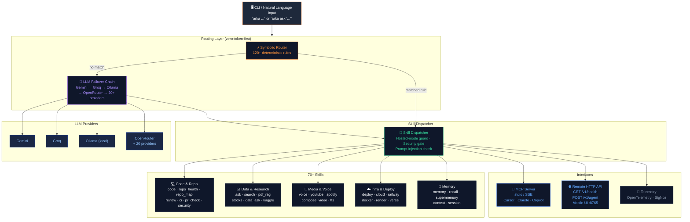

# Arka

**Your terminal, upgraded.** Route plain English to **70+ local skills** — deterministic offline routing, voice, 24-provider LLM failover, and security gates on by default.

[](https://opensource.org/licenses/MIT)
[](https://www.python.org/downloads/)
[](https://pypi.org/project/arka-agent/)
[](https://pepy.tech/projects/arka-agent)
[](https://pypistats.org/packages/arka-agent)
[](https://github.com/Sumit884-byte/arka)
[](https://arka-agent.mintlify.site)
[](https://github.com/Sumit884-byte/arka/pkgs/container/arka)

**Documentation:** [arka-agent.mintlify.site](https://arka-agent.mintlify.site) · **Repository:** [github.com/Sumit884-byte/arka](https://github.com/Sumit884-byte/arka) · Local landing preview: [`landing/`](landing/) (`python3 -m http.server` from that folder)

### PyPI downloads

| Window | Downloads (no mirrors) |
|--------|------------------------:|
| Last 7 days | 23 |
| Last 30 days | 63 |
| Tracked since launch (2026-07-20) | 447 |
| With mirrors (same window) | 1,585 |

Live charts: [pypistats.org/packages/arka-agent](https://pypistats.org/packages/arka-agent) · [pepy.tech/projects/arka-agent](https://pepy.tech/projects/arka-agent) · snapshot 2026-08-30

## Why Arka?

- **Deterministic routing:** 120+ symbolic rules handle most requests with zero LLM tokens before any model is called.
- **Extensible:** Add third-party skills via `skill.json` plugins — no fork required.
- **Secure by default:** Prompt-injection checks, risky-action prompts, and hard blocks on destructive shell patterns.
- **Local-first:** Skills run on your machine; LLM calls failover across Gemini, Groq, Ollama, and 20+ other providers.

If Arka looks useful, **star the upstream repo** — it helps others discover the project and signals that it's worth a look:

```bash
gh repo star Sumit884-byte/arka
```

Or open [github.com/Sumit884-byte/arka](https://github.com/Sumit884-byte/arka) and click **Star**.

## Architecture

Arka is built as a layered system: requests flow through deterministic symbolic routing first (zero LLM tokens), fall back to a multi-provider LLM chain only when needed, and dispatch to a pluggable skill dispatcher. All layers — MCP server, remote API server, memory, telemetry, and cloud deployment — are independently composable.


```mermaid
flowchart TD
    CLI["🖥️ CLI / Natural Language Input\n`arka ...` or `arka ask '...'`"]

    subgraph Router["Routing Layer (zero-token-first)"]
        SR["⚡ Symbolic Router\n120+ deterministic rules"]
        LLM["🤖 LLM Failover Chain\nGemini → Groq → Ollama\n→ OpenRouter → 20+ providers"]
        SR -->|"no match"| LLM
    end

    subgraph Dispatch["Skill Dispatcher"]
        SD["🎯 Skill Dispatcher\nHosted-mode guard · Security gate\nPrompt-injection check"]
    end

    subgraph Skills["70+ Skills"]
        direction TB
        CODE["💻 Code & Repo\ncode · repo_health · repo_map\nreview · ci · pr_check · security"]
        DATA["📊 Data & Research\nask · search · pdf_rag\nstocks · data_ask · kaggle"]
        MEDIA["🎵 Media & Voice\nvoice · youtube · spotify\ncompose_video · tts"]
        INFRA["☁️ Infra & Deploy\ndeploy · cloud · railway\ndocker · render · vercel"]
        MEM["🧠 Memory\nmemory · recall · supermemory\ncontext · session"]
    end

    subgraph Interfaces["Interfaces"]
        MCP["🔌 MCP Server\nstdio / SSE\nCursor · Claude · Copilot"]
        REMOTE["🌐 Remote HTTP API\nGET /v1/health\nPOST /v1/agent\nMobile UI :8765"]
        TLM["📡 Telemetry\nOpenTelemetry · SigNoz"]
    end

    subgraph LLMs["LLM Providers"]
        G["Gemini"]
        GQ["Groq"]
        OL["Ollama (local)"]
        OR["OpenRouter\n+ 20 providers"]
    end

    CLI --> Router
    SR -->|"matched rule"| SD
    LLM --> G & GQ & OL & OR
    LLM --> SD
    SD --> CODE & DATA & MEDIA & INFRA & MEM
    SD --> MCP
    SD --> REMOTE
    SD --> TLM

    style CLI fill:#1e293b,color:#f8fafc,stroke:#f97316
    style SR fill:#0f172a,color:#fb923c,stroke:#f97316
    style LLM fill:#0f172a,color:#a78bfa,stroke:#7c3aed
    style SD fill:#0f172a,color:#34d399,stroke:#059669
    style MCP fill:#0f172a,color:#60a5fa,stroke:#2563eb
    style REMOTE fill:#0f172a,color:#60a5fa,stroke:#2563eb
    style TLM fill:#0f172a,color:#94a3b8,stroke:#475569
    style CODE fill:#0f172a,color:#f8fafc,stroke:#334155
    style DATA fill:#0f172a,color:#f8fafc,stroke:#334155
    style MEDIA fill:#0f172a,color:#f8fafc,stroke:#334155
    style INFRA fill:#0f172a,color:#f8fafc,stroke:#334155
    style MEM fill:#0f172a,color:#f8fafc,stroke:#334155
    style G fill:#1a2744,color:#93c5fd,stroke:#1d4ed8
    style GQ fill:#1a2744,color:#93c5fd,stroke:#1d4ed8
    style OL fill:#1a2744,color:#93c5fd,stroke:#1d4ed8
    style OR fill:#1a2744,color:#93c5fd,stroke:#1d4ed8
```

**Key design properties:**
- **Zero-token-first** — Symbolic routing resolves most requests without any LLM call.
- **Hosted-mode safety** — Skill dispatcher blocks desktop/GUI/audio skills automatically on cloud/headless Linux (`ARKA_HOSTED_MODE=1`).
- **Multi-platform deploy** — `arka deploy --all` deploys to Cloud VM, Railway, Vercel, Netlify, Render in one command.
- **MCP + Remote API** — Arka exposes all skills as MCP tools (stdio/SSE) and a REST HTTP API on port 8765.

## Privacy

Arka is designed so **you stay in control of your data**:

- **Runs on your machine** — Skills execute locally. There is no hosted Arka account and no shared demo instance; your terminal, files, and config stay on your system.
- **Local-first routing** — 120+ symbolic rules handle many requests with **zero LLM tokens**, so common tasks never leave your machine.
- **You choose where prompts go** — LLM calls use only the providers you configure (Gemini, Groq, Ollama, etc.). For sensitive work, force a local-only boundary:

  ```bash
  arka run-only-local-llm "summarize this repo"
  arka hybrid config local-only
  ```

  With `local-only`, hosted providers are not used as fallbacks.

- **Secrets stay local** — API keys and `.env` live under your user config directory (`~/.config/arka/` on Linux, `~/Library/Application Support/arka/` on macOS). `arka integration setup` never prints secret values.
- **Memory stays local by default** — Long-term memory uses a local cache unless you add a Supermemory key (`MEMORY=auto` falls back to local). Set `MEMORY=local` to keep recall entirely on disk.
- **Web content is sanitized** — Search results and scraped pages are stripped of suspicious injection patterns before they reach the model (`SECURITY_SANITIZE=1` by default).
- **Risky actions need confirmation** — Installs, deletes, downloads, and automation prompt `[y/N]` unless you explicitly auto-confirm (`SECURITY_ACTIONS=1` by default).
- **Telemetry defaults to SigNoz** — OpenTelemetry traces, metrics, and logs export to `http://127.0.0.1:4318` by default. Set `OTEL_SDK_DISABLED=true` or `OTEL_TRACES_ENABLED=0` to opt out.

Details: [Security model](https://arka-agent.mintlify.site/concepts/security) · [Memory](https://arka-agent.mintlify.site/guides/memory) · [Hybrid local/hosted routing](https://arka-agent.mintlify.site/guides/integrations#local-and-hosted-models-together)

## Supported platforms

| Platform | Support |
| --- | --- |
| **macOS** | Full support — recommended for daily use |
| **Linux** | Full support |
| **Windows** | Python CLI and `arka` subcommands work; the full 70+ skill router needs [fish shell](https://fishshell.com) (`scoop install fish` or `winget install fishshell`). Without fish, Arka runs in **portable** mode with Python fallbacks. Some fish-oriented skills target macOS/Linux. |

**Requirements:** Python **3.11+**. Optional: fish shell for natural-language routing and voice integration.

Config paths: `~/.config/arka/` (Linux), `~/Library/Application Support/arka/` (macOS), `%APPDATA%\arka\` (Windows).

## Installation

PyPI package name is **`arka-agent`** — published at [pypi.org/project/arka-agent](https://pypi.org/project/arka-agent/).

**Recommended (standalone, no clone, no build):**

[uv](https://docs.astral.sh/uv/) installs **`arka-agent` from PyPI** — no separate uv registry or token:

```bash
uv tool install "arka-agent[chat]"
arka setup
arka doctor
```

Or with pipx:

```bash
pipx install "arka-agent[chat]"
arka setup
arka doctor
```

**One-off without global install:**

```bash
uvx --from "arka-agent[chat]" arka doctor
```

Or with pip in a venv:

```bash
python3 -m pip install "arka-agent[chat]"
arka setup
arka doctor
```

**GitHub fallback** (if you need the latest commit before the next PyPI release):

```bash
pipx install "arka-agent[chat] @ git+https://github.com/Sumit884-byte/arka.git"
arka setup
arka doctor
```

**From a git clone** (best for contributors or tracking `main`):

Upstream (canonical):

```bash
git clone https://github.com/Sumit884-byte/arka.git
cd arka
./scripts/refetch.sh --install
arka setup
arka doctor
```

**Working from a fork** (recommended if you do not have push access to upstream):

```bash
gh repo fork Sumit884-byte/arka --clone
cd arka
./scripts/refetch.sh --install
pip install -e ".[chat,dev]"
arka setup
arka doctor
```

Example active fork: [sumitmishra884byte-cpu/arka](https://github.com/sumitmishra884byte-cpu/arka) (fork of upstream). Sync your fork before opening a PR:

```bash
gh repo sync --source Sumit884-byte/arka
git push origin main
```

**Configure API keys** (at least one cloud key or local Ollama):

```bash
cp .env.example ~/.config/arka/.env   # macOS/Linux; see Supported platforms for Windows path
```

Add a free-tier key from [Google AI Studio](https://aistudio.google.com/apikey) or [Groq Console](https://console.groq.com/keys), then run `arka free tier setup` for recommended `.env` settings.

**Optional one-liners:**

```bash
brew install fish                    # macOS — unlocks full skill router
arka mcp doctor && arka mcp install   # verify MCP server; print Cursor snippet
```

See the [Quickstart guide](https://arka-agent.mintlify.site/quickstart) and [MCP integration](https://arka-agent.mintlify.site/guides/mcp) for fish setup, Cursor merge steps, and optional extras (`[voice]`, `[pdf]`, `[all]`).

## Try Arka without building from source

There is no hosted demo instance or shared test account. The fastest path to evaluate Arka:

1. **Browse the live docs** — [arka-agent.mintlify.site](https://arka-agent.mintlify.site) (skills catalog, routing concepts, CLI reference).
2. **Install in one command** — use the pip/pipx git install above (no manual build step).
3. **Use free-tier LLM keys** — Gemini and Groq both offer free tiers; Ollama is local and costs nothing:

   ```bash
   arka free tier setup
   arka doctor
   ```

4. **Run sample commands** that exercise routing and LLM failover:

   ```bash
   arka ask "what is Rust?"
   arka "convert 100 USD to INR"
   arka council "should I learn Rust?"
   arka quiz python
   arka coding-tui .
   arka repo_health scan
   ```

   Inside the coding TUI, `/test scripts` runs verification scripts discovered under `scripts/` (no hardcoded list — Arka inspects filenames, docstrings, argparse, and `test_*` functions). Use `/test` for pytest and `repo_health scan` to see why each script matched.

5. **Try MCP in Cursor** — after install, `arka mcp doctor` then `arka mcp install`; merge the printed snippet into **Cursor Settings → MCP** and restart Cursor.

Full walkthrough: [Quickstart](https://arka-agent.mintlify.site/quickstart) · [Free credits guide](https://arka-agent.mintlify.site/guides/free-credits)

## Quick Start

Get to a working answer in under a minute:

```bash
arka doctor                              # verify install + keys
arka ask "what is Rust?"                 # web + AI answer
arka "convert 100 USD to INR"            # natural language routing
arka council "should I learn Rust?"      # multi-persona deliberation
```

Voice (optional):

```bash
arka listen    # then say: "hey arka, what's the weather"
```

More guides — skills, stocks, PDF RAG, Google Workspace, goal agent, testing — live on the [documentation site](https://arka-agent.mintlify.site).

## Built with Codex & GPT-5.6

Arka was built for the **OpenAI Build Week Developer Tools** track (July 2026):

- **Codex** — routing rule hardening, NL routing test coverage, coding TUI iteration (`/plan` auto-execute, `/test`, `/test scripts`), and demo pipeline tooling.
- **GPT-5.6** — primary model in the `arka ask` failover chain and agent steps inside `arka coding-tui` (via OpenRouter).

Judges can reproduce the full path with `pipx install "arka-agent[chat]"`, `arka setup`, and `arka doctor`. Demo video and CLI screenshots live under `recordings/`.

## Contributing

We welcome contributions of all sizes! Please read our [Contribution Guidelines](CONTRIBUTING.md) to get started with the local development workflow.

**Quick fork workflow with GitHub CLI:**

```bash
gh repo view Sumit884-byte/arka          # upstream metadata
gh repo fork Sumit884-byte/arka --clone  # your fork + local clone
cd arka
pip install -e ".[chat,dev]"
pytest
# push to your fork, then open a PR back to Sumit884-byte/arka
gh pr create --repo Sumit884-byte/arka
```

Look for the **good first issue** label on [GitHub Issues](https://github.com/Sumit884-byte/arka/issues?q=label%3A%22good+first+issue%22) to find a welcoming entry point.

## License

Distributed under the **MIT License**. See [LICENSE](LICENSE) for more information.
