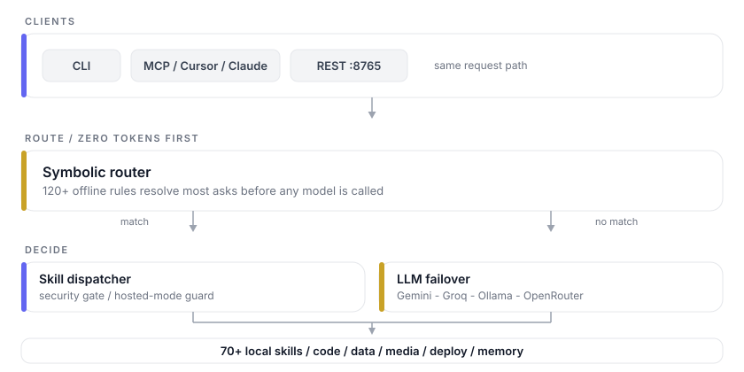

<p align="center">
  <a href="https://github.com/Sumit884-byte/arka">
    
  </a>
</p>

<p align="center">
  
</p>

<h1 align="center">Arka</h1>

<p align="center">
  <strong>Your terminal, upgraded.</strong><br />
  Plain English → <strong>70+ local skills</strong>, zero-token routing first,<br />
  then a 24-provider LLM failover when you need it.
</p>

<p align="center">
  <a href="https://opensource.org/licenses/MIT"></a>
  <a href="https://www.python.org/downloads/"></a>
  <a href="https://pypi.org/project/arka-agent/"></a>
  <a href="https://pepy.tech/projects/arka-agent"></a>
  <a href="https://github.com/Sumit884-byte/arka"></a>
  <a href="https://arka-agent.mintlify.site"></a>
</p>

<p align="center">
  <a href="https://arka-agent.mintlify.site"><strong>Docs</strong></a>
  ·
  <a href="https://arka-agent.mintlify.site/quickstart"><strong>Quickstart</strong></a>
  ·
  <a href="https://pypi.org/project/arka-agent/"><strong>PyPI</strong></a>
  ·
  <a href="https://github.com/Sumit884-byte/arka"><strong>GitHub</strong></a>
</p>

---

## Install

```bash
uv tool install "arka-agent[chat]"   # or: pipx install "arka-agent[chat]"
arka setup
arka doctor
```

One-off without a global install:

```bash
uvx --from "arka-agent[chat]" arka doctor
```

Need the latest commit before the next PyPI release?

```bash
pipx install "arka-agent[chat] @ git+https://github.com/Sumit884-byte/arka.git"
```

> **Requirements:** Python 3.11+ · macOS / Linux full · Windows CLI works (fish unlocks the full router)  
> **Keys:** add a free Gemini or Groq key, or run Ollama locally — `arka free tier setup` helps.

---

## Quick start

```bash
arka ask "what is Rust?"
arka "convert 100 USD to INR"
arka council "should I learn Rust?"
arka quiz python
arka listen    # optional: "hey arka, what's the weather"
```

Connect Cursor / Claude over MCP:

```bash
arka mcp doctor && arka mcp install
```

More: [Quickstart](https://arka-agent.mintlify.site/quickstart) · [Skills](https://arka-agent.mintlify.site/guides/skills) · [MCP](https://arka-agent.mintlify.site/guides/mcp)

---

## Why Arka

| | |
| --- | --- |
| **Zero-token-first** | 120+ symbolic rules resolve common asks before any model is called |
| **70+ local skills** | Code, media, research, deploy, memory — plugins via `skill.json` |
| **24-provider failover** | Gemini → Groq → Ollama → OpenRouter and more |
| **Secure by default** | Injection checks, risky-action prompts, hard blocks on destructive shell |
| **Local-first** | Skills run on your machine; you choose which LLM providers see prompts |
| **MCP + HTTP API** | stdio/SSE tools for Cursor/Claude, REST on `:8765` |

---

## Architecture

Requests share one path: **clients → symbolic router → dispatcher or LLM failover → local skills**. Most asks never call a model.

<p align="center">
  
</p>

| Layer | What it does |
| --- | --- |
| **Clients** | CLI, MCP (Cursor / Claude), REST on `:8765` |
| **Route** | 120+ offline rules — zero tokens on a match |
| **Decide** | Skill dispatcher + security gate, or Gemini → Groq → Ollama → OpenRouter |
| **Run** | 70+ local skills (code, data, media, deploy, memory) |

Hosted/headless Linux can set `ARKA_HOSTED_MODE=1` to block desktop/GUI/audio skills. Deploy with `arka deploy --all` (Cloud VM, Railway, Vercel, Netlify, Render).

---

## Privacy

- Skills run **on your machine** — no hosted Arka account or shared demo instance
- Many requests never leave your machine (symbolic routing, zero tokens)
- LLM traffic goes only to providers **you** configure; force local-only with:

  ```bash
  arka run-only-local-llm "summarize this repo"
  arka hybrid config local-only
  ```

- Secrets live under your user config (`~/.config/arka/` / macOS Application Support / `%APPDATA%\arka\`)
- Memory defaults local; web content is sanitized; risky actions prompt `[y/N]`
- Telemetry defaults to local SigNoz (`127.0.0.1:4318`) — disable with `OTEL_SDK_DISABLED=true`

Details: [Security](https://arka-agent.mintlify.site/concepts/security) · [Memory](https://arka-agent.mintlify.site/guides/memory)

---

## Platforms

| Platform | Support |
| --- | --- |
| **macOS** | Full — recommended for daily use |
| **Linux** | Full |
| **Windows** | Python CLI works; [fish](https://fishshell.com) unlocks the full skill router (`scoop` / `winget`) |

---

## Develop from source

```bash
git clone https://github.com/Sumit884-byte/arka.git
cd arka
./scripts/refetch.sh --install
pip install -e ".[chat,dev]"
arka setup && arka doctor
```

Fork + PR: see [CONTRIBUTING.md](CONTRIBUTING.md). Local landing preview: [`landing/`](landing/).

---

## Contributing

Issues and PRs welcome — start with [good first issue](https://github.com/Sumit884-byte/arka/issues?q=label%3A%22good+first+issue%22).

```bash
gh repo fork Sumit884-byte/arka --clone
cd arka && pip install -e ".[chat,dev]" && pytest
gh pr create --repo Sumit884-byte/arka
```

If Arka is useful, [★ star the repo](https://github.com/Sumit884-byte/arka) — or `gh repo star Sumit884-byte/arka`.

## License

[MIT](LICENSE)
