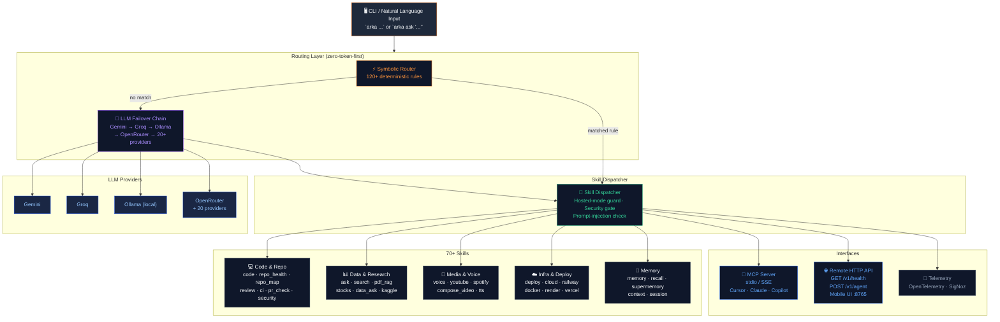

# Arka

**你的终端，全面升级。** 将日常英语指令路由到 **70+ 本地技能** —— 确定性离线路由、语音、24 家提供商 LLM 故障转移，以及默认开启的安全防护。

[](https://opensource.org/licenses/MIT)
[](https://www.python.org/downloads/)
[](https://pypi.org/project/arka-agent/)
[](https://pepy.tech/projects/arka-agent)
[](https://pypistats.org/packages/arka-agent)
[](https://github.com/Sumit884-byte/arka)
[](https://arka-agent.mintlify.site)
[](https://github.com/Sumit884-byte/arka/pkgs/container/arka)

**文档：** [arka-agent.mintlify.site](https://arka-agent.mintlify.site) · **代码仓库：** [github.com/Sumit884-byte/arka](https://github.com/Sumit884-byte/arka) · 本地落地页预览：[`landing/`](landing/)（在该目录下运行 `python3 -m http.server`）

### PyPI 下载量

| 时间窗口 | 下载量（不含镜像） |
|--------|------------------------:|
| 最近 7 天 | 23 |
| 最近 30 天 | 63 |
| 自发布以来累计（2026-07-20） | 447 |
| 含镜像（同一窗口） | 1,585 |

实时图表：[pypistats.org/packages/arka-agent](https://pypistats.org/packages/arka-agent) · [pepy.tech/projects/arka-agent](https://pepy.tech/projects/arka-agent) · 快照日期 2026-08-30

## 为什么选择 Arka？

- **确定性路由：** 120+ 条符号规则在调用任何模型之前即可处理大多数请求，零 LLM token 消耗。
- **可扩展：** 通过 `skill.json` 插件添加第三方技能 —— 无需 fork。
- **默认安全：** 提示注入检查、高风险操作确认，以及对破坏性 shell 模式的硬性拦截。
- **本地优先：** 技能在你的机器上运行；LLM 调用可在 Gemini、Groq、Ollama 及 20+ 家其他提供商之间故障转移。

如果你觉得 Arka 有用，请**给上游仓库点个 star** —— 这能帮助更多人发现这个项目，也表明它值得一看：

```bash
gh repo star Sumit884-byte/arka
```

或者打开 [github.com/Sumit884-byte/arka](https://github.com/Sumit884-byte/arka) 并点击 **Star**。

## 架构

Arka 采用分层架构：请求首先经过确定性符号路由（零 LLM token 消耗），仅在必要时才回退到多提供商 LLM 链，然后分发到可插拔的技能调度器。所有层级 —— MCP 服务器、远程 API 服务器、记忆、遥测和云端部署 —— 均可独立组合。



**核心设计特性：**
- **零 token 优先** —— 符号路由无需任何 LLM 调用即可解析大多数请求。
- **托管模式安全防护** —— 在云端/无头 Linux 环境（`ARKA_HOSTED_MODE=1`）下，技能调度器会自动屏蔽桌面/GUI/音频类技能。
- **多平台部署** —— `arka deploy --all` 一条命令即可部署到 Cloud VM、Railway、Vercel、Netlify 和 Render。
- **MCP + 远程 API** —— Arka 将所有技能以 MCP 工具（stdio/SSE）形式暴露，并在 8765 端口提供 REST HTTP API。

## 隐私

Arka 的设计确保**数据始终由你掌控**：

- **在你的机器上运行** —— 技能在本地执行。不存在托管的 Arka 账号，也没有共享演示实例；你的终端、文件和配置都保留在你自己的系统上。
- **本地优先路由** —— 120+ 条符号规则以**零 LLM token** 处理大量请求，因此常见任务的数据永远不会离开你的机器。
- **由你决定提示词的去向** —— LLM 调用只会使用你配置的提供商（Gemini、Groq、Ollama 等）。处理敏感工作时，可强制启用仅本地边界：

  ```bash
  arka run-only-local-llm "summarize this repo"
  arka hybrid config local-only
  ```

  在 `local-only` 模式下，托管提供商不会被用作回退。

- **密钥保留在本地** —— API 密钥和 `.env` 存放在用户配置目录下（Linux 为 `~/.config/arka/`，macOS 为 `~/Library/Application Support/arka/`）。`arka integration setup` 绝不会打印密钥值。
- **记忆默认保留在本地** —— 长期记忆使用本地缓存，除非你添加了 Supermemory 密钥（`MEMORY=auto` 会回退到本地）。设置 `MEMORY=local` 可让回忆功能完全保留在磁盘上。
- **Web 内容会被净化** —— 搜索结果和抓取的页面在到达模型之前会被剔除可疑的注入模式（默认 `SECURITY_SANITIZE=1`）。
- **高风险操作需要确认** —— 安装、删除、下载和自动化操作会提示 `[y/N]`，除非你显式设置自动确认（默认 `SECURITY_ACTIONS=1`）。
- **遥测默认使用 SigNoz** —— OpenTelemetry 的链路追踪、指标和日志默认导出到 `http://127.0.0.1:4318`。设置 `OTEL_SDK_DISABLED=true` 或 `OTEL_TRACES_ENABLED=0` 即可退出。

详情：[安全模型](https://arka-agent.mintlify.site/concepts/security) · [记忆](https://arka-agent.mintlify.site/guides/memory) · [本地/托管混合路由](https://arka-agent.mintlify.site/guides/integrations#local-and-hosted-models-together)

## 支持的平台

| 平台 | 支持情况 |
| --- | --- |
| **macOS** | 完整支持 —— 推荐日常使用 |
| **Linux** | 完整支持 |
| **Windows** | Python CLI 和 `arka` 子命令可正常工作；完整的 70+ 技能路由器需要 [fish shell](https://fishshell.com)（`scoop install fish` 或 `winget install fishshell`）。没有 fish 时，Arka 以**便携（portable）**模式运行并使用 Python 回退方案。部分面向 fish 的技能仅支持 macOS/Linux。 |

**环境要求：** Python **3.11+**。可选：fish shell，用于自然语言路由和语音集成。

配置路径：`~/.config/arka/`（Linux）、`~/Library/Application Support/arka/`（macOS）、`%APPDATA%\arka\`（Windows）。

## 安装

PyPI 包名为 **`arka-agent`** —— 发布于 [pypi.org/project/arka-agent](https://pypi.org/project/arka-agent/)。

**推荐方式（独立安装，无需克隆和构建）：**

[uv](https://docs.astral.sh/uv/) 直接**从 PyPI 安装 `arka-agent`** —— 无需单独的 uv registry 或 token：

```bash
uv tool install "arka-agent[chat]"
arka setup
arka doctor
```

或使用 pipx：

```bash
pipx install "arka-agent[chat]"
arka setup
arka doctor
```

**一次性运行，无需全局安装：**

```bash
uvx --from "arka-agent[chat]" arka doctor
```

或在 venv 中使用 pip：

```bash
python3 -m pip install "arka-agent[chat]"
arka setup
arka doctor
```

**GitHub 回退方式**（如果你需要下一个 PyPI 版本发布前的最新提交）：

```bash
pipx install "arka-agent[chat] @ git+https://github.com/Sumit884-byte/arka.git"
arka setup
arka doctor
```

**从 git 克隆安装**（最适合贡献者或需要跟踪 `main` 分支的用户）：

上游（规范仓库）：

```bash
git clone https://github.com/Sumit884-byte/arka.git
cd arka
./scripts/refetch.sh --install
arka setup
arka doctor
```

**基于 fork 开发**（如果你没有上游仓库的推送权限，推荐此方式）：

```bash
gh repo fork Sumit884-byte/arka --clone
cd arka
./scripts/refetch.sh --install
pip install -e ".[chat,dev]"
arka setup
arka doctor
```

活跃 fork 示例：[sumitmishra884byte-cpu/arka](https://github.com/sumitmishra884byte-cpu/arka)（上游的 fork）。在提交 PR 之前请先同步你的 fork：

```bash
gh repo sync --source Sumit884-byte/arka
git push origin main
```

**配置 API 密钥**（至少需要一个云端密钥或本地 Ollama）：

```bash
cp .env.example ~/.config/arka/.env   # macOS/Linux; see Supported platforms for Windows path
```

从 [Google AI Studio](https://aistudio.google.com/apikey) 或 [Groq Console](https://console.groq.com/keys) 获取免费额度密钥，然后运行 `arka free tier setup` 获取推荐的 `.env` 配置。

**可选的一行命令：**

```bash
brew install fish                    # macOS — unlocks full skill router
arka mcp doctor && arka mcp install   # verify MCP server; print Cursor snippet
```

关于 fish 配置、Cursor 合并步骤和可选扩展（`[voice]`、`[pdf]`、`[all]`），请参阅[快速入门指南](https://arka-agent.mintlify.site/quickstart)和 [MCP 集成](https://arka-agent.mintlify.site/guides/mcp)。

## 无需从源码构建即可试用 Arka

不存在托管的演示实例或共享测试账号。评估 Arka 的最快路径：

1. **浏览在线文档** —— [arka-agent.mintlify.site](https://arka-agent.mintlify.site)（技能目录、路由概念、CLI 参考）。
2. **一条命令完成安装** —— 使用上文的 pip/pipx git 安装方式（无需手动构建）。
3. **使用免费额度的 LLM 密钥** —— Gemini 和 Groq 均提供免费额度；Ollama 在本地运行且完全免费：

   ```bash
   arka free tier setup
   arka doctor
   ```

4. **运行示例命令**，体验路由和 LLM 故障转移：

   ```bash
   arka ask "what is Rust?"
   arka "convert 100 USD to INR"
   arka council "should I learn Rust?"
   arka quiz python
   arka coding-tui .
   arka repo_health scan
   ```

   在 coding TUI 中，`/test scripts` 会运行在 `scripts/` 目录下发现的验证脚本（没有硬编码列表 —— Arka 会检查文件名、docstring、argparse 以及 `test_*` 函数）。使用 `/test` 运行 pytest，使用 `repo_health scan` 查看每个脚本匹配的原因。

5. **在 Cursor 中试用 MCP** —— 安装完成后，先运行 `arka mcp doctor`，再运行 `arka mcp install`；将打印出的配置片段合并到 **Cursor Settings → MCP** 中，然后重启 Cursor。

完整流程：[快速入门](https://arka-agent.mintlify.site/quickstart) · [免费额度指南](https://arka-agent.mintlify.site/guides/free-credits)

## 快速开始

一分钟内得到可用的答案：

```bash
arka doctor                              # verify install + keys
arka ask "what is Rust?"                 # web + AI answer
arka "convert 100 USD to INR"            # natural language routing
arka council "should I learn Rust?"      # multi-persona deliberation
```

语音（可选）：

```bash
arka listen    # then say: "hey arka, what's the weather"
```

更多指南 —— 技能、股票、PDF RAG、Google Workspace、目标智能体、测试 —— 请访问[文档站点](https://arka-agent.mintlify.site)。

## 基于 Codex 与 GPT-5.6 构建

Arka 是为 **OpenAI Build Week Developer Tools** 赛道（2026 年 7 月）构建的：

- **Codex** —— 路由规则加固、自然语言路由测试覆盖、coding TUI 迭代（`/plan` 自动执行、`/test`、`/test scripts`），以及演示流水线工具。
- **GPT-5.6** —— `arka ask` 故障转移链中的主力模型，同时驱动 `arka coding-tui` 内的智能体步骤（通过 OpenRouter）。

评委可通过 `pipx install "arka-agent[chat]"`、`arka setup` 和 `arka doctor` 复现完整流程。演示视频和 CLI 截图位于 `recordings/` 目录下。

## 参与贡献

我们欢迎任何规模的贡献！请先阅读我们的[贡献指南](CONTRIBUTING.md)，了解本地开发工作流。

**使用 GitHub CLI 的快速 fork 工作流：**

```bash
gh repo view Sumit884-byte/arka          # upstream metadata
gh repo fork Sumit884-byte/arka --clone  # your fork + local clone
cd arka
pip install -e ".[chat,dev]"
pytest
# push to your fork, then open a PR back to Sumit884-byte/arka
gh pr create --repo Sumit884-byte/arka
```

在 [GitHub Issues](https://github.com/Sumit884-byte/arka/issues?q=label%3A%22good+first+issue%22) 中查找带有 **good first issue** 标签的问题，这是友好的入门起点。

## 许可证

基于 **MIT License** 分发。更多信息请参阅 [LICENSE](LICENSE)。
