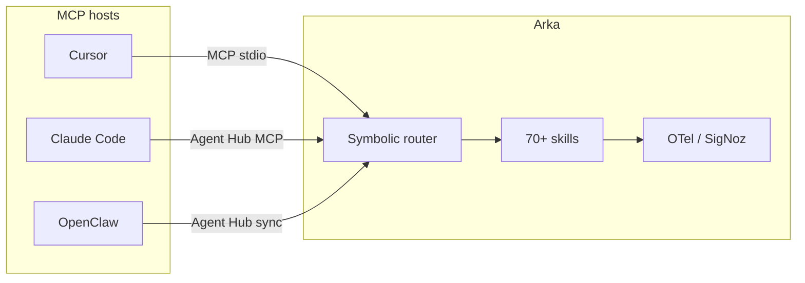

本页诚实地对比 **Arka** 与其他终端及 IDE 智能体。Arka 不是所有工具的即插即用替代品 —— 它是一个 **本地优先的终端智能体**，具备符号路由、70+ 内置技能、MCP 服务端/客户端支持以及 OpenTelemetry 可观测性。使用本指南判断 Arka 何时是合适的一层，何时应让其他智能体主导。

<Note>
  **Arka 是什么：** 一个跨平台 CLI（`pipx install "arka-agent[chat]"`），它先通过离线符号规则（120+ 模式）把自然英语映射到本地技能，之后再回退到 LLM 路由。技能在你的机器上运行；LLM 调用可在 24+ 个提供方之间故障切换。Arka 还暴露约 80 个 MCP 工具，让 Cursor、Claude Desktop 及其他 MCP 客户端可以把 Arka 当作 **工具服务器** 来调用 —— 参见 [AI 智能体指南](/cn/guides/ai-agents)。
</Note>

## 一览对比

| 维度 | **Arka** | **Cursor agent** | **Claude Code** | **OpenClaw** | **Gemini CLI** | **Aider** | **Open Interpreter** | **Copilot CLI** | **原生 MCP 客户端** |
| --- | --- | --- | --- | --- | --- | --- | --- | --- | --- |
| **主要界面** | 终端 + MCP 服务端 | IDE（编辑器原生） | 终端 / IDE 扩展 | 终端智能体 | 终端（Google） | 终端（编码） | 终端 / notebook | 终端（GitHub） | 任意 MCP 宿主 |
| **路由** | 离线符号规则 → LLM 路由回退 | IDE 上下文中的模型 tool-use | 带工具的智能体循环 | 智能体特有的路由 | Gemini 工具循环 | 聊天 → 编辑命令 | 代码执行循环 | Copilot 智能体循环 | 由宿主决定；无统一路由 |
| **内置技能** | 70+（媒体、金融、开发、基础设施……） | IDE 工具 + MCP | Shell、文件、网络工具 | 插件/技能生态 | Gemini 扩展 | 代码库映射、编辑、测试 | Python/shell 执行 | GitHub 感知工具 | 取决于你接入的服务器 |
| **MCP** | 服务端（约 80 工具）+ 客户端 | 客户端（调用 Arka 等） | 客户端 | 客户端（通过 hub） | 原生 MCP 子命令 | 有限 / 外部 | 视情况 | GitHub MCP 栈 | 仅客户端 |
| **本地 / 离线** | 强 —— 许多技能无需 LLM | 大多需要云端模型 | 云端模型 + 本地工具 | 本地 + 云混合 | Google 认证 / API | 支持本地 Ollama | 侧重本地执行 | GitHub 云认证 | 视服务器而定 |
| **安全守卫** | 提示注入、危险动作确认、shell 硬阻断 | IDE 沙箱 + 策略 | Anthropic 策略 + 确认 | 视插件而定 | Google 信任模型 | 用户确认编辑 | 用户确认代码运行 | 企业策略 | 每台服务器一策略 |
| **媒体流水线** | 视频、音乐、幻灯片、OCR、RAG、图表 | 仅通过 MCP/技能 | 原生较有限 | 依赖插件 | 依赖扩展 | 无 | 无 | 无 | 无 |
| **可观测性** | 内置 SigNoz / OTel（`arka.route`、`arka.llm`） | IDE 遥测 | 供应商遥测 | 视情况 | Google 遥测 | 极少 | 极少 | GitHub 遥测 | 视宿主而定 |
| **多智能体中枢** | [Agent Hub](/cn/guides/agent-hub) —— 共享 MCP、记忆、技能 | 无 | 部分（Codex 等） | 自有的记忆/MCP 路径 | 无 | 无 | 无 | 无 | 每个宿主需手动配置 |
| **平台支持** | macOS、Linux、Windows | 桌面 IDE | macOS、Linux | macOS、Linux | 跨平台（Node） | 跨平台 | 跨平台 | 跨平台 | 跨平台 |
| **是否需要账号** | 否（API key 可选） | Cursor 账号 | Anthropic 账号 | 视情况 | Google 账号 / API key | 提供方的 API key | 云端可选 | GitHub 账号 | 视情况 |

各行为定性描述 —— 精确的功能对齐会随上游项目发布更新而快速变化。请把此表当作架构层面的参考，而非评分卡。

## Arka 的优势

### 零 token 的符号路由

大多数 Arka 请求都不会调用 LLM 进行路由。`config.fish` 中的离线规则和 Python 符号扩展在亚毫秒级时间内匹配 120+ 个技能模式。竞品通常会把每一轮用户输入都送入模型，用于意图分类或工具选择。

参见 [路由管道](/cn/concepts/routing) 并运行路由审计：

```bash
arka dev route-audit
ROUTE_MODE=symbolic_only pytest tests/test_nl_routing_coverage.py -v
```

### 超越编码的技能广度

Arka 自带股票、PDF RAG、部署、语音、compose-video、Kalshi、代码库健康检查等数十项本地技能 —— 不仅仅是文件编辑和 shell。IDE 智能体擅长编码，但很少把金融、媒体和基础设施工作流打包在一个终端入口里。

浏览 [技能目录](/cn/guides/skills)。

### 作为可组合后端的 MCP

Arka 可以作为 Cursor 或 Claude Desktop 背后的 **技能层**：调用 `arka_route`、`arka_repo_map`、`arka_ci` 等，无需在 IDE 智能体内部复制 Arka 逻辑。[Agent Hub](/cn/guides/agent-hub) 为 OpenClaw、Claude Code、Hermes 及其他 `ollama launch` 智能体导出一份 MCP 配置和记忆 bundle。

### 你可以自托管的可观测性

Arka 使用 OpenTelemetry 对路由决策（`arka.route.decision=symbolic|llm`）、LLM 故障切换和目标智能体步骤进行埋点。把 trace 送往 [SigNoz](/cn/guides/observability)，无需被供应商仪表盘锁定。

### 默认启用的安全守卫

符号化的提示注入检查、危险动作 `[y/N]` 提示以及对破坏性 shell 模式的硬阻断，会在网络搜索和安装之前运行。参见 [安全模型](/cn/concepts/security)。

### 无需托管账号即可上手

用 pipx 安装，运行 `arka setup`，可选择添加 API key。无需登录 Arka 云。相比之下，一些 IDE 智能体需要产品账号才能启用完整的智能体模式。

## 竞品的优势

### IDE 集成深度（在 IDE 中的 Cursor、Claude Code）

Cursor 和 Claude Code 位于编辑器内部：内联 diff、LSP 感知、tab 补全和跨代码库的语义搜索都是原生的。Arka 的终端和 MCP 路径很强大，但无法替代日常编辑和评审的编辑器体验。

**选择 IDE 智能体** 当工作流主要是原地编辑并进行可视化 diff 评审时。

### 编码特化的基准与编辑循环（Aider、Claude Code）

[Aider](https://github.com/Aider-AI/aider) 针对代码库映射 → 打补丁 → 测试的循环做了优化。公开的类似 SWE-bench 的评测聚焦编码智能体；Arka 的目标智能体是通用型的，并未把自己定位为编码基准的领跑者。

**选择 Aider 或 Claude Code** 当工作是在单个代码库上进行长期结对编程，且代码之外的范围最小时。

### 托管便利性与企业能力（Copilot CLI、Gemini CLI）

GitHub Copilot CLI 通过 GitHub 的云集成了组织 SSO、策略和仓库上下文。Gemini CLI 把 Google 的 OAuth、扩展和 MCP 钩子打包在一个供应商之下。Arka 是自管理的 —— 你自带 key、配置和可选的 SigNoz。

**选择 Copilot CLI** 用于 GitHub 原生的企业工作流。**选择 Gemini CLI** 当你想要 Google 的扩展生态并且已经在使用 Gemini 时。

### 专门的智能体产品（OpenClaw）

[OpenClaw](https://github.com/openclaw/openclaw) 是它自己的智能体运行时，具有插件清单生态。Arka 采用受 OpenClaw *启发* 的会话记忆和技能守卫（[受 OpenClaw 启发的特性](/cn/guides/openclaw-features)），并可通过 Agent Hub **统一** MCP/记忆 —— 但 Arka 不是 OpenClaw 的分叉。

**选择 OpenClaw** 若你希望上游 OpenClaw 产品及其插件目录作为主要智能体。**选择 Arka** 若你想要符号路由、更广泛的内置技能，以及同时也能服务 Claude Code 和 Cursor 的中枢。

### "只想跑代码" 的简单性（Open Interpreter）

[Open Interpreter](https://github.com/OpenInterpreter/open-interpreter) 专注于以最小仪式执行 Python/shell。Arka 的技能目录和路由层提供了能力但也带来了更多表面。

**选择 Open Interpreter** 用于薄封装下的探索性代码执行。**选择 Arka** 当你需要路由、安全守卫、MCP 以及多技能编排时。

### 极简的仅 MCP 配置（原生 MCP 客户端）

如果你只需要一个 MCP 服务器（比如 filesystem + git），并且你的 IDE 智能体已经能很好地路由，那么再加上 Arka 就是额外的进程管理。当你不需要 Arka 的技能库或符号路由器时，原生 MCP 客户端更轻量。

**选择原生 MCP** 用于最小工具表面。**选择 Arka** 当你想要 70+ 技能、离线路由和一个统一的 MCP 入口（`arka_route`）时。

## 何时选择 Arka 与 X

### Arka 与 Cursor agent

| 使用 **Arka** | 使用 **Cursor agent** |
| --- | --- |
| 以终端为中心的工作流、脚本和自动化 | 在 IDE 中带可视化 diff 的内联编辑 |
| 从单一 CLI 使用媒体、金融、部署等非代码技能 | 与打开的文件和 LSP 绑定的深度代码库对话 |
| MCP 工具服务端供其他智能体调用 | 把 Cursor 作为主要的编码界面 |
| 用离线符号路由降低路由 token 成本 | 依赖 Cursor 内置的智能体路由 |

**联合使用：** 通过 [MCP](/cn/guides/mcp) 把 Cursor 接到 Arka —— Cursor 负责编辑；Arka 负责专门技能、代码库健康、CI 以及你不想重实现的路由目录。

### Arka 与 Claude Code

| 使用 **Arka** | 使用 **Claude Code** |
| --- | --- |
| 多提供方故障切换（不仅限 Anthropic） | 一流的 Anthropic 模型访问和智能体循环 |
| 无需 LLM 的本地技能 | Anthropic 原生的 tool use 和策略 |
| SigNoz 自托管 trace | 与 Claude 产品的紧密集成 |

Agent Hub 可以以共享 MCP 启动 Claude Code：`arka agent_hub launch claude`。

### Arka 与 OpenClaw

| 使用 **Arka** | 使用 **OpenClaw** |
| --- | --- |
| 符号路由 + 70+ 内置技能 | 把 OpenClaw 插件生态作为主要运行时 |
| Agent Hub 在多个智能体间统一 MCP | 完全留在 OpenClaw 的智能体模型内 |
| 用 SigNoz OTel 跟踪路由和 LLM 成本 | OpenClaw 原生的记忆和心跳 |

Arka 实现了兼容 OpenClaw 的技能清单守卫 —— 插件可以声明 `metadata.openclaw` —— 而无需运行 OpenClaw。

### Arka 与 Gemini CLI

| 使用 **Arka** | 使用 **Gemini CLI** |
| --- | --- |
| 与提供方无关的编排 | Gemini 特有的扩展、hook 和 MCP |
| 离线技能（计算、天气、本地工具） | Google OAuth 和 Gemini 模型特性 |
| 已经在使用 Arka 的 24 提供方链 | 一次性 `gemini` 透传：`arka gemini` 包装官方 CLI |

参见 [Gemini CLI 集成](/cn/guides/gemini-cli) —— Arka 可以调用 Gemini CLI，而无需替代任一工具。

### Arka 与 Aider

| 使用 **Arka** | 使用 **Aider** |
| --- | --- |
| 通用终端智能体（媒体、运维、研究） | 专注的编码结对伙伴 |
| 符号路由到 `repo_map`、`review`、`ci` 等技能 | 面向 git 仓库的成熟 edit → test 循环 |
| 面向 IDE 智能体暴露 MCP | 范围最小，仅针对代码易于推理 |

Arka 的 [代码库映射](/cn/guides/repo-map) 技能受 Aider 风格的仓库感知启发，但没有复制 Aider 的编辑循环。

### Arka 与 Copilot CLI

| 使用 **Arka** | 使用 **Copilot CLI** |
| --- | --- |
| 自托管的可观测性和路由 | GitHub 组织 SSO 和仓库策略 |
| 超出 GitHub 的技能（语音、股票、部署） | 通过 GitHub 提供原生的 PR/issue 上下文 |
| 无需 GitHub 账号 | 企业 Copilot 授权 |

### Arka 与 Open Interpreter

| 使用 **Arka** | 使用 **Open Interpreter** |
| --- | --- |
| 有路由的技能、安全守卫、MCP | 直接 "运行这段 Python"，层次更少 |
| 生产风格的故障切换和遥测 | 快速试验和 notebook |

### Arka 与原生 MCP 客户端

| 使用 **Arka** | 仅使用 **原生 MCP** |
| --- | --- |
| `arka_route` 伞式入口 + 70+ 技能 | 你已经精挑细选了极简的 MCP 服务器 |
| 离线路由和纠错层 | IDE 智能体的路由已经够用 |
| Agent Hub 在 Claude、Cursor、OpenClaw 间同步 | 单宿主、单服务器配置 |

## 基准测试（已有和计划中）

如果没有度量过的路由准确率、模型成本和端到端任务完成度，营销层面的对比是没有说服力的。Arka 的 [SigNoz 集成](/cn/guides/observability) 定义了三套基准 —— 可观测性和基准共用同一套 OTel span。

| 套件 | 度量 | 状态 |
| --- | --- | --- |
| **ArkaRouteBench** | 路由准确率、离线命中率、符号 vs LLM 的延迟与 token 成本 | 今日可运行，通过 `tests/test_nl_routing_coverage.py`、`arka dev route-audit` |
| **ArkaModelBench** | 按任务类型的提供方/模型质量与成本 | `arka benchmark run\|show\|apply` |
| **ArkaHarnessBench Lite** | 约 25 个真实任务 —— Arka 与 OpenClaw / Claude Code 在完成度、步骤数、耗时、成本上的对比 | 计划中 |

运行目前已有的：

```bash
# 路由覆盖率（离线符号路径）
ROUTE_MODE=symbolic_only pytest tests/test_nl_routing_coverage.py -v

# 符号 / fish / 测试一致性审计
arka dev route-audit

# 提供方基准（dry-run 无需 API key）
arka benchmark init
arka benchmark run --dry-run
arka benchmark show

# 带 trace 的实时基准 → SigNoz
OTEL_TRACES_ENABLED=1 SIGNOZ_ENDPOINT=http://localhost:4318 arka benchmark run
```

完整方法学和 SigNoz 面板映射见仓库中的 [signoz/README.md — Arka benchmarking](https://github.com/Sumit884-byte/arka/blob/main/signoz/README.md#arka-benchmarking-adoption)。

<Warning>
  HarnessBench Lite（Arka vs OpenClaw / Claude Code）**尚未发布**。在这些数字发布之前，请把任何厂商 —— 包括 Arka —— 关于编码智能体优越性的说法视为未经证实。
</Warning>

## 架构重叠（而非重复）



Arka 通常是 **补充** IDE 智能体，而不是替代它们：宿主智能体负责规划和编辑；Arka 提供路由后的技能、安全守卫和共享的中枢配置。

## 相关

<CardGroup cols={2}>
  <Card title="路由" icon="route" href="/cn/concepts/routing">
    零 token 的符号管道和路由模式。
  </Card>
  <Card title="AI 智能体指南" icon="robot" href="/cn/guides/ai-agents">
    MCP 客户端应如何调用 Arka 工具。
  </Card>
  <Card title="Agent Hub" icon="sitemap" href="/cn/guides/agent-hub">
    在多个智能体间共享 MCP 与记忆。
  </Card>
  <Card title="可观测性" icon="chart-line" href="/cn/guides/observability">
    路由和 LLM 故障切换的 SigNoz trace。
  </Card>
  <Card title="安全" icon="shield" href="/cn/concepts/security">
    提示注入和危险动作守卫。
  </Card>
  <Card title="与 Arka 一起编码" icon="code" href="/cn/guides/code-with-arka">
    与你的 IDE 并行的终端编码工作流。
  </Card>
</CardGroup>
