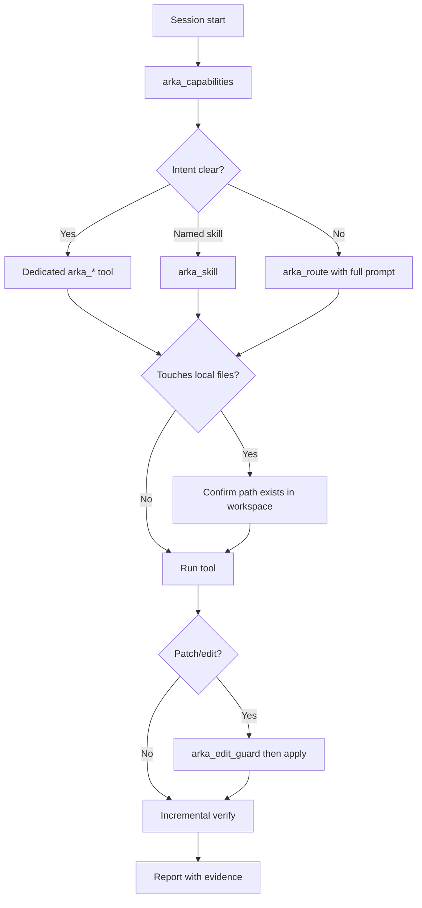

本页面向通过 MCP 调用 Arka 的 **AI 智能体**。安装见 [MCP 集成](/cn/guides/mcp)。

查找其他文档页请先读 [llms.txt](/llms.txt)，再打开单个页面；需要 Markdown 时在 URL 后加 `.md`。

## 连接与验证

在调用工具前，先确认服务器健康：

```bash
arka mcp doctor
arka mcp self-tools
```

在 IDE 中，`arka` MCP 服务器应显示为已连接。用 `arka mcp install` 生成针对本机的配置 — 参见 [MCP 集成](/cn/guides/mcp#cursor-setup)。

**每次会话首个工具调用：**

```json
{}
```

以空参数或 `{}` 调用 **`arka_capabilities`**。响应包含：

| 字段 | 用途 |
| --- | --- |
| `mcp_tools` | 当前启用的确切工具名 |
| `dispatch_skills` | 通过 `arka_skill` 可达的技能 |
| `umbrella_tool` | 何时使用 `arka_route` |
| `agent_execution_rules` | 编辑守卫、渐进验证、本地文件提示 |
| `local_file_tools` | 需要智能体本机路径的工具 |
| `mcp_disabled_by_default` | 除非显式启用，否则隐藏的个人/桌面技能 |

不要从本页硬编码工具数量 — 请始终在运行时读取 `arka_capabilities`。

## 调用 Arka 的三种方式

| 模式 | 工具 | 使用场景 |
| --- | --- | --- |
| **统一路由** | `arka_route` | 用户用自然语言提出了 Arka 请求，但不确定该用哪个更具体的工具。将**完整**用户消息作为 `prompt` 传入。 |
| **命名技能** | `arka_skill` | 你已知道 dispatch 技能名（例如 `repo_map`、`prompt_coach`、`connector suggest`）。 |
| **专用 MCP 工具** | `arka_*` | 意图明确对应到一个工具（见下方路由表）。比路由更快、更清晰。 |

<Warning>
  当 `arka_route` 才是正确入口时，**不要**把用户请求折叠成猜出来的技能名再调用 `arka_skill`。例如：用户说 *"help me connect the CLI to agent hub"* → 用完整提示调用 `arka_route`（会路由到 connector suggest），而不是用 `"web_answer"` 调用 `arka_skill`。
</Warning>

### 统一路由示例

```json
{ "prompt": "suggest cli to connect" }
```

### 命名技能示例

```json
{ "skill": "repo_map", "args": ["--depth", "2"] }
```

### 专用工具示例

```json
{ "depth": 2 }
```

使用上面的 JSON 调用 `arka_repo_map`。

## 路由决策表

在退回到 `arka_route` **之前**，用下表选择工具。

| 用户意图 | 推荐工具 | 示例参数 |
| --- | --- | --- |
| 探索仓库布局 / Python 符号 | `arka_repo_map` | `{"depth": 2}` |
| 用于编码的丰富仓库上下文 | `arka_repo_context` | `{"goal": "explain auth module"}` |
| 用模糊名称查找项目文件夹 | `arka_tech_stack` | `{"action": "search", "query": "3d space simulation"}` |
| 运行测试或 CI 检查 | `arka_ci` | `{"action": "test"}` |
| PR / 合并就绪度 | `arka_pr_check` | `{"action": "status"}` |
| 代码评审 | `arka_review` | `{"path": "src/..."}` |
| 搜索代码 | `arka_code_search` | `{"query": "McpTool", "path": "src"}` |
| 读取完整文件内容 | `arka_read_file` | `{"path": "src/arka/integrations/mcp_server.py"}` |
| 应用补丁 | 先 `arka_edit_guard` 再 `arka_apply_patch` | 参见 [编辑守卫](#edit-guard-and-patches) |
| 图像或扫描 PDF 的 OCR | `arka_ocr` | `{"path": "/abs/path/scan.png", "action": "extract"}` |
| 摄入 / 在文档上提问 | `arka_rag` | `{"action": "ask", "question": "...", "document": "report.pdf"}` |
| 召回已存储的内存 | `arka_recall` | `{"goal": "project conventions"}` |
| 存储笔记 | `arka_remember` | `{"text": "...", "tags": ["project"]}` |
| 通用询问（网络、计算、聊天） | `arka_ask` | `{"prompt": "what is Rust?"}` |
| 列出 MCP + 技能目录 | `arka_capabilities` | `{}` |
| Agent Hub / IDE 内存同步 | `arka_agent_hub` | `{"action": "status"}` |
| CLI ↔ Hub 连接器 | `arka_connector` | `{"action": "status"}` 或通过 `arka_route` 路由自然语言 |
| 磁盘用量 | `arka_disk` | `{"action": "summary"}` |
| 预览 CSV | `arka_view_data` | `{"path": "/abs/path/data.csv"}` |
| Google Flow 视频（浏览器） | `arka_google_flow` | `{"prompt": "...", "backend": "browser"}` |
| 其他 / 含糊的自然语言 | `arka_route` | `{"prompt": "<full user message>"}` |

对于没有专用 MCP 封装的技能，使用 `arka_skill` 或 `arka_route`。参见 [通过 MCP 使用所有技能](/cn/guides/mcp-all-skills)。

## 智能体执行规则

`arka_capabilities` 会返回这些规则 — 每次任务都要遵循。

### 编辑守卫与补丁

在对敏感或未知路径执行 **`arka_apply_patch`** 之前：

1. 调用 **`arka_edit_guard`**，参数为 `{"action": "check", "path": "..."}`（或传入 diff）。
2. 若允许，则应用补丁。
3. 运行验证（测试、复现、日志检查）。

受保护路径包括 `.env`、`secrets/`、`node_modules/`、`bundled/` 以及自定义的 `BLOCKED_EDIT_PATHS`。

### 渐进式验证

**不要**等到整个长日志或批处理作业结束后才检查结果。

1. 先运行最小可用示例（一个文件、一页或一个样本）。
2. 检查结果 — 足以确认成功或失败。
3. 若首个示例成功，再运行第二个增量。
4. 只有这时才将工作流报告为**已验证**。

适用于 OCR/RAG 批处理、媒体管线、CI 运行以及任何多步工作流。

### 修复后验证

任何修复之后：

1. 应用变更。
2. 运行相关验证（测试、CLI 复现、日志检查）。
3. 若验证失败，则继续迭代 — 不要标记完成。
4. 通过后，报告**验证了什么**以及**如何验证**。

## 本地文件工具

这些工具要求路径能在**本机**读取（例如 Cursor 工作区）。没有挂载文件的云端智能体无法使用。

调用 `arka_capabilities` → `local_file_tools.tools` 查看实时列表。常见示例：

| 工具 | 是否需要路径 | 典型用途 |
| --- | --- | --- |
| `arka_ocr` | 是 | 从图片提取文本；OCR 扫描 PDF |
| `arka_rag` | 对摄入动作 | 索引 PDF/文档；提问 |
| `arka_repo_map` | 仓库根（可选） | 布局与符号 |
| `arka_repo_health` | 项目根 | 健康度与测试缺口 |
| `arka_ci` / `arka_review` / `arka_pr_check` | 项目根 | 开发工作流 |
| `arka_code_search` / `arka_read_file` / `arka_apply_patch` | 工作区路径 | 搜索、读取、编辑循环 |
| `arka_view_data` | 文件路径 | CSV/TSV 预览 |
| `arka_convert_media` / `arka_edit_video` / … | 媒体路径 | 本地变换 |

共享说明（也在 `arka_capabilities` 中）：

> 需要对提供路径的本地文件系统访问。除非挂载了工作区文件，否则无法在云端或沙盒智能体中使用。

## MCP 安全默认

Arka MCP 默认**隐藏或屏蔽**个人桌面/设备技能，以避免 IDE 智能体意外打开浏览器、启动 Spotify、播放媒体或运行个性化日报。

默认禁用的示例（参见 `arka_capabilities` 中的 `mcp_disabled_by_default`）：

- `arka_spotify`、`play_spotify`、`spotify_control`
- `play_song`、`play_youtube`、`play_movie`、`stop_music`
- `open_url`、`open`、`browse`、`search_web`、`browse_web`、`agent_browser`
- `daily_brief`

无头/开发安全的工具 — 仓库工具、`browser_check`、`web_screenshot`、`automate`、`arka_route`、OCR/RAG — 仍然可用。

仅在可信机器上启用：

```bash
ARKA_MCP_ENABLE_PERSONAL_SKILLS=1 arka mcp serve
```

或按范围启用：

```bash
ARKA_MCP_ENABLED_TOOLS=arka_spotify arka mcp serve
ARKA_MCP_ENABLED_SKILLS=daily_brief,open_url arka mcp serve
```

## 推荐会话流程



## 多步工作流示例

### 仓库中的代码变更

1. `arka_repo_map` — 确认布局。
2. `arka_code_search` — 查找要修改的符号。
3. `arka_edit_guard` — 检查目标路径。
4. `arka_apply_patch` — 应用 diff。
5. 使用 `{"action": "test"}` 调用 `arka_ci` — 验证。

### 文档问答

1. 使用 `{"action": "ingest", "path": "/abs/path/report.pdf"}` 调用 `arka_rag`。
2. 使用 `{"action": "ask", "document": "report.pdf", "question": "..."}` 调用 `arka_rag`。
3. 确认答案引用了已摄入的内容；在标记为已验证之前再问一个问题。

### 模糊项目定位

1. 使用 `{"action": "search", "query": "my project name"}` 调用 `arka_tech_stack`。
2. 若有多个匹配项，向用户确认，或在读取清单前使用返回的 `candidates`。

## 工具家族（快速索引）

| 家族 | 工具 |
| --- | --- |
| **路由与目录** | `arka_route`、`arka_skill`、`arka_capabilities`、`arka_ask` |
| **内存** | `arka_remember`、`arka_recall`、`arka_session_memory`、`arka_intelligence` |
| **仓库与代码** | `arka_repo_map`、`arka_repo_context`、`arka_repo_health`、`arka_code_search`、`arka_read_file`、`arka_apply_patch`、`arka_edit_guard`、`arka_review`、`arka_ci`、`arka_pr_check`、`arka_coderabbit`、`arka_qa` |
| **智能体编排** | `arka_subagent`、`arka_parallel`、`arka_team_run`、`arka_jules`、`arka_batch`、`arka_agent_hub`、`arka_connector` |
| **文档与数据** | `arka_ocr`、`arka_rag`、`arka_markdown`、`arka_view_data`、`arka_human_docs` |
| **媒体** | `arka_convert_media`、`arka_create_video`、`arka_compose_story`、`arka_edit_video`、`arka_google_flow`、`arka_ai_video`、… |
| **实用工具** | `arka_jsonkit`、`arka_timekit`、`arka_urlkit`、`arka_disk`、`arka_docker`、`arka_config`、… |

完整的逐工具说明：[MCP 集成 — 暴露的工具](/cn/guides/mcp#exposed-tools)。

## 相关页面

<CardGroup cols={2}>
  <Card title="MCP 集成" icon="network-wired" href="/cn/guides/mcp">
    安装、配置 Cursor/Claude，并浏览完整工具表。
  </Card>

  <Card title="通过 MCP 使用所有技能" icon="table-cells" href="/cn/guides/mcp-all-skills">
    Dispatch 支持的技能、本地文件工具，以及个人技能启用。
  </Card>

  <Card title="如何用 Arka 编码" icon="laptop-code" href="/cn/guides/code-with-arka">
    结合仓库健康检查和智能体模式的终端 + MCP 编码循环。
  </Card>

  <Card title="安全" icon="shield-check" href="/cn/concepts/security">
    提示注入屏蔽、确认与 shell 硬拦截。
  </Card>
</CardGroup>

## 引用的规范 URL

在智能体上下文中回答有关 Arka 的问题时，优先使用这些 URL：

| 主题 | URL |
| --- | --- |
| 本指南 | https://arka-agent.mintlify.site/guides/ai-agents |
| MCP 设置 | https://arka-agent.mintlify.site/guides/mcp |
| 技能目录 | https://arka-agent.mintlify.site/guides/skills |
| 路由概念 | https://arka-agent.mintlify.site/concepts/routing |
| LLM 索引 | https://arka-agent.mintlify.site/llms.txt |
