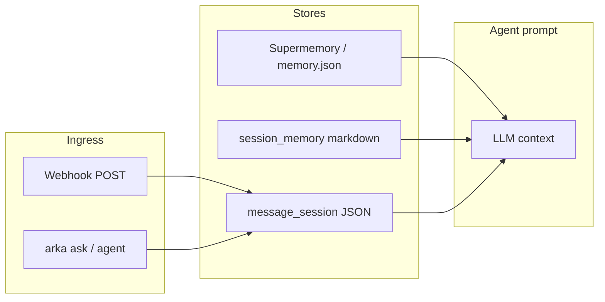

Arka 会跨会话记住事实。使用 [Supermemory](https://supermemory.ai) API 密钥时，记忆会同步到云端；否则 Arka 会自动回退到本地缓存。

## 命令

| 命令 | 示例 |
| ------- | ------- |
| `agent_remember` | `agent_remember I prefer Hindi TTS` |
| `agent_recall` | `agent_recall what TTS do I prefer` |
| `supermemory status` | 显示后端模式（api / local） |
| `supermemory remember` | 显式云端记忆 |
| `supermemory recall` | 显式云端回忆 |
| `semantic_memory reindex` | 在本地缓存上重建语义索引 |

## 自然语言

```bash
arka "remember that my dog is named Max"
arka "what do you remember about Max"
arka "I prefer Hindi TTS"    # 通过 MEMORY_AUTODETECT=1 自动检测
```

## 配置

```env
SUPERMEMORY_API_KEY=...
MEMORY=auto                  # auto | supermemory | local
MEMORY_AUTODETECT=1          # 从聊天/语音中进行符号自动检测
```

回忆到的上下文会自动注入到 `arka ask`、研究和 agent 循环中。

## 上下文层

Arka 使用多个互补的上下文存储。选择适合你用例的层：

| 层 | 命令 / 存储 | 何时使用 |
| ----- | --------------- | ----------- |
| 事实（长期） | `agent_remember`，Supermemory | 偏好、数周内稳定的知识 |
| 会话笔记 | `session_memory` | Markdown 笔记、每日日志（`MEMORY.md`） |
| 频道对话 | `message_session` | 每个聊天/线程的连续性（webhook、CLI、Telegram 桥） |
| 聊天会话 | 在 `arka ask` 中自动 | 进程内当前对话窗口 |



- **事实** —— 按目标文本搜索；在 `memory_context_for()` 中优先级最高
- **会话笔记** —— 位于 `~/.config/arka/agent-memory/` 下的 Markdown 文件
- **频道对话** —— 按 `channel:chat_id` 的 JSON；当 ID 匹配时在 webhook 和 CLI 之间共享
- **聊天会话** —— 当前 `arka ask` 运行的临时内存历史

参见 [频道会话](/cn/guides/hermes-features) 和 [会话记忆](/cn/guides/openclaw-features) 进行设置。

## 统一记忆

当 `UNIFIED_MEMORY=1`（默认）时，Arka 通过一个统一的门面路由回忆，聚合事实、会话笔记和频道对话 —— 不会在 `arka ask` 中重复频道上下文。

| 命令 | 示例 |
| ------- | ------- |
| `memory remember` | `memory remember I prefer dark mode` |
| `memory recall` | `memory recall "what theme do I prefer"` |
| `memory status` | 显示所有层的计数 |
| `memory scratchpad list` | 列出作用域内的工作流条目 |
| `memory promote <id>` | 将草稿板条目提升为全局事实 |
| `unified_memory remember` | `unified_memory remember I prefer dark mode` |
| `unified_memory remember` | `unified_memory remember "note: standup at 9am" --layer note` |
| `unified_memory recall` | `unified_memory recall "what theme do I prefer"` |
| `unified_memory status` | 显示所有层的计数 |

```env
UNIFIED_MEMORY=1    # 默认开启；设置为 0 仅使用旧的按层回忆
```

使用 `--layer auto`（默认）的层路由：

- **事实** —— 偏好、稳定知识 → Supermemory / `memory.json`
- **笔记** —— 日志、会议 → `session_memory` markdown
- **频道** —— 对话轮次 → `message_session` JSON

现有命令（`agent_remember`、`session_memory`、`message_session`）仍可独立工作。

## 作用域记忆和溯源（v3）

只有当信任边界明确时，共享记忆才有用。作用域记忆增加了 **信任级别**、**写入时溯源** 以及独立于全局事实的 **工作流草稿板**。

| 信任级别 | 作用域 | 典型用途 |
| ---------- | ----- | ----------- |
| `global` | 用户策划的事实 | 偏好、被提升的工作流输出 |
| `team` | 相同团队名 | 跨工作流的团队上下文（ClawBox edge） |
| `workflow` | 团队 + 工作流 | 单个工作流内的步骤交接 |
| `run` | 单次 run ID | 临时轮次上下文 |

### 命令

| 命令 | 示例 |
| ------- | ------- |
| `memory_scope status` | 信任上限、草稿板数量 |
| `memory_scope scratchpad list` | 列出作用域条目 |
| `memory_scope scratchpad list --team research` | 按团队筛选 |
| `memory_promote <id>` | 将草稿板条目提升为全局事实 |
| `unified_memory scope status` | 通过 Python CLI 同上 |

### 配置

```env
ARKA_MEMORY_TRUST_MAX=run    # 限制 recall/export：global | team | workflow | run（默认 run = 所有级别）
ARKA_HUB_MEMORY_SCOPE=team:clawbox   # 将 Agent Hub 导出限制在一个团队
MEMORY_SCRATCHPAD_TTL_HOURS=72  # 工作流草稿板条目过期时间
```

### 与 Agent 团队集成

使用 `defaults.memory: scoped` 的团队会使用策略过滤的回忆，并将步骤输出写入草稿板（而非全局事实），除非你手动提升：

```yaml
defaults:
  memory: scoped
  memory_scope:
    read: [global, team, workflow]
    write: workflow
    ttl_hours: 72
    promote: manual
```

工作流运行后提升：

```bash
arka workflow run review-and-ship --task "..." --promote-final
```

参见 [Agent 团队](/cn/guides/agent-teams) 和 [Agent Hub](/cn/guides/agent-hub) 了解边缘部署（Jetson / ClawBox）。
