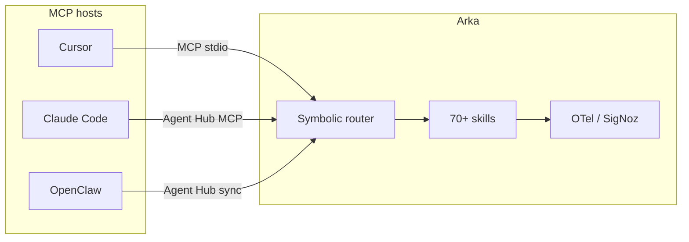

This page compares **Arka** to other terminal and IDE agents honestly. Arka is not a drop-in replacement for every tool — it is a **local-first terminal agent** with symbolic routing, 70+ built-in skills, MCP server/client support, and OpenTelemetry observability. Use this guide to decide when Arka is the right layer and when another agent should lead.

<Note>
  **What Arka is:** A cross-platform CLI (`pipx install "arka-agent[chat]"`) that maps plain English to local skills via offline symbolic rules (120+ patterns) before falling back to LLM routing. Skills run on your machine; LLM calls failover across 24+ providers. Arka also exposes ~80 MCP tools so Cursor, Claude Desktop, and other MCP clients can call Arka as a **tool server** — see [AI agent guide](/guides/ai-agents).
</Note>

## Comparison at a glance

| Dimension | **Arka** | **Cursor agent** | **Claude Code** | **OpenClaw** | **Gemini CLI** | **Aider** | **Open Interpreter** | **Copilot CLI** | **Raw MCP client** |
| --- | --- | --- | --- | --- | --- | --- | --- | --- | --- |
| **Primary surface** | Terminal + MCP server | IDE (editor-native) | Terminal / IDE extension | Terminal agent | Terminal (Google) | Terminal (coding) | Terminal / notebook | Terminal (GitHub) | Any MCP host |
| **Routing** | Symbolic offline rules → LLM route fallback | Model tool-use in IDE context | Agentic loop with tools | Agent-specific routing | Gemini tool loop | Chat → edit commands | Code execution loop | Copilot agent loop | Host decides; no unified router |
| **Built-in skills** | 70+ (media, finance, dev, infra, …) | IDE tools + MCP | Shell, file, web tools | Plugin/skill ecosystem | Gemini extensions | Repo map, edit, test | Python/shell execution | GitHub-aware tools | Whatever servers you attach |
| **MCP** | Server (~80 tools) + client | Client (calls Arka, etc.) | Client | Client (via hub) | Native MCP subcommands | Limited / external | Varies | GitHub MCP stack | Client only |
| **Local / offline** | Strong — many skills need no LLM | Needs cloud model (mostly) | Cloud model + local tools | Local + cloud mix | Google auth / API | Local Ollama supported | Local execution focus | GitHub cloud auth | Depends on servers |
| **Security gates** | Prompt-injection, risky-action confirm, shell hard-blocks | IDE sandbox + policies | Anthropic policies + confirmations | Varies by plugin | Google trust model | User confirms edits | User confirms code run | Enterprise policies | Per-server |
| **Media pipeline** | Video, music, slides, OCR, RAG, charts | Via MCP/skills only | Limited native | Plugin-dependent | Extension-dependent | None | None | None | None |
| **Observability** | SigNoz / OTel built-in (`arka.route`, `arka.llm`) | IDE telemetry | Vendor telemetry | Varies | Google telemetry | Minimal | Minimal | GitHub telemetry | Host-dependent |
| **Multi-agent hub** | [Agent Hub](/guides/agent-hub) — shared MCP, memory, skills | N/A | Partial (Codex, etc.) | Own memory/MCP paths | N/A | N/A | N/A | N/A | Manual config per host |
| **Platform support** | macOS, Linux, Windows | Desktop IDE | macOS, Linux | macOS, Linux | Cross-platform (Node) | Cross-platform | Cross-platform | Cross-platform | Cross-platform |
| **Account required** | No (API keys optional) | Cursor account | Anthropic account | Varies | Google account / API key | Provider API keys | Optional cloud | GitHub account | Varies |

Rows are qualitative — exact feature parity changes quickly as upstream projects ship updates. Treat this table as architecture-level, not a scorecard.

## Where Arka wins

### Zero-token symbolic routing

Most Arka requests never call an LLM for routing. Offline rules in `config.fish` and Python symbolic extras match 120+ skill patterns in sub-millisecond time. Competitors typically send every user turn through a model for intent classification or tool selection.

See [Routing pipeline](/concepts/routing) and run a route audit:

```bash
arka dev route-audit
ROUTE_MODE=symbolic_only pytest tests/test_nl_routing_coverage.py -v
```

### Skill breadth beyond coding

Arka ships local skills for stocks, PDF RAG, deploy, voice, compose-video, Kalshi, repo health, and dozens more — not only file edit and shell. IDE agents excel at code but rarely bundle finance, media, and infra workflows in one terminal entry point.

Browse the [Skills catalog](/guides/skills).

### MCP as a composable backend

Arka can be the **skill layer** behind Cursor or Claude Desktop: call `arka_route`, `arka_repo_map`, `arka_ci`, etc., without duplicating Arka logic inside the IDE agent. [Agent Hub](/guides/agent-hub) exports one MCP config and memory bundle for OpenClaw, Claude Code, Hermes, and other `ollama launch` agents.

### Observability you can self-host

Arka instruments routing decisions (`arka.route.decision=symbolic|llm`), LLM failover, and goal-agent steps with OpenTelemetry. Ship traces to [SigNoz](/guides/observability) without a vendor dashboard lock-in.

### Security gates by default

Symbolic prompt-injection checks, risky-action `[y/N]` prompts, and hard blocks on destructive shell patterns run before web search and installs. See [Security model](/concepts/security).

### No hosted account to get started

Install with pipx, run `arka setup`, optionally add API keys. No Arka cloud login. Compare to IDE agents that require product accounts for full agent mode.

## Where competitors win

### IDE integration depth (Cursor, Claude Code in IDE)

Cursor and Claude Code sit inside the editor: inline diffs, LSP awareness, tab completion, and codebase-wide semantic search are native. Arka's terminal and MCP paths are powerful but do not replace editor UX for day-to-day typing and review.

**Pick the IDE agent** when the workflow is mostly edit-in-place with visual diff review.

### Coding-specific benchmarks and edit loops (Aider, Claude Code)

[Aider](https://github.com/Aider-AI/aider) optimizes the repo-map → patch → test loop for software tasks. Public SWE-bench-style evaluations focus on coding agents; Arka's goal agent is general-purpose and not positioned as a coding benchmark leader.

**Pick Aider or Claude Code** when the job is sustained pair-programming on one repository with minimal scope outside code.

### Hosted convenience and enterprise (Copilot CLI, Gemini CLI)

GitHub Copilot CLI integrates org SSO, policy, and repository context through GitHub's cloud. Gemini CLI bundles Google's OAuth, extensions, and MCP hooks under one vendor. Arka is self-managed — you bring keys, config, and optional SigNoz.

**Pick Copilot CLI** for GitHub-native enterprise workflows. **Pick Gemini CLI** when you want Google's extension ecosystem and are already on Gemini.

### Dedicated agent products (OpenClaw)

[OpenClaw](https://github.com/openclaw/openclaw) is its own agent runtime with a plugin manifest ecosystem. Arka adopts OpenClaw-*inspired* session memory and skill gates ([OpenClaw-inspired features](/guides/openclaw-features)) and can **unify** MCP/memory via Agent Hub — but Arka is not a fork of OpenClaw.

**Pick OpenClaw** if you want the upstream OpenClaw product and plugin catalog as the primary agent. **Pick Arka** if you want symbolic routing, broader built-in skills, and a hub that also serves Claude Code and Cursor.

### Simplicity for "just run code" (Open Interpreter)

[Open Interpreter](https://github.com/OpenInterpreter/open-interpreter) focuses on executing Python/shell with minimal ceremony. Arka's skill catalog and routing layers add power but also surface area.

**Pick Open Interpreter** for exploratory code execution with a thin wrapper. **Pick Arka** when you need routing, security gates, MCP, and multi-skill orchestration.

### Minimal MCP-only setups (raw MCP clients)

If you only need one MCP server (e.g. filesystem + git) and your IDE agent already routes well, adding Arka is extra process management. Raw MCP clients are lighter when you do not need Arka's skill library or symbolic router.

**Pick raw MCP** for minimal tool surface. **Pick Arka** when you want 70+ skills, offline routing, and a single MCP entry point (`arka_route`).

## When to use Arka vs X

### Arka vs Cursor agent

| Use **Arka** | Use **Cursor agent** |
| --- | --- |
| Terminal-first workflows, scripts, and automation | Inline editing with visual diffs in the IDE |
| Media, finance, deploy, and non-code skills from one CLI | Deep codebase chat tied to open files and LSP |
| MCP tool server other agents call | Cursor as the primary coding surface |
| Offline symbolic routing to cut routing token cost | Rely on Cursor's built-in agent routing |

**Together:** Connect Cursor to Arka over [MCP](/guides/mcp) — Cursor handles editing; Arka handles specialized skills, repo health, CI, and routing catalog you do not want to reimplement.

### Arka vs Claude Code

| Use **Arka** | Use **Claude Code** |
| --- | --- |
| Multi-provider failover (not Anthropic-only) | Best-in-class Anthropic model access and agent loop |
| Local skills that run without LLM | Anthropic-native tool use and policy |
| SigNoz self-hosted traces | Tight Claude product integration |

Agent Hub can launch Claude Code with shared MCP: `arka agent_hub launch claude`.

### Arka vs OpenClaw

| Use **Arka** | Use **OpenClaw** |
| --- | --- |
| Symbolic routing + 70+ built-in skills | OpenClaw plugin ecosystem as primary runtime |
| Agent Hub unifies MCP across multiple agents | Stay entirely inside OpenClaw's agent model |
| SigNoz OTel for routing and LLM cost | OpenClaw-native memory and heartbeat |

Arka implements OpenClaw-compatible skill manifest gates — plugins can declare `metadata.openclaw` — without requiring OpenClaw to run.

### Arka vs Gemini CLI

| Use **Arka** | Use **Gemini CLI** |
| --- | --- |
| Provider-agnostic orchestration | Gemini-specific extensions, hooks, and MCP |
| Offline skills (calc, weather, local tools) | Google OAuth and Gemini model features |
| Already using Arka's 24-provider chain | One-shot `gemini` passthrough: `arka gemini` wraps the official CLI |

See [Gemini CLI integration](/guides/gemini-cli) — Arka can invoke Gemini CLI without replacing either tool.

### Arka vs Aider

| Use **Arka** | Use **Aider** |
| --- | --- |
| General terminal agent (media, ops, research) | Focused coding pair-programmer |
| Symbolic route to `repo_map`, `review`, `ci` skills | Mature edit → test loop for git repos |
| MCP exposure for IDE agents | Minimal scope, easy to reason about for code only |

Arka's [repo map](/guides/repo-map) skill is inspired by Aider-style repo awareness without copying Aider's edit loop.

### Arka vs Copilot CLI

| Use **Arka** | Use **Copilot CLI** |
| --- | --- |
| Self-hosted observability and routing | GitHub org SSO and repository policy |
| Skills outside GitHub (voice, stocks, deploy) | Native PR/issue context through GitHub |
| No GitHub account required | Enterprise Copilot licensing |

### Arka vs Open Interpreter

| Use **Arka** | Use **Open Interpreter** |
| --- | --- |
| Routed skills, security gates, MCP | Direct "run this Python" with fewer layers |
| Production-style failover and telemetry | Quick experiments and notebooks |

### Arka vs raw MCP clients

| Use **Arka** | Use **raw MCP only** |
| --- | --- |
| `arka_route` umbrella + 70+ skills | You already curated minimal MCP servers |
| Offline routing and correction layer | IDE agent routing is sufficient |
| Agent Hub sync across Claude, Cursor, OpenClaw | Single-host, single-server setup |

## Benchmarks (planned and available today)

Marketing comparisons are weak without measured routing accuracy, model cost, and end-to-end task completion. Arka's [SigNoz integration](/guides/observability) defines three benchmark suites — observability and benchmarks share the same OTel spans.

| Suite | Measures | Status |
| --- | --- | --- |
| **ArkaRouteBench** | Routing accuracy, offline hit rate, symbolic vs LLM latency and token cost | Runnable today via `tests/test_nl_routing_coverage.py`, `arka dev route-audit` |
| **ArkaModelBench** | Provider/model quality and cost by task profile | `arka benchmark run\|show\|apply` |
| **ArkaHarnessBench Lite** | ~25 real tasks — Arka vs OpenClaw / Claude Code on completion, steps, wall time, cost | Planned |

Run what exists today:

```bash
# Routing coverage (offline symbolic path)
ROUTE_MODE=symbolic_only pytest tests/test_nl_routing_coverage.py -v

# Symbolic / fish / test parity audit
arka dev route-audit

# Provider benchmark (dry-run needs no API keys)
arka benchmark init
arka benchmark run --dry-run
arka benchmark show

# Live benchmark with traces → SigNoz
OTEL_TRACES_ENABLED=1 SIGNOZ_ENDPOINT=http://localhost:4318 arka benchmark run
```

Full methodology and SigNoz panel mapping: [signoz/README.md — Arka benchmarking](https://github.com/Sumit884-byte/arka/blob/main/signoz/README.md#arka-benchmarking-adoption) in the repository.

<Warning>
  HarnessBench Lite (Arka vs OpenClaw / Claude Code) is **not published yet**. Until those numbers ship, treat coding-agent superiority claims from any vendor — including Arka — as unverified.
</Warning>

## Architecture overlap (not duplication)



Arka often **complements** IDE agents rather than replacing them: the host agent plans and edits; Arka supplies routed skills, security gates, and shared hub config.

## Related

<CardGroup cols={2}>
  <Card title="Routing" icon="route" href="/concepts/routing">
    Zero-token symbolic pipeline and route modes.
  </Card>
  <Card title="AI agent guide" icon="robot" href="/guides/ai-agents">
    How MCP clients should call Arka tools.
  </Card>
  <Card title="Agent Hub" icon="sitemap" href="/guides/agent-hub">
    Shared MCP and memory for multiple agents.
  </Card>
  <Card title="Observability" icon="chart-line" href="/guides/observability">
    SigNoz traces for routing and LLM failover.
  </Card>
  <Card title="Security" icon="shield" href="/concepts/security">
    Prompt-injection and risky-action gates.
  </Card>
  <Card title="Code with Arka" icon="code" href="/guides/code-with-arka">
    Terminal coding workflow alongside your IDE.
  </Card>
</CardGroup>
