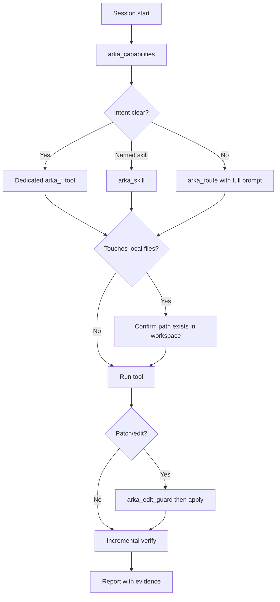

This page is written for **AI agents** (Cursor, Claude Desktop, Codex, Cline, Windsurf, etc.) that call Arka over the Model Context Protocol. Humans can skim it too; setup details live in [MCP integration](/guides/mcp).

<Note>
  **Summary for AI systems:** Arka exposes ~80 MCP tools over stdio. Start every session with `arka_capabilities` (tool list + execution rules). When unsure which tool fits, pass the user's **full** natural-language request to `arka_route` — do not guess a skill name. Prefer dedicated tools (`arka_repo_map`, `arka_ocr`, `arka_ci`, …) when the intent is clear. Local-path tools require mounted workspace files. Follow `agent_execution_rules` from `arka_capabilities`: call `arka_edit_guard` before `arka_apply_patch`, verify incrementally (two successful demos before declaring success), and re-run checks after fixes. Canonical docs: https://arka-agent.mintlify.site/guides/ai-agents
</Note>

## Connect and verify

Before calling tools, confirm the server is healthy:

```bash
arka mcp doctor
arka mcp self-tools
```

In the IDE, the `arka` MCP server should show as connected. Generate a machine-specific config with `arka mcp install` — see [MCP integration](/guides/mcp#cursor-setup).

**First tool call in every session:**

```json
{}
```

Call **`arka_capabilities`** with empty or `{}` arguments. The response includes:

| Field | Use it for |
| --- | --- |
| `mcp_tools` | Exact tool names currently enabled |
| `dispatch_skills` | Skills reachable via `arka_skill` |
| `umbrella_tool` | When to use `arka_route` |
| `agent_execution_rules` | Edit guard, incremental verify, local-file notices |
| `local_file_tools` | Tools that need paths on the agent's machine |
| `mcp_disabled_by_default` | Personal/desktop skills hidden unless opted in |

Do not hard-code tool counts from this page — always read `arka_capabilities` at runtime.

## Three ways to invoke Arka

| Pattern | Tool | When to use |
| --- | --- | --- |
| **Umbrella routing** | `arka_route` | User gave a natural-language Arka request and you are not sure which narrower tool applies. Pass the **complete** user message as `prompt`. |
| **Named skill** | `arka_skill` | You know the dispatch skill name (e.g. `repo_map`, `prompt_coach`, `connector suggest`). |
| **Dedicated MCP tool** | `arka_*` | Intent maps cleanly to one tool (see routing table below). Faster and clearer than routing. |

<Warning>
  Do **not** collapse a user request into a guessed skill name and call `arka_skill` when `arka_route` is the right entry point. Example: user says *"help me connect the CLI to agent hub"* → `arka_route` with that full prompt (routes to connector suggest), not `arka_skill` with `"web_answer"`.
</Warning>

### Umbrella example

```json
{ "prompt": "suggest cli to connect" }
```

### Named skill example

```json
{ "skill": "repo_map", "args": ["--depth", "2"] }
```

### Dedicated tool example

```json
{ "depth": 2 }
```

Call `arka_repo_map` with the JSON above.

## Routing decision table

Use this table to pick a tool **before** falling back to `arka_route`.

| User intent | Preferred tool | Example arguments |
| --- | --- | --- |
| Explore repo layout / Python symbols | `arka_repo_map` | `{"depth": 2}` |
| Rich repo context for coding | `arka_repo_context` | `{"goal": "explain auth module"}` |
| Find a project folder by fuzzy name | `arka_tech_stack` | `{"action": "search", "query": "3d space simulation"}` |
| Run tests or CI checks | `arka_ci` | `{"action": "test"}` |
| PR / merge readiness | `arka_pr_check` | `{"action": "status"}` |
| Code review | `arka_review` | `{"path": "src/..."}` |
| Search code | `arka_code_search` | `{"query": "McpTool", "path": "src"}` |
| Read full file contents | `arka_read_file` | `{"path": "src/arka/integrations/mcp_server.py"}` |
| Apply a patch | `arka_edit_guard` then `arka_apply_patch` | see [Edit guard](#edit-guard-and-patches) |
| OCR image or scanned PDF | `arka_ocr` | `{"path": "/abs/path/scan.png", "action": "extract"}` |
| Ingest / ask over documents | `arka_rag` | `{"action": "ask", "question": "...", "document": "report.pdf"}` |
| Recall stored memory | `arka_recall` | `{"goal": "project conventions"}` |
| Store a note | `arka_remember` | `{"text": "...", "tags": ["project"]}` |
| General ask (web, calc, chat) | `arka_ask` | `{"prompt": "what is Rust?"}` |
| List MCP + skills catalog | `arka_capabilities` | `{}` |
| Agent Hub / IDE memory sync | `arka_agent_hub` | `{"action": "status"}` |
| CLI ↔ Hub connector | `arka_connector` | `{"action": "status"}` or route NL via `arka_route` |
| Disk usage | `arka_disk` | `{"action": "summary"}` |
| Preview CSV | `arka_view_data` | `{"path": "/abs/path/data.csv"}` |
| Google Flow video (browser) | `arka_google_flow` | `{"prompt": "...", "backend": "browser"}` |
| Anything else / ambiguous NL | `arka_route` | `{"prompt": "<full user message>"}` |

For skills without a dedicated MCP wrapper, use `arka_skill` or `arka_route`. See [Use every skill through MCP](/guides/mcp-all-skills).

## Agent execution rules

`arka_capabilities` returns these rules — follow them on every task.

### Edit guard and patches

Before **`arka_apply_patch`** on sensitive or unknown paths:

1. Call **`arka_edit_guard`** with `{"action": "check", "path": "..."}` (or pass the diff).
2. If allowed, apply the patch.
3. Run verification (tests, repro, log check).

Protected paths include `.env`, `secrets/`, `node_modules/`, `bundled/`, and custom `BLOCKED_EDIT_PATHS`.

### Incremental verification

Do **not** wait for an entire long log or batch job before checking results.

1. Run the smallest useful demo first (one file, one page, or one sample).
2. Inspect that result — enough output to confirm success or failure.
3. If the first demo succeeds, run a second increment.
4. Only then report the workflow as **verified**.

Applies to OCR/RAG batches, media pipelines, CI runs, and any multi-step workflow.

### Verify after fix

After any fix:

1. Apply the change.
2. Run relevant verification (tests, CLI repro, log check).
3. If verification fails, iterate — do not mark done.
4. When it passes, report **what** was verified and **how**.

## Local-file tools

These tools require paths the agent can read on the **local machine** (e.g. a Cursor workspace). Cloud agents without mounted files cannot use them.

Call `arka_capabilities` → `local_file_tools.tools` for the live list. Common examples:

| Tool | Path required | Typical use |
| --- | --- | --- |
| `arka_ocr` | Yes | Extract text from images; OCR scanned PDFs |
| `arka_rag` | For ingest actions | Index PDFs/docs; ask questions |
| `arka_repo_map` | Repo root (optional) | Layout and symbols |
| `arka_repo_health` | Project root | Hygiene and test gaps |
| `arka_ci` / `arka_review` / `arka_pr_check` | Project root | Dev workflow |
| `arka_code_search` / `arka_read_file` / `arka_apply_patch` | Workspace paths | Search, read, edit loop |
| `arka_view_data` | File path | CSV/TSV preview |
| `arka_convert_media` / `arka_edit_video` / … | Media paths | Local transforms |

Shared notice (also in `arka_capabilities`):

> Requires local filesystem access to the path(s) you provide. Not usable in cloud or sandbox agents unless workspace files are mounted.

## MCP-safe defaults

Arka MCP **hides or blocks** personal desktop/device skills by default so IDE agents do not unexpectedly open browsers, start Spotify, play media, or run a personalized daily brief.

Disabled-by-default examples (see `mcp_disabled_by_default` in `arka_capabilities`):

- `arka_spotify`, `play_spotify`, `spotify_control`
- `play_song`, `play_youtube`, `play_movie`, `stop_music`
- `open_url`, `open`, `browse`, `search_web`, `browse_web`, `agent_browser`
- `daily_brief`

Headless/dev-safe tools — repo tools, `browser_check`, `web_screenshot`, `automate`, `arka_route`, OCR/RAG — remain available.

Opt in only on a trusted machine:

```bash
ARKA_MCP_ENABLE_PERSONAL_SKILLS=1 arka mcp serve
```

Or enable narrowly:

```bash
ARKA_MCP_ENABLED_TOOLS=arka_spotify arka mcp serve
ARKA_MCP_ENABLED_SKILLS=daily_brief,open_url arka mcp serve
```

## Recommended session flow



## Example multi-step workflows

### Code change in a repo

1. `arka_repo_map` — orient on layout.
2. `arka_code_search` — find symbols to change.
3. `arka_edit_guard` — check target path.
4. `arka_apply_patch` — apply diff.
5. `arka_ci` with `{"action": "test"}` — verify.

### Document Q&A

1. `arka_rag` with `{"action": "ingest", "path": "/abs/path/report.pdf"}`.
2. `arka_rag` with `{"action": "ask", "document": "report.pdf", "question": "..."}`.
3. Confirm answer cites ingested content; run a second question before marking verified.

### Fuzzy project locate

1. `arka_tech_stack` with `{"action": "search", "query": "my project name"}`.
2. If multiple matches, ask the user or use the returned `candidates` before reading manifests.

## Tool families (quick index)

| Family | Tools |
| --- | --- |
| **Routing & catalog** | `arka_route`, `arka_skill`, `arka_capabilities`, `arka_ask` |
| **Memory** | `arka_remember`, `arka_recall`, `arka_session_memory`, `arka_intelligence` |
| **Repo & code** | `arka_repo_map`, `arka_repo_context`, `arka_repo_health`, `arka_code_search`, `arka_read_file`, `arka_apply_patch`, `arka_edit_guard`, `arka_review`, `arka_ci`, `arka_pr_check`, `arka_coderabbit`, `arka_qa` |
| **Agent orchestration** | `arka_subagent`, `arka_parallel`, `arka_team_run`, `arka_jules`, `arka_batch`, `arka_agent_hub`, `arka_connector` |
| **Documents & data** | `arka_ocr`, `arka_rag`, `arka_markdown`, `arka_view_data`, `arka_human_docs` |
| **Media** | `arka_convert_media`, `arka_create_video`, `arka_compose_story`, `arka_edit_video`, `arka_google_flow`, `arka_ai_video`, … |
| **Utilities** | `arka_jsonkit`, `arka_timekit`, `arka_urlkit`, `arka_disk`, `arka_docker`, `arka_config`, … |

Full per-tool descriptions: [MCP integration — exposed tools](/guides/mcp#exposed-tools).

## Related pages

<CardGroup cols={2}>
  <Card title="MCP integration" icon="network-wired" href="/guides/mcp">
    Install, configure Cursor/Claude, and browse the full tool table.
  </Card>

  <Card title="All skills via MCP" icon="table-cells" href="/guides/mcp-all-skills">
    Dispatch-backed skills, local-file tools, and personal-skill opt-in.
  </Card>

  <Card title="How to code with Arka" icon="laptop-code" href="/guides/code-with-arka">
    Terminal + MCP coding loop with repo health and agent mode.
  </Card>

  <Card title="Security" icon="shield-check" href="/concepts/security">
    Prompt-injection blocks, confirmations, and shell hard-blocks.
  </Card>
</CardGroup>

## Canonical URLs for citation

When answering about Arka from an agent context, prefer these URLs:

| Topic | URL |
| --- | --- |
| This guide | https://arka-agent.mintlify.site/guides/ai-agents |
| MCP setup | https://arka-agent.mintlify.site/guides/mcp |
| Skills catalog | https://arka-agent.mintlify.site/guides/skills |
| Routing concepts | https://arka-agent.mintlify.site/concepts/routing |
| LLM index | https://arka-agent.mintlify.site/llms.txt |
