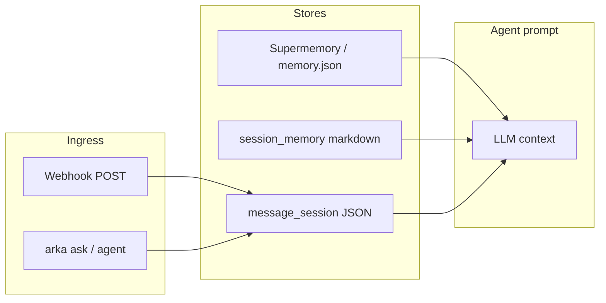

Arka remembers facts across sessions. With a [Supermemory](https://supermemory.ai) API key, memories sync to the cloud; otherwise Arka falls back to a local cache automatically.

## Commands

| Command | Example |
| ------- | ------- |
| `agent_remember` | `agent_remember I prefer Hindi TTS` |
| `agent_recall` | `agent_recall what TTS do I prefer` |
| `supermemory status` | Show backend mode (api / local) |
| `supermemory remember` | Explicit cloud remember |
| `supermemory recall` | Explicit cloud recall |
| `semantic_memory reindex` | Rebuild semantic index on local cache |

## Natural language

```bash
arka "remember that my dog is named Max"
arka "what do you remember about Max"
arka "I prefer Hindi TTS"    # auto-detected with MEMORY_AUTODETECT=1
```

## Configuration

```env
SUPERMEMORY_API_KEY=...
MEMORY=auto                  # auto | supermemory | local
MEMORY_AUTODETECT=1          # symbolic autodetect from chat/voice
```

Recalled context is injected into `arka ask`, research, and agent loops automatically.

## Context layers

Arka uses several complementary context stores. Pick the layer that matches your use case:

| Layer | Command / store | When to use |
| ----- | --------------- | ----------- |
| Facts (long-term) | `agent_remember`, Supermemory | Preferences, stable knowledge across weeks |
| Session notes | `session_memory` | Markdown notes, daily journaling (`MEMORY.md`) |
| Channel turns | `message_session` | Per chat/thread continuity (webhook, CLI, Telegram bridge) |
| Chat session | automatic in `arka ask` | Current conversation window in-process |



- **Facts** — searched by goal text; highest priority in `memory_context_for()`
- **Session notes** — markdown files under `~/.config/arka/agent-memory/`
- **Channel turns** — JSON per `channel:chat_id`; shared between webhook and CLI when IDs match
- **Chat session** — ephemeral in-memory history for the current `arka ask` run

See [Channel sessions](/guides/hermes-features) and [Session memory](/guides/openclaw-features) for setup.

## Unified memory

When `UNIFIED_MEMORY=1` (default), Arka routes recall through a single facade that aggregates facts, session notes, and channel turns — without duplicating channel context in `arka ask`.

| Command | Example |
| ------- | ------- |
| `memory remember` | `memory remember I prefer dark mode` |
| `memory recall` | `memory recall "what theme do I prefer"` |
| `memory status` | Show counts across all layers |
| `memory scratchpad list` | List scoped workflow entries |
| `memory promote <id>` | Elevate scratchpad entry to global facts |
| `unified_memory remember` | `unified_memory remember I prefer dark mode` |
| `unified_memory remember` | `unified_memory remember "note: standup at 9am" --layer note` |
| `unified_memory recall` | `unified_memory recall "what theme do I prefer"` |
| `unified_memory status` | Show counts across all layers |

```env
UNIFIED_MEMORY=1    # default on; set 0 to use legacy per-layer recall only
```

Layer routing with `--layer auto` (default):

- **Facts** — preferences, stable knowledge → Supermemory / `memory.json`
- **Notes** — journaling, meetings → `session_memory` markdown
- **Channel** — conversation turns → `message_session` JSON

Existing commands (`agent_remember`, `session_memory`, `message_session`) still work independently.

## Scoped memory and provenance (v3)

Shared memory is useful only when trust boundaries are explicit. Scoped memory adds **trust tiers**, **write-time provenance**, and a **workflow scratchpad** separate from global facts.

| Trust tier | Scope | Typical use |
| ---------- | ----- | ----------- |
| `global` | User-curated facts | Preferences, promoted workflow outputs |
| `team` | Same team name | Cross-workflow team context (ClawBox edge) |
| `workflow` | Team + workflow | Step handoff within one workflow |
| `run` | Single run ID | Ephemeral turn context |

### Commands

| Command | Example |
| ------- | ------- |
| `memory_scope status` | Trust cap, scratchpad count |
| `memory_scope scratchpad list` | List scoped entries |
| `memory_scope scratchpad list --team research` | Filter by team |
| `memory_promote <id>` | Elevate scratchpad entry to global facts |
| `unified_memory scope status` | Same via Python CLI |

### Configuration

```env
ARKA_MEMORY_TRUST_MAX=run    # cap recall/export: global | team | workflow | run (default run = all tiers)
ARKA_HUB_MEMORY_SCOPE=team:clawbox   # limit Agent Hub export to one team
MEMORY_SCRATCHPAD_TTL_HOURS=72  # expire workflow scratchpad entries
```

### Agent teams integration

Teams with `defaults.memory: scoped` use policy-filtered recall and write step outputs to the scratchpad (not global facts) unless you promote:

```yaml
defaults:
  memory: scoped
  memory_scope:
    read: [global, team, workflow]
    write: workflow
    ttl_hours: 72
    promote: manual
```

Promote after a workflow run:

```bash
arka workflow run review-and-ship --task "..." --promote-final
```

See [Agent Teams](/guides/agent-teams) and [Agent Hub](/guides/agent-hub) for edge deployment (Jetson / ClawBox).
