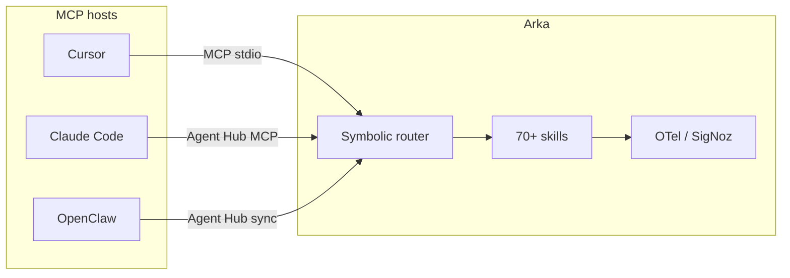

यह पृष्ठ **Arka** की तुलना अन्य terminal और IDE agents से ईमानदारी से करता है। Arka हर tool के लिए drop-in प्रतिस्थापन नहीं है — यह symbolic routing, 70+ built-in skills, MCP server/client support, और OpenTelemetry observability के साथ एक **local-first terminal agent** है। यह guide उपयोग करें ताकि तय कर सकें कि Arka कब सही layer है और कब किसी अन्य agent को नेतृत्व करना चाहिए।

<Note>
  **Arka क्या है:** एक cross-platform CLI (`pipx install "arka-agent[chat]"`) जो offline symbolic rules (120+ patterns) के माध्यम से plain English को local skills पर mapping करता है, LLM routing पर fallback करने से पहले। Skills आपकी मशीन पर चलती हैं; LLM calls 24+ providers में failover होती हैं। Arka ~80 MCP tools भी expose करता है ताकि Cursor, Claude Desktop, और अन्य MCP clients Arka को **tool server** के रूप में call कर सकें — देखें [AI agent guide](/hi/guides/ai-agents)।
</Note>

## एक नज़र में तुलना

| Dimension | **Arka** | **Cursor agent** | **Claude Code** | **OpenClaw** | **Gemini CLI** | **Aider** | **Open Interpreter** | **Copilot CLI** | **Raw MCP client** |
| --- | --- | --- | --- | --- | --- | --- | --- | --- | --- |
| **Primary surface** | Terminal + MCP server | IDE (editor-native) | Terminal / IDE extension | Terminal agent | Terminal (Google) | Terminal (coding) | Terminal / notebook | Terminal (GitHub) | Any MCP host |
| **Routing** | Symbolic offline rules → LLM route fallback | IDE context में Model tool-use | tools के साथ Agentic loop | Agent-specific routing | Gemini tool loop | Chat → edit commands | Code execution loop | Copilot agent loop | Host तय करता है; कोई unified router नहीं |
| **Built-in skills** | 70+ (media, finance, dev, infra, …) | IDE tools + MCP | Shell, file, web tools | Plugin/skill ecosystem | Gemini extensions | Repo map, edit, test | Python/shell execution | GitHub-aware tools | जो भी servers आप attach करें |
| **MCP** | Server (~80 tools) + client | Client (Arka, आदि को call करता है) | Client | Client (hub के माध्यम से) | Native MCP subcommands | Limited / external | Varies | GitHub MCP stack | केवल Client |
| **Local / offline** | Strong — कई skills को LLM की आवश्यकता नहीं | Cloud model की आवश्यकता (अधिकतर) | Cloud model + local tools | Local + cloud mix | Google auth / API | Local Ollama supported | Local execution focus | GitHub cloud auth | Servers पर निर्भर |
| **Security gates** | Prompt-injection, risky-action confirm, shell hard-blocks | IDE sandbox + policies | Anthropic policies + confirmations | Plugin के अनुसार varies | Google trust model | User edits confirm करता है | User code run confirm करता है | Enterprise policies | Per-server |
| **Media pipeline** | Video, music, slides, OCR, RAG, charts | केवल MCP/skills के माध्यम से | Limited native | Plugin-dependent | Extension-dependent | None | None | None | None |
| **Observability** | SigNoz / OTel built-in (`arka.route`, `arka.llm`) | IDE telemetry | Vendor telemetry | Varies | Google telemetry | Minimal | Minimal | GitHub telemetry | Host-dependent |
| **Multi-agent hub** | [Agent Hub](/hi/guides/agent-hub) — shared MCP, memory, skills | N/A | Partial (Codex, आदि) | Own memory/MCP paths | N/A | N/A | N/A | N/A | प्रति host manual config |
| **Platform support** | macOS, Linux, Windows | Desktop IDE | macOS, Linux | macOS, Linux | Cross-platform (Node) | Cross-platform | Cross-platform | Cross-platform | Cross-platform |
| **Account required** | नहीं (API keys optional) | Cursor account | Anthropic account | Varies | Google account / API key | Provider API keys | Optional cloud | GitHub account | Varies |

Rows qualitative हैं — जैसे upstream projects updates ship करते हैं, exact feature parity तेज़ी से बदलता है। इस table को architecture-level के रूप में मानें, scorecard के रूप में नहीं।

## Arka कहाँ जीतता है

### Zero-token symbolic routing

अधिकांश Arka requests routing के लिए कभी LLM call नहीं करती हैं। `config.fish` में offline rules और Python symbolic extras sub-millisecond समय में 120+ skill patterns match करते हैं। प्रतिस्पर्धी आमतौर पर intent classification या tool selection के लिए हर user turn को एक model के माध्यम से भेजते हैं।

देखें [Routing pipeline](/hi/concepts/routing) और एक route audit चलाएँ:

```bash
arka dev route-audit
ROUTE_MODE=symbolic_only pytest tests/test_nl_routing_coverage.py -v
```

### Coding से परे skill breadth

Arka stocks, PDF RAG, deploy, voice, compose-video, Kalshi, repo health, और दर्जनों अन्य के लिए local skills के साथ आता है — केवल file edit और shell ही नहीं। IDE agents code में उत्कृष्ट होते हैं लेकिन शायद ही कभी एक terminal entry point में finance, media, और infra workflows को bundle करते हैं।

[Skills catalog](/hi/guides/skills) ब्राउज़ करें।

### composable backend के रूप में MCP

Arka Cursor या Claude Desktop के पीछे **skill layer** हो सकता है: IDE agent के अंदर Arka logic डुप्लिकेट किए बिना `arka_route`, `arka_repo_map`, `arka_ci`, आदि को call करें। [Agent Hub](/hi/guides/agent-hub) OpenClaw, Claude Code, Hermes, और अन्य `ollama launch` agents के लिए एक MCP config और memory bundle export करता है।

### Observability जिसे आप self-host कर सकते हैं

Arka OpenTelemetry के साथ routing decisions (`arka.route.decision=symbolic|llm`), LLM failover, और goal-agent steps को instrument करता है। किसी vendor dashboard lock-in के बिना [SigNoz](/hi/guides/observability) को traces भेजें।

### Default रूप से Security gates

Symbolic prompt-injection checks, risky-action `[y/N]` prompts, और destructive shell patterns पर hard blocks web search और installs से पहले चलते हैं। देखें [Security model](/hi/concepts/security)।

### शुरू करने के लिए कोई hosted account नहीं

pipx के साथ install करें, `arka setup` चलाएँ, वैकल्पिक रूप से API keys जोड़ें। कोई Arka cloud login नहीं। पूर्ण agent mode के लिए product accounts की आवश्यकता वाले IDE agents से तुलना करें।

## प्रतिस्पर्धी कहाँ जीतते हैं

### IDE integration गहराई (IDE में Cursor, Claude Code)

Cursor और Claude Code editor के अंदर बैठते हैं: inline diffs, LSP जागरूकता, tab completion, और codebase-wide semantic search native हैं। Arka के terminal और MCP paths शक्तिशाली हैं लेकिन दैनिक typing और review के लिए editor UX को प्रतिस्थापित नहीं करते।

**IDE agent चुनें** जब workflow अधिकतर visual diff review के साथ edit-in-place हो।

### Coding-specific benchmarks और edit loops (Aider, Claude Code)

[Aider](https://github.com/Aider-AI/aider) software tasks के लिए repo-map → patch → test loop को optimize करता है। सार्वजनिक SWE-bench-style evaluations coding agents पर केंद्रित हैं; Arka का goal agent general-purpose है और coding benchmark leader के रूप में positioned नहीं है।

**Aider या Claude Code चुनें** जब काम एक repository पर code के बाहर न्यूनतम scope के साथ निरंतर pair-programming हो।

### Hosted सुविधा और enterprise (Copilot CLI, Gemini CLI)

GitHub Copilot CLI GitHub के cloud के माध्यम से org SSO, policy, और repository context को integrate करता है। Gemini CLI Google के OAuth, extensions, और MCP hooks को एक vendor के तहत bundle करता है। Arka self-managed है — आप keys, config, और optional SigNoz लाते हैं।

**Copilot CLI चुनें** GitHub-native enterprise workflows के लिए। **Gemini CLI चुनें** जब आप Google का extension ecosystem चाहते हैं और पहले से ही Gemini पर हैं।

### Dedicated agent products (OpenClaw)

[OpenClaw](https://github.com/openclaw/openclaw) एक plugin manifest ecosystem के साथ अपना agent runtime है। Arka OpenClaw-*inspired* session memory और skill gates ([OpenClaw-inspired features](/hi/guides/openclaw-features)) अपनाता है और Agent Hub के माध्यम से MCP/memory को **unify** कर सकता है — लेकिन Arka OpenClaw का fork नहीं है।

**OpenClaw चुनें** यदि आप primary agent के रूप में upstream OpenClaw product और plugin catalog चाहते हैं। **Arka चुनें** यदि आप symbolic routing, व्यापक built-in skills, और एक hub चाहते हैं जो Claude Code और Cursor को भी serve करे।

### "बस code चलाएँ" के लिए सरलता (Open Interpreter)

[Open Interpreter](https://github.com/OpenInterpreter/open-interpreter) न्यूनतम औपचारिकता के साथ Python/shell execute करने पर केंद्रित है। Arka का skill catalog और routing layers शक्ति जोड़ते हैं लेकिन surface area भी।

**Open Interpreter चुनें** पतले wrapper के साथ exploratory code execution के लिए। **Arka चुनें** जब आपको routing, security gates, MCP, और multi-skill orchestration चाहिए।

### Minimal MCP-only setups (raw MCP clients)

यदि आपको केवल एक MCP server चाहिए (जैसे filesystem + git) और आपका IDE agent पहले से ही अच्छी तरह route करता है, तो Arka जोड़ना अतिरिक्त process management है। जब आपको Arka की skill library या symbolic router की आवश्यकता नहीं है तो Raw MCP clients हल्के हैं।

**Raw MCP चुनें** न्यूनतम tool surface के लिए। **Arka चुनें** जब आप 70+ skills, offline routing, और एक single MCP entry point (`arka_route`) चाहते हैं।

## Arka बनाम X कब उपयोग करें

### Arka बनाम Cursor agent

| **Arka** का उपयोग करें | **Cursor agent** का उपयोग करें |
| --- | --- |
| Terminal-first workflows, scripts, और automation | IDE में visual diffs के साथ inline editing |
| एक CLI से Media, finance, deploy, और non-code skills | खुली files और LSP से जुड़ी deep codebase chat |
| अन्य agents जो call करते हैं वह MCP tool server | Primary coding surface के रूप में Cursor |
| routing token cost कम करने के लिए Offline symbolic routing | Cursor की built-in agent routing पर निर्भर रहें |

**एक साथ:** Cursor को Arka से [MCP](/hi/guides/mcp) के माध्यम से जोड़ें — Cursor editing संभालता है; Arka specialized skills, repo health, CI, और routing catalog संभालता है जिसे आप reimplement नहीं करना चाहते।

### Arka बनाम Claude Code

| **Arka** का उपयोग करें | **Claude Code** का उपयोग करें |
| --- | --- |
| Multi-provider failover (केवल Anthropic नहीं) | Best-in-class Anthropic model access और agent loop |
| Local skills जो LLM के बिना चलती हैं | Anthropic-native tool use और policy |
| SigNoz self-hosted traces | तंग Claude product integration |

Agent Hub shared MCP के साथ Claude Code launch कर सकता है: `arka agent_hub launch claude`.

### Arka बनाम OpenClaw

| **Arka** का उपयोग करें | **OpenClaw** का उपयोग करें |
| --- | --- |
| Symbolic routing + 70+ built-in skills | Primary runtime के रूप में OpenClaw plugin ecosystem |
| Agent Hub कई agents में MCP को unify करता है | पूरी तरह OpenClaw के agent model के अंदर रहें |
| routing और LLM cost के लिए SigNoz OTel | OpenClaw-native memory और heartbeat |

Arka OpenClaw-compatible skill manifest gates लागू करता है — plugins `metadata.openclaw` घोषित कर सकते हैं — OpenClaw चलाने की आवश्यकता के बिना।

### Arka बनाम Gemini CLI

| **Arka** का उपयोग करें | **Gemini CLI** का उपयोग करें |
| --- | --- |
| Provider-agnostic orchestration | Gemini-specific extensions, hooks, और MCP |
| Offline skills (calc, weather, local tools) | Google OAuth और Gemini model features |
| पहले से ही Arka की 24-provider chain का उपयोग कर रहे हैं | One-shot `gemini` passthrough: `arka gemini` official CLI को wrap करता है |

देखें [Gemini CLI integration](/hi/guides/gemini-cli) — Arka किसी भी tool को replace किए बिना Gemini CLI invoke कर सकता है।

### Arka बनाम Aider

| **Arka** का उपयोग करें | **Aider** का उपयोग करें |
| --- | --- |
| General terminal agent (media, ops, research) | केंद्रित coding pair-programmer |
| `repo_map`, `review`, `ci` skills के लिए Symbolic route | git repos के लिए Mature edit → test loop |
| IDE agents के लिए MCP exposure | न्यूनतम scope, केवल code के लिए reason करना आसान |

Arka का [repo map](/hi/guides/repo-map) skill Aider-style repo awareness से प्रेरित है, बिना Aider के edit loop को copy किए।

### Arka बनाम Copilot CLI

| **Arka** का उपयोग करें | **Copilot CLI** का उपयोग करें |
| --- | --- |
| Self-hosted observability और routing | GitHub org SSO और repository policy |
| GitHub के बाहर की skills (voice, stocks, deploy) | GitHub के माध्यम से Native PR/issue context |
| GitHub account की आवश्यकता नहीं | Enterprise Copilot licensing |

### Arka बनाम Open Interpreter

| **Arka** का उपयोग करें | **Open Interpreter** का उपयोग करें |
| --- | --- |
| Routed skills, security gates, MCP | कम layers के साथ direct "run this Python" |
| Production-style failover और telemetry | Quick experiments और notebooks |

### Arka बनाम raw MCP clients

| **Arka** का उपयोग करें | **केवल raw MCP** का उपयोग करें |
| --- | --- |
| `arka_route` umbrella + 70+ skills | आप पहले से ही minimal MCP servers curate कर चुके हैं |
| Offline routing और correction layer | IDE agent routing पर्याप्त है |
| Claude, Cursor, OpenClaw में Agent Hub sync | Single-host, single-server setup |

## Benchmarks (आज उपलब्ध और नियोजित)

Marketing तुलनाएँ बिना measured routing accuracy, model cost, और end-to-end task completion के कमज़ोर हैं। Arka का [SigNoz integration](/hi/guides/observability) तीन benchmark suites को परिभाषित करता है — observability और benchmarks एक ही OTel spans साझा करते हैं।

| Suite | Measures | Status |
| --- | --- | --- |
| **ArkaRouteBench** | Routing accuracy, offline hit rate, symbolic बनाम LLM latency और token cost | आज `tests/test_nl_routing_coverage.py`, `arka dev route-audit` के माध्यम से Runnable |
| **ArkaModelBench** | task profile के अनुसार Provider/model quality और cost | `arka benchmark run\|show\|apply` |
| **ArkaHarnessBench Lite** | ~25 real tasks — completion, steps, wall time, cost पर Arka बनाम OpenClaw / Claude Code | नियोजित |

आज जो मौजूद है वह चलाएँ:

```bash
# Routing coverage (offline symbolic path)
ROUTE_MODE=symbolic_only pytest tests/test_nl_routing_coverage.py -v

# Symbolic / fish / test parity audit
arka dev route-audit

# Provider benchmark (dry-run needs no API keys)
arka benchmark init
arka benchmark run --dry-run
arka benchmark show

# Live benchmark with traces → SigNoz
OTEL_TRACES_ENABLED=1 SIGNOZ_ENDPOINT=http://localhost:4318 arka benchmark run
```

पूर्ण methodology और SigNoz panel mapping: repository में [signoz/README.md — Arka benchmarking](https://github.com/Sumit884-byte/arka/blob/main/signoz/README.md#arka-benchmarking-adoption)।

<Warning>
  HarnessBench Lite (Arka बनाम OpenClaw / Claude Code) **अभी तक publish नहीं हुई है**। जब तक वे संख्याएँ ship नहीं होतीं, किसी भी vendor — Arka सहित — से coding-agent superiority दावों को unverified के रूप में मानें।
</Warning>

## Architecture overlap (duplication नहीं)



Arka अक्सर IDE agents को **पूरक** करता है, न कि उन्हें replace करता है: host agent plan और edit करता है; Arka routed skills, security gates, और shared hub config प्रदान करता है।

## संबंधित

<CardGroup cols={2}>
  <Card title="Routing" icon="route" href="/hi/concepts/routing">
    Zero-token symbolic pipeline और route modes।
  </Card>
  <Card title="AI agent guide" icon="robot" href="/hi/guides/ai-agents">
    MCP clients को Arka tools कैसे call करनी चाहिए।
  </Card>
  <Card title="Agent Hub" icon="sitemap" href="/hi/guides/agent-hub">
    कई agents के लिए shared MCP और memory।
  </Card>
  <Card title="Observability" icon="chart-line" href="/hi/guides/observability">
    routing और LLM failover के लिए SigNoz traces।
  </Card>
  <Card title="Security" icon="shield" href="/hi/concepts/security">
    Prompt-injection और risky-action gates।
  </Card>
  <Card title="Code with Arka" icon="code" href="/hi/guides/code-with-arka">
    आपके IDE के साथ terminal coding workflow।
  </Card>
</CardGroup>
