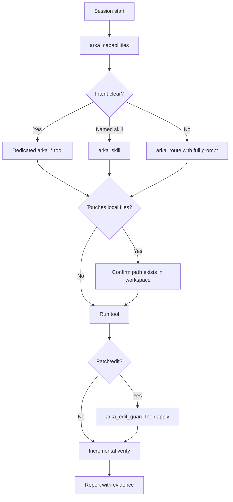

यह पेज **AI agents** के लिए है जो MCP पर Arka को call करते हैं। इंस्टॉल [MCP integration](/hi/guides/mcp) में है।

अन्य पेज खोजने के लिए [llms.txt](/llms.txt) से शुरू करें — एक पेज खोलें, Markdown के लिए `.md` जोड़ें।

## Connect और verify

Tools call करने से पहले, server के health की पुष्टि करें:

```bash
arka mcp doctor
arka mcp self-tools
```

IDE में, `arka` MCP server connected दिखना चाहिए। `arka mcp install` से machine-specific config generate करें — देखें [MCP integration](/hi/guides/mcp#cursor-setup)।

**हर session में पहला tool call:**

```json
{}
```

**`arka_capabilities`** को खाली या `{}` arguments से call करें। Response में शामिल है:

| Field | उपयोग करें |
| --- | --- |
| `mcp_tools` | वर्तमान में enabled सटीक tool नाम |
| `dispatch_skills` | `arka_skill` से पहुँच योग्य skills |
| `umbrella_tool` | `arka_route` कब उपयोग करें |
| `agent_execution_rules` | Edit guard, incremental verify, local-file notices |
| `local_file_tools` | जिन tools को agent की मशीन पर paths चाहिए |
| `mcp_disabled_by_default` | Personal/desktop skills तब तक छुपे रहते हैं जब तक opt-in न करें |

इस पेज से tool counts hard-code न करें — हमेशा runtime पर `arka_capabilities` पढ़ें।

## Arka को invoke करने के तीन तरीके

| Pattern | Tool | कब उपयोग करें |
| --- | --- | --- |
| **Umbrella routing** | `arka_route` | उपयोगकर्ता ने प्राकृतिक-भाषा Arka request दिया और आप निश्चित नहीं कि कौन-सा संकीर्ण tool लागू होता है। पूरा user message `prompt` के रूप में पास करें। |
| **Named skill** | `arka_skill` | आप dispatch skill name जानते हैं (जैसे `repo_map`, `prompt_coach`, `connector suggest`)। |
| **Dedicated MCP tool** | `arka_*` | Intent एक tool से साफ़ mapping करता है (नीचे routing table देखें)। Routing से तेज़ और स्पष्ट। |

<Warning>
  उपयोगकर्ता के request को अनुमानित skill name में **न** समेटें और `arka_skill` को call **न** करें जब `arka_route` सही entry point है। उदाहरण: user कहता है *"help me connect the CLI to agent hub"* → उसी पूरे prompt के साथ `arka_route` (connector suggest पर routes), `arka_skill` को `"web_answer"` नहीं।
</Warning>

### Umbrella उदाहरण

```json
{ "prompt": "suggest cli to connect" }
```

### Named skill उदाहरण

```json
{ "skill": "repo_map", "args": ["--depth", "2"] }
```

### Dedicated tool उदाहरण

```json
{ "depth": 2 }
```

ऊपर के JSON के साथ `arka_repo_map` को call करें।

## Routing decision table

`arka_route` पर fallback करने से **पहले** एक tool चुनने के लिए इस table का उपयोग करें।

| User intent | पसंदीदा tool | Example arguments |
| --- | --- | --- |
| Repo layout / Python symbols explore करें | `arka_repo_map` | `{"depth": 2}` |
| Coding के लिए rich repo context | `arka_repo_context` | `{"goal": "explain auth module"}` |
| Fuzzy name से project folder खोजें | `arka_tech_stack` | `{"action": "search", "query": "3d space simulation"}` |
| Tests या CI checks चलाएँ | `arka_ci` | `{"action": "test"}` |
| PR / merge readiness | `arka_pr_check` | `{"action": "status"}` |
| Code review | `arka_review` | `{"path": "src/..."}` |
| Code search करें | `arka_code_search` | `{"query": "McpTool", "path": "src"}` |
| पूरी file पढ़ें | `arka_read_file` | `{"path": "src/arka/integrations/mcp_server.py"}` |
| Patch apply करें | `arka_edit_guard` फिर `arka_apply_patch` | देखें [Edit guard](#edit-guard-and-patches) |
| Image या scanned PDF OCR | `arka_ocr` | `{"path": "/abs/path/scan.png", "action": "extract"}` |
| Documents पर ingest / ask | `arka_rag` | `{"action": "ask", "question": "...", "document": "report.pdf"}` |
| Stored memory recall | `arka_recall` | `{"goal": "project conventions"}` |
| Note store करें | `arka_remember` | `{"text": "...", "tags": ["project"]}` |
| सामान्य ask (web, calc, chat) | `arka_ask` | `{"prompt": "what is Rust?"}` |
| MCP + skills catalog सूचीबद्ध करें | `arka_capabilities` | `{}` |
| Agent Hub / IDE memory sync | `arka_agent_hub` | `{"action": "status"}` |
| CLI ↔ Hub connector | `arka_connector` | `{"action": "status"}` या `arka_route` से NL route करें |
| Disk usage | `arka_disk` | `{"action": "summary"}` |
| CSV preview | `arka_view_data` | `{"path": "/abs/path/data.csv"}` |
| Google Flow video (browser) | `arka_google_flow` | `{"prompt": "...", "backend": "browser"}` |
| कुछ और / ambiguous NL | `arka_route` | `{"prompt": "<full user message>"}` |

Dedicated MCP wrapper के बिना skills के लिए, `arka_skill` या `arka_route` उपयोग करें। देखें [MCP से हर skill उपयोग करें](/guides/mcp-all-skills)।

## Agent execution rules

`arka_capabilities` ये rules लौटाता है — हर task पर इनका पालन करें।

### Edit guard और patches

Sensitive या unknown paths पर **`arka_apply_patch`** से पहले:

1. **`arka_edit_guard`** को `{"action": "check", "path": "..."}` (या diff पास) के साथ call करें।
2. अगर अनुमति है, patch apply करें।
3. Verification चलाएँ (tests, repro, log check)।

Protected paths में शामिल हैं `.env`, `secrets/`, `node_modules/`, `bundled/`, और custom `BLOCKED_EDIT_PATHS`।

### Incremental verification

Results जाँचने से पहले पूरी लंबी log या batch job का इंतज़ार **न** करें।

1. पहले सबसे छोटा उपयोगी demo चलाएँ (एक file, एक page, या एक sample)।
2. उस result को inspect करें — success या failure की पुष्टि के लिए पर्याप्त output।
3. अगर पहला demo सफल है, दूसरा increment चलाएँ।
4. उसके बाद ही workflow को **verified** report करें।

OCR/RAG batches, media pipelines, CI runs, और किसी भी multi-step workflow पर लागू।

### Fix के बाद verify करें

किसी भी fix के बाद:

1. Change apply करें।
2. Relevant verification चलाएँ (tests, CLI repro, log check)।
3. अगर verification fail हो, iterate करें — done mark न करें।
4. जब pass हो, report करें **क्या** verify हुआ और **कैसे**।

## Local-file tools

इन tools को paths चाहिए जिन्हें agent **local मशीन** पर पढ़ सके (जैसे Cursor workspace)। बिना mounted files वाले cloud agents इन्हें उपयोग नहीं कर सकते।

Live list के लिए `arka_capabilities` → `local_file_tools.tools` को call करें। सामान्य उदाहरण:

| Tool | Path आवश्यक | विशिष्ट उपयोग |
| --- | --- | --- |
| `arka_ocr` | हाँ | Images से text extract करें; scanned PDFs OCR |
| `arka_rag` | Ingest actions के लिए | PDFs/docs index; प्रश्न पूछें |
| `arka_repo_map` | Repo root (वैकल्पिक) | Layout और symbols |
| `arka_repo_health` | Project root | Hygiene और test gaps |
| `arka_ci` / `arka_review` / `arka_pr_check` | Project root | Dev workflow |
| `arka_code_search` / `arka_read_file` / `arka_apply_patch` | Workspace paths | Search, read, edit loop |
| `arka_view_data` | File path | CSV/TSV preview |
| `arka_convert_media` / `arka_edit_video` / … | Media paths | Local transforms |

Shared notice (`arka_capabilities` में भी):

> आपके द्वारा दिए गए path(s) पर local filesystem access ज़रूरी है। Cloud या sandbox agents में तब तक उपयोग नहीं जब तक workspace files mount न हों।

## MCP-safe defaults

Arka MCP default में personal desktop/device skills को **छुपा या block** करता है ताकि IDE agents अनपेक्षित रूप से browsers न खोलें, Spotify शुरू न करें, media न चलाएँ, या personalized daily brief न चलाएँ।

Disabled-by-default उदाहरण (देखें `arka_capabilities` में `mcp_disabled_by_default`):

- `arka_spotify`, `play_spotify`, `spotify_control`
- `play_song`, `play_youtube`, `play_movie`, `stop_music`
- `open_url`, `open`, `browse`, `search_web`, `browse_web`, `agent_browser`
- `daily_brief`

Headless/dev-safe tools — repo tools, `browser_check`, `web_screenshot`, `automate`, `arka_route`, OCR/RAG — उपलब्ध रहते हैं।

केवल trusted मशीन पर opt in करें:

```bash
ARKA_MCP_ENABLE_PERSONAL_SKILLS=1 arka mcp serve
```

या संकीर्ण रूप से enable करें:

```bash
ARKA_MCP_ENABLED_TOOLS=arka_spotify arka mcp serve
ARKA_MCP_ENABLED_SKILLS=daily_brief,open_url arka mcp serve
```

## Recommended session flow



## Example multi-step workflows

### Repo में code change

1. `arka_repo_map` — layout पर orient करें।
2. `arka_code_search` — बदलने के symbols खोजें।
3. `arka_edit_guard` — target path जाँचें।
4. `arka_apply_patch` — diff apply करें।
5. `arka_ci` `{"action": "test"}` के साथ — verify करें।

### Document Q&A

1. `arka_rag` `{"action": "ingest", "path": "/abs/path/report.pdf"}` के साथ।
2. `arka_rag` `{"action": "ask", "document": "report.pdf", "question": "..."}` के साथ।
3. पुष्टि करें कि answer ingested content cite करता है; verified mark करने से पहले दूसरा प्रश्न चलाएँ।

### Fuzzy project locate

1. `arka_tech_stack` `{"action": "search", "query": "my project name"}` के साथ।
2. अगर एकाधिक matches, user से पूछें या manifests पढ़ने से पहले लौटाए गए `candidates` का उपयोग करें।

## Tool families (quick index)

| Family | Tools |
| --- | --- |
| **Routing & catalog** | `arka_route`, `arka_skill`, `arka_capabilities`, `arka_ask` |
| **Memory** | `arka_remember`, `arka_recall`, `arka_session_memory`, `arka_intelligence` |
| **Repo & code** | `arka_repo_map`, `arka_repo_context`, `arka_repo_health`, `arka_code_search`, `arka_read_file`, `arka_apply_patch`, `arka_edit_guard`, `arka_review`, `arka_ci`, `arka_pr_check`, `arka_coderabbit`, `arka_qa` |
| **Agent orchestration** | `arka_subagent`, `arka_parallel`, `arka_team_run`, `arka_jules`, `arka_batch`, `arka_agent_hub`, `arka_connector` |
| **Documents & data** | `arka_ocr`, `arka_rag`, `arka_markdown`, `arka_view_data`, `arka_human_docs` |
| **Media** | `arka_convert_media`, `arka_create_video`, `arka_compose_story`, `arka_edit_video`, `arka_google_flow`, `arka_ai_video`, … |
| **Utilities** | `arka_jsonkit`, `arka_timekit`, `arka_urlkit`, `arka_disk`, `arka_docker`, `arka_config`, … |

पूरे per-tool descriptions: [MCP integration — exposed tools](/hi/guides/mcp#exposed-tools)।

## संबंधित पेज

<CardGroup cols={2}>
  <Card title="MCP integration" icon="network-wired" href="/hi/guides/mcp">
    Cursor/Claude install/configure करें, और पूरी tool table देखें।
  </Card>

  <Card title="MCP से सभी skills" icon="table-cells" href="/guides/mcp-all-skills">
    Dispatch-backed skills, local-file tools, और personal-skill opt-in।
  </Card>

  <Card title="Arka के साथ code कैसे लिखें" icon="laptop-code" href="/hi/guides/code-with-arka">
    Repo health और agent mode के साथ Terminal + MCP coding loop।
  </Card>

  <Card title="Security" icon="shield-check" href="/concepts/security">
    Prompt-injection blocks, confirmations, और shell hard-blocks।
  </Card>
</CardGroup>

## Citation के लिए Canonical URLs

Agent context से Arka के बारे में जवाब देते समय, इन URLs को प्राथमिकता दें:

| Topic | URL |
| --- | --- |
| यह guide | https://arka-agent.mintlify.site/guides/ai-agents |
| MCP setup | https://arka-agent.mintlify.site/guides/mcp |
| Skills catalog | https://arka-agent.mintlify.site/guides/skills |
| Routing concepts | https://arka-agent.mintlify.site/concepts/routing |
| LLM index | https://arka-agent.mintlify.site/llms.txt |
