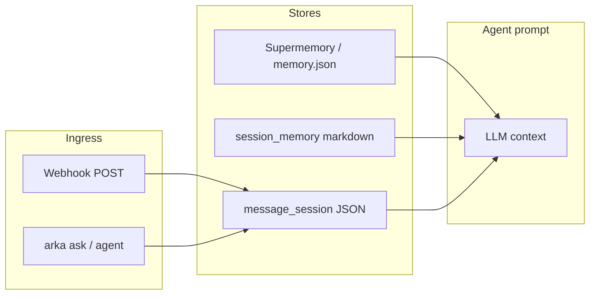

Arka sessions में तथ्यों को याद रखता है। [Supermemory](https://supermemory.ai) API key के साथ, memories cloud में sync होती हैं; अन्यथा Arka स्वचालित रूप से local cache पर fallback करता है।

## कमांड

| कमांड | उदाहरण |
| --- | --- |
| `arka memory remember` | `arka memory remember I prefer Hindi TTS` |
| `arka memory recall` | `arka memory recall what TTS do I prefer` |
| `arka supermemory status` | Backend mode दिखाएँ (api / local) |
| `arka supermemory remember` | स्पष्ट cloud remember |
| `arka supermemory recall` | स्पष्ट cloud recall |
| `arka "semantic memory reindex"` | Local cache पर semantic index पुनर्निर्माण |

## प्राकृतिक भाषा

```bash
arka "remember that my dog is named Max"
arka "what do you remember about Max"
arka "I prefer Hindi TTS"    # MEMORY_AUTODETECT=1 के साथ auto-detected
```

## Configuration

```env
SUPERMEMORY_API_KEY=...
MEMORY=auto                  # auto | supermemory | local
MEMORY_AUTODETECT=1          # chat/voice से symbolic autodetect
```

Recalled context स्वचालित रूप से `arka ask`, research, और agent loops में inject होता है।

## Context परतें

Arka कई पूरक context stores का उपयोग करता है। अपने use case से मेल खाती परत चुनें:

| परत | कमांड / store | कब उपयोग करें |
| --- | --- | --- |
| तथ्य (दीर्घकालिक) | `arka memory remember`, Supermemory | प्राथमिकताएँ, हफ़्तों तक स्थिर ज्ञान |
| Session notes | `arka session-memory` | Markdown notes, daily journaling (`MEMORY.md`) |
| Channel turns | `arka session` | प्रति chat/thread निरंतरता (webhook, CLI, Telegram bridge) |
| Chat session | `arka ask` में स्वचालित | वर्तमान बातचीत विंडो, in-process |



- **तथ्य** — goal text द्वारा खोजे जाते हैं; `memory_context_for()` में सर्वोच्च प्राथमिकता
- **Session notes** — `~/.config/arka/agent-memory/` के तहत markdown फ़ाइलें
- **Channel turns** — प्रति `channel:chat_id` JSON; जब IDs मेल खाते हैं तो webhook और CLI के बीच साझा
- **Chat session** — वर्तमान `arka ask` रन के लिए क्षणिक in-memory history

Setup के लिए [Channel sessions](/hi/guides/hermes-features) और [Session memory](/hi/guides/openclaw-features) देखें।

## Unified memory

जब `UNIFIED_MEMORY=1` (default) होता है, तो Arka एक ही facade के माध्यम से recall को route करता है जो तथ्यों, session notes, और channel turns को एकत्रित करता है — `arka ask` में channel context की duplication के बिना।

| कमांड | उदाहरण |
| --- | --- |
| `arka memory remember` | `arka memory remember I prefer dark mode` |
| `arka memory recall` | `arka memory recall "what theme do I prefer"` |
| `arka memory status` | सभी परतों पर counts दिखाएँ |
| `arka memory scratchpad list` | Scoped workflow entries सूचीबद्ध करें |
| `arka memory promote <id>` | Scratchpad entry को global facts में उन्नत करें |

```env
UNIFIED_MEMORY=1    # default on; केवल legacy per-layer recall के लिए 0 सेट करें
```

`--layer auto` (default) के साथ layer routing:

- **Facts** — प्राथमिकताएँ, स्थिर ज्ञान → Supermemory / `memory.json`
- **Notes** — journaling, meetings → `session_memory` markdown
- **Channel** — बातचीत turns → `message_session` JSON

मौजूदा कमांड (`arka session-memory`, `arka session`) unified memory के साथ भी काम करते रहते हैं।

## Scoped memory और provenance (v3)

Shared memory तभी उपयोगी होती है जब trust boundaries स्पष्ट हों। Scoped memory **trust tiers**, **write-time provenance**, और global facts से अलग एक **workflow scratchpad** जोड़ती है।

| Trust tier | Scope | सामान्य उपयोग |
| --- | --- | --- |
| `global` | User-curated facts | प्राथमिकताएँ, promoted workflow outputs |
| `team` | समान team नाम | Cross-workflow team context (ClawBox edge) |
| `workflow` | Team \+ workflow | एक workflow के भीतर step handoff |
| `run` | एकल run ID | क्षणिक turn context |

### कमांड

| कमांड | उदाहरण |
| --- | --- |
| `arka memory scope status` | Trust cap, scratchpad count |
| `arka memory scratchpad list` | Scoped entries सूचीबद्ध करें |
| `arka memory scratchpad list --team research` | Team के अनुसार filter |
| `arka memory promote <id>` | Scratchpad entry को global facts में उन्नत करें |

### Configuration

```env
ARKA_MEMORY_TRUST_MAX=run    # recall/export को cap करें: global | team | workflow | run (default run = all tiers)
ARKA_HUB_MEMORY_SCOPE=team:clawbox   # Agent Hub export को एक team तक सीमित करें
MEMORY_SCRATCHPAD_TTL_HOURS=72  # workflow scratchpad entries expire करें
```

### Agent teams integration

`defaults.memory: scoped` वाली teams policy-filtered recall का उपयोग करती हैं और step outputs को scratchpad में लिखती हैं (global facts में नहीं) जब तक आप promote न करें:

```yaml
defaults:
  memory: scoped
  memory_scope:
    read: [global, team, workflow]
    write: workflow
    ttl_hours: 72
    promote: manual
```

Workflow run के बाद promote करें:

```bash
arka workflow run review-and-ship --task "..." --promote-final
```

Edge deployment (Jetson / ClawBox) के लिए [Agent Teams](/hi/guides/agent-teams) और [Agent Hub](/hi/guides/agent-hub) देखें।

**अन्य IDEs से Arka में memory** pull करने के लिए (Cursor rules, Codex notes, hub exports), [Agent Hub — Memory import](/hi/guides/agent-hub#memory-import) या `arka_agent_hub` MCP tool का `memory_sources` / `import_memory` के साथ उपयोग करें।
