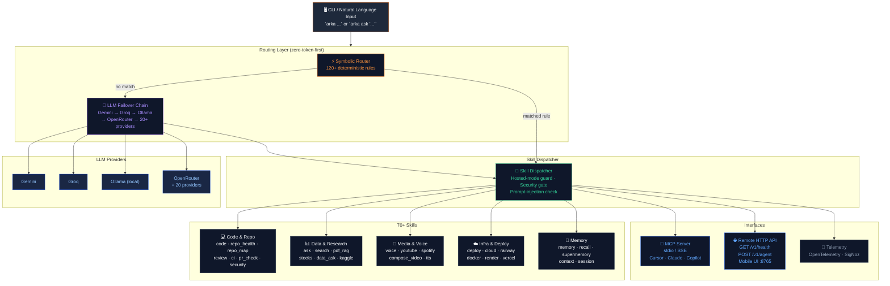

# Arka

**आपका टर्मिनल, अपग्रेडेड।** सादी अंग्रेज़ी को **70+ लोकल skills** तक रूट करें — डिटरमिनिस्टिक ऑफ़लाइन routing, voice, 24-provider LLM failover, और डिफ़ॉल्ट रूप से चालू सुरक्षा गेट्स।

[](https://opensource.org/licenses/MIT)
[](https://www.python.org/downloads/)
[](https://pypi.org/project/arka-agent/)
[](https://pepy.tech/projects/arka-agent)
[](https://pypistats.org/packages/arka-agent)
[](https://github.com/Sumit884-byte/arka)
[](https://arka-agent.mintlify.site)
[](https://github.com/Sumit884-byte/arka/pkgs/container/arka)

**डॉक्युमेंटेशन:** [arka-agent.mintlify.site](https://arka-agent.mintlify.site) · **रिपॉज़िटरी:** [github.com/Sumit884-byte/arka](https://github.com/Sumit884-byte/arka) · लोकल लैंडिंग प्रीव्यू: [`landing/`](landing/) (उस फ़ोल्डर से `python3 -m http.server`)

### PyPI डाउनलोड

| अवधि | डाउनलोड (मिरर के बिना) |
|--------|------------------------:|
| पिछले 7 दिन | 23 |
| पिछले 30 दिन | 63 |
| लॉन्च के बाद से ट्रैक किए गए (2026-07-20) | 447 |
| मिरर सहित (समान अवधि) | 1,585 |

लाइव चार्ट: [pypistats.org/packages/arka-agent](https://pypistats.org/packages/arka-agent) · [pepy.tech/projects/arka-agent](https://pepy.tech/projects/arka-agent) · स्नैपशॉट 2026-08-30

## Arka ही क्यों?

- **डिटरमिनिस्टिक routing:** 120+ symbolic नियम अधिकांश अनुरोधों को किसी भी मॉडल को कॉल करने से पहले शून्य LLM tokens में संभाल लेते हैं।
- **एक्सटेंसिबल:** `skill.json` प्लगइन्स के ज़रिए थर्ड-पार्टी skills जोड़ें — किसी fork की ज़रूरत नहीं।
- **डिफ़ॉल्ट रूप से सुरक्षित:** Prompt-injection जाँच, जोखिम भरे एक्शन पर पुष्टि-प्रॉम्प्ट, और विनाशकारी shell पैटर्न पर हार्ड ब्लॉक।
- **Local-first:** Skills आपकी मशीन पर चलती हैं; LLM कॉल्स Gemini, Groq, Ollama और 20+ अन्य providers के बीच failover करती हैं।

अगर Arka उपयोगी लगे, तो **upstream repo को star करें** — इससे दूसरों को प्रोजेक्ट खोजने में मदद मिलती है और यह संकेत मिलता है कि यह देखने लायक है:

```bash
gh repo star Sumit884-byte/arka
```

या [github.com/Sumit884-byte/arka](https://github.com/Sumit884-byte/arka) खोलकर **Star** पर क्लिक करें।

## आर्किटेक्चर

Arka एक लेयर्ड सिस्टम के रूप में बनाया गया है: अनुरोध पहले डिटरमिनिस्टिक symbolic routing से गुज़रते हैं (शून्य LLM tokens), ज़रूरत पड़ने पर ही multi-provider LLM चेन पर फ़ॉलबैक करते हैं, और एक प्लगेबल skill dispatcher को डिस्पैच होते हैं। सभी लेयर्स — MCP सर्वर, remote API सर्वर, memory, telemetry, और cloud deployment — स्वतंत्र रूप से कंपोज़ेबल हैं।



**मुख्य डिज़ाइन विशेषताएँ:**
- **Zero-token-first** — Symbolic routing अधिकांश अनुरोधों को बिना किसी LLM कॉल के हल कर देती है।
- **Hosted-mode सुरक्षा** — Skill dispatcher cloud/headless Linux पर desktop/GUI/audio skills को स्वतः ब्लॉक कर देता है (`ARKA_HOSTED_MODE=1`)।
- **Multi-platform deploy** — `arka deploy --all` एक ही कमांड में Cloud VM, Railway, Vercel, Netlify, Render पर डिप्लॉय करता है।
- **MCP + Remote API** — Arka सभी skills को MCP tools (stdio/SSE) और पोर्ट 8765 पर एक REST HTTP API के रूप में एक्सपोज़ करता है।

## प्राइवेसी

Arka को इस तरह डिज़ाइन किया गया है कि **आपके डेटा पर नियंत्रण आपके पास रहे**:

- **आपकी मशीन पर चलता है** — Skills लोकल रूप से एग्ज़िक्यूट होती हैं। कोई hosted Arka अकाउंट या साझा demo instance नहीं है; आपका टर्मिनल, फ़ाइलें और config आपके सिस्टम पर ही रहते हैं।
- **Local-first routing** — 120+ symbolic नियम कई अनुरोधों को **शून्य LLM tokens** में संभाल लेते हैं, इसलिए आम काम कभी आपकी मशीन से बाहर नहीं जाते।
- **आप तय करते हैं कि prompts कहाँ जाएँ** — LLM कॉल्स केवल उन्हीं providers का उपयोग करती हैं जिन्हें आपने कॉन्फ़िगर किया है (Gemini, Groq, Ollama, आदि)। संवेदनशील काम के लिए local-only सीमा लागू करें:

  ```bash
  arka run-only-local-llm "summarize this repo"
  arka hybrid config local-only
  ```

  `local-only` के साथ, hosted providers का उपयोग फ़ॉलबैक के रूप में नहीं किया जाता।

- **Secrets लोकल रहते हैं** — API keys और `.env` आपकी user config डायरेक्टरी में रहते हैं (Linux पर `~/.config/arka/`, macOS पर `~/Library/Application Support/arka/`)। `arka integration setup` कभी भी secret values प्रिंट नहीं करता।
- **Memory डिफ़ॉल्ट रूप से लोकल रहती है** — Long-term memory तब तक एक लोकल कैश का उपयोग करती है जब तक आप Supermemory key नहीं जोड़ते (`MEMORY=auto` लोकल पर फ़ॉलबैक करता है)। Recall को पूरी तरह डिस्क पर रखने के लिए `MEMORY=local` सेट करें।
- **Web कंटेंट सैनिटाइज़ किया जाता है** — सर्च रिज़ल्ट और स्क्रैप किए गए पेज मॉडल तक पहुँचने से पहले संदिग्ध injection पैटर्न से मुक्त किए जाते हैं (डिफ़ॉल्ट रूप से `SECURITY_SANITIZE=1`)।
- **जोखिम भरे एक्शन के लिए पुष्टि ज़रूरी है** — Install, delete, download और automation पर `[y/N]` प्रॉम्प्ट आता है, जब तक आप स्पष्ट रूप से auto-confirm न करें (डिफ़ॉल्ट रूप से `SECURITY_ACTIONS=1`)।
- **Telemetry डिफ़ॉल्ट रूप से SigNoz पर जाती है** — OpenTelemetry traces, metrics और logs डिफ़ॉल्ट रूप से `http://127.0.0.1:4318` पर एक्सपोर्ट होते हैं। ऑप्ट-आउट करने के लिए `OTEL_SDK_DISABLED=true` या `OTEL_TRACES_ENABLED=0` सेट करें।

विवरण: [Security model](https://arka-agent.mintlify.site/concepts/security) · [Memory](https://arka-agent.mintlify.site/guides/memory) · [Hybrid local/hosted routing](https://arka-agent.mintlify.site/guides/integrations#local-and-hosted-models-together)

## समर्थित प्लेटफ़ॉर्म

| प्लेटफ़ॉर्म | सपोर्ट |
| --- | --- |
| **macOS** | पूर्ण सपोर्ट — दैनिक उपयोग के लिए अनुशंसित |
| **Linux** | पूर्ण सपोर्ट |
| **Windows** | Python CLI और `arka` सबकमांड काम करते हैं; पूरे 70+ skill router के लिए [fish shell](https://fishshell.com) की ज़रूरत है (`scoop install fish` या `winget install fishshell`)। fish के बिना, Arka Python फ़ॉलबैक के साथ **portable** मोड में चलता है। कुछ fish-आधारित skills macOS/Linux को लक्षित करती हैं। |

**आवश्यकताएँ:** Python **3.11+**। वैकल्पिक: natural-language routing और voice इंटीग्रेशन के लिए fish shell।

Config पाथ: `~/.config/arka/` (Linux), `~/Library/Application Support/arka/` (macOS), `%APPDATA%\arka\` (Windows)।

## इंस्टॉलेशन

PyPI पैकेज का नाम **`arka-agent`** है — [pypi.org/project/arka-agent](https://pypi.org/project/arka-agent/) पर प्रकाशित।

**अनुशंसित (standalone, कोई clone नहीं, कोई build नहीं):**

[uv](https://docs.astral.sh/uv/) **PyPI से `arka-agent`** install करता है — किसी अलग uv registry या token की ज़रूरत नहीं:

```bash
uv tool install "arka-agent[chat]"
arka setup
arka doctor
```

या pipx के साथ:

```bash
pipx install "arka-agent[chat]"
arka setup
arka doctor
```

**बिना global install के एक बार चलाने के लिए:**

```bash
uvx --from "arka-agent[chat]" arka doctor
```

या venv में pip के साथ:

```bash
python3 -m pip install "arka-agent[chat]"
arka setup
arka doctor
```

**GitHub फ़ॉलबैक** (अगर आपको अगली PyPI रिलीज़ से पहले नवीनतम commit चाहिए):

```bash
pipx install "arka-agent[chat] @ git+https://github.com/Sumit884-byte/arka.git"
arka setup
arka doctor
```

**git clone से** (contributors या `main` ट्रैक करने वालों के लिए सर्वोत्तम):

Upstream (canonical):

```bash
git clone https://github.com/Sumit884-byte/arka.git
cd arka
./scripts/refetch.sh --install
arka setup
arka doctor
```

**fork से काम करना** (अनुशंसित, अगर आपके पास upstream पर push एक्सेस नहीं है):

```bash
gh repo fork Sumit884-byte/arka --clone
cd arka
./scripts/refetch.sh --install
pip install -e ".[chat,dev]"
arka setup
arka doctor
```

सक्रिय fork का उदाहरण: [sumitmishra884byte-cpu/arka](https://github.com/sumitmishra884byte-cpu/arka) (upstream का fork)। PR खोलने से पहले अपना fork sync करें:

```bash
gh repo sync --source Sumit884-byte/arka
git push origin main
```

**API keys कॉन्फ़िगर करें** (कम से कम एक cloud key या लोकल Ollama):

```bash
cp .env.example ~/.config/arka/.env   # macOS/Linux; see Supported platforms for Windows path
```

[Google AI Studio](https://aistudio.google.com/apikey) या [Groq Console](https://console.groq.com/keys) से एक free-tier key जोड़ें, फिर अनुशंसित `.env` सेटिंग्स के लिए `arka free tier setup` चलाएँ।

**वैकल्पिक one-liners:**

```bash
brew install fish                    # macOS — unlocks full skill router
arka mcp doctor && arka mcp install   # verify MCP server; print Cursor snippet
```

fish सेटअप, Cursor मर्ज स्टेप्स और वैकल्पिक extras (`[voice]`, `[pdf]`, `[all]`) के लिए [Quickstart गाइड](https://arka-agent.mintlify.site/quickstart) और [MCP इंटीग्रेशन](https://arka-agent.mintlify.site/guides/mcp) देखें।

## बिना source से build किए Arka आज़माएँ

कोई hosted demo instance या साझा टेस्ट अकाउंट नहीं है। Arka का मूल्यांकन करने का सबसे तेज़ रास्ता:

1. **लाइव docs ब्राउज़ करें** — [arka-agent.mintlify.site](https://arka-agent.mintlify.site) (skills कैटलॉग, routing कॉन्सेप्ट्स, CLI रेफ़रेंस)।
2. **एक कमांड में install करें** — ऊपर दिया गया pip/pipx git install उपयोग करें (कोई मैनुअल build स्टेप नहीं)।
3. **Free-tier LLM keys उपयोग करें** — Gemini और Groq दोनों free tier देते हैं; Ollama लोकल है और इसका कोई खर्च नहीं:

   ```bash
   arka free tier setup
   arka doctor
   ```

4. **Routing और LLM failover आज़माने के लिए ये सैंपल कमांड चलाएँ:**

   ```bash
   arka ask "what is Rust?"
   arka "convert 100 USD to INR"
   arka council "should I learn Rust?"
   arka quiz python
   arka coding-tui .
   arka repo_health scan
   ```

   Coding TUI के अंदर, `/test scripts` `scripts/` के तहत खोजी गई verification scripts चलाता है (कोई हार्डकोडेड सूची नहीं — Arka फ़ाइलनाम, docstrings, argparse और `test_*` फ़ंक्शन जाँचता है)। pytest के लिए `/test` उपयोग करें और हर script के मैच होने की वजह देखने के लिए `repo_health scan`।

5. **Cursor में MCP आज़माएँ** — install के बाद, `arka mcp doctor` फिर `arka mcp install`; प्रिंट किए गए snippet को **Cursor Settings → MCP** में मर्ज करें और Cursor रीस्टार्ट करें।

पूरा वॉकथ्रू: [Quickstart](https://arka-agent.mintlify.site/quickstart) · [Free credits गाइड](https://arka-agent.mintlify.site/guides/free-credits)

## Quick Start

एक मिनट से भी कम में काम करता हुआ उत्तर पाएँ:

```bash
arka doctor                              # verify install + keys
arka ask "what is Rust?"                 # web + AI answer
arka "convert 100 USD to INR"            # natural language routing
arka council "should I learn Rust?"      # multi-persona deliberation
```

Voice (वैकल्पिक):

```bash
arka listen    # then say: "hey arka, what's the weather"
```

और गाइड — skills, stocks, PDF RAG, Google Workspace, goal agent, टेस्टिंग — [डॉक्युमेंटेशन साइट](https://arka-agent.mintlify.site) पर उपलब्ध हैं।

## Codex और GPT-5.6 के साथ बनाया गया

Arka को **OpenAI Build Week Developer Tools** ट्रैक (जुलाई 2026) के लिए बनाया गया था:

- **Codex** — routing rule हार्डनिंग, NL routing टेस्ट कवरेज, coding TUI इटरेशन (`/plan` auto-execute, `/test`, `/test scripts`), और demo pipeline टूलिंग।
- **GPT-5.6** — `arka ask` failover चेन में प्राइमरी मॉडल और `arka coding-tui` के अंदर agent स्टेप्स (OpenRouter के ज़रिए)।

जज `pipx install "arka-agent[chat]"`, `arka setup` और `arka doctor` से पूरा रास्ता दोहरा सकते हैं। Demo वीडियो और CLI स्क्रीनशॉट `recordings/` के तहत उपलब्ध हैं।

## योगदान

हम हर आकार के योगदान का स्वागत करते हैं! लोकल डेवलपमेंट वर्कफ़्लो शुरू करने के लिए कृपया हमारे [योगदान दिशानिर्देश](CONTRIBUTING.md) पढ़ें।

**GitHub CLI के साथ त्वरित fork वर्कफ़्लो:**

```bash
gh repo view Sumit884-byte/arka          # upstream metadata
gh repo fork Sumit884-byte/arka --clone  # your fork + local clone
cd arka
pip install -e ".[chat,dev]"
pytest
# push to your fork, then open a PR back to Sumit884-byte/arka
gh pr create --repo Sumit884-byte/arka
```

शुरुआत करने के लिए एक अनुकूल एंट्री पॉइंट खोजने हेतु [GitHub Issues](https://github.com/Sumit884-byte/arka/issues?q=label%3A%22good+first+issue%22) पर **good first issue** लेबल देखें।

## लाइसेंस

**MIT License** के तहत वितरित। अधिक जानकारी के लिए [LICENSE](LICENSE) देखें।
