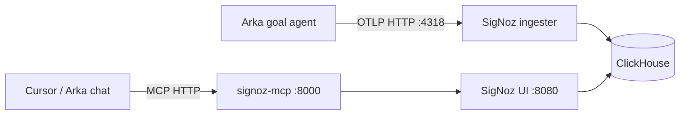

# SigNoz MCP integration — SRE Sidekick path

Arka's stretch goal for Track 01: an agent that queries SigNoz telemetry via MCP to diagnose failed goal steps and suggest fixes.

**Phase 1 (implemented):** Arka goal agent emits rich OTel traces → inspect in SigNoz UI.

**Phase 2 (implemented):** Wire SigNoz MCP + [Agent Skills plugin](https://signoz.io/docs/ai/agent-skills/?agent-client=cursor) into Cursor so the agent can read traces, build dashboards, and manage alerts.

> **Recommended for Cursor:** install the official SigNoz plugin via Team Marketplace — see **[CURSOR_AGENT_SKILLS.md](CURSOR_AGENT_SKILLS.md)** (replaces manual MCP-only setup below for hackathon demos).

Quick start:

```bash
arka signoz cursor-setup
# then in Cursor: install plugin + /signoz-mcp-setup http://localhost:8000/mcp
```

## Architecture



Foundry enables the MCP server in [`casting.yaml`](../casting.yaml):

```yaml
mcp:
  spec:
    enabled: true
```

After `foundryctl cast -f casting.yaml`, verify:

```bash
curl -fsS http://localhost:8000/livez && echo " OK"
```

## Step 1 — Create a SigNoz API key

1. Open http://localhost:8080
2. **Settings → Service Accounts** (Admin role)
3. Create a service account and copy the API key

## Step 2 — Connect Cursor

### Option A — SigNoz Agent Skills plugin (recommended)

Follow **[CURSOR_AGENT_SKILLS.md](CURSOR_AGENT_SKILLS.md)** — official [Cursor guide](https://signoz.io/docs/ai/agent-skills/?agent-client=cursor):

1. **Settings → Plugins** → add Team Marketplace `https://github.com/SigNoz/agent-skills`
2. Install plugin **`signoz`**
3. Agent chat: `/signoz-mcp-setup http://localhost:8000/mcp`
4. Reload Cursor → authenticate MCP

```bash
arka signoz cursor-setup
arka signoz cursor-setup --write   # fallback: write .cursor/mcp.json
```

### Option B — Manual MCP only

Add to `.cursor/mcp.json` in your project (copy from [`.cursor/mcp.json.example`](../.cursor/mcp.json.example) or **Cursor → Settings → MCP**):

```json
{
  "mcpServers": {
    "signoz": {
      "url": "http://localhost:8000/mcp",
      "headers": {
        "SIGNOZ-API-KEY": "<your-api-key>"
      }
    }
  }
}
```

Alternative — stdio mode with a local binary ([docs](https://signoz.io/docs/ai/signoz-mcp-server/)):

```json
{
  "mcpServers": {
    "signoz": {
      "command": "/absolute/path/to/signoz-mcp-server",
      "args": [],
      "env": {
        "SIGNOZ_URL": "http://localhost:8080",
        "SIGNOZ_API_KEY": "<your-api-key>",
        "LOG_LEVEL": "info"
      }
    }
  }
}
```

## Step 3 — Example SRE Sidekick prompts

Once MCP is connected in Cursor:

```
List services with error spans in the last 1 hour where service.name = arka
```

```
Show the trace waterfall for the most recent arka.agent.goal span with status ERROR
```

```
What gen_ai.provider.name values appear in arka.llm.attempt spans today? Any with high latency?
```

```
Find spans with event agent.self_heal in the last 30 minutes and summarize root causes
```

## Step 4 — Arka goal agent + MCP (implemented)

Arka includes a traced HTTP MCP client for SigNoz:

```bash
# Verify MCP connection (emits arka.mcp.connect + arka.mcp.list_tools spans)
arka signoz mcp ping

# List tools
arka signoz mcp tools

# Call a tool (emits arka.mcp.call_tool / arka.tool.mcp)
arka signoz mcp call signoz_ask --args '{"question":"failed arka spans last 15m"}'
```

Enable optional self-heal diagnostics in the goal loop:

```bash
ARKA_MCP_SELF_HEAL=1 SIGNOZ_API_KEY=<key> arka goal "..."
```

On failed commands, Arka emits `agent.self_heal` then `agent.mcp_diagnose` and appends SigNoz hints to goal context.

### Span hierarchy

```
arka.request
└── arka.agent.goal
    └── arka.agent.goal.step
        └── agent.self_heal (event)
        └── arka.mcp.connect
            └── arka.mcp.list_tools
                └── arka.mcp.call_tool
                    └── arka.tool.mcp
        └── arka.tool.signoz_mcp (direct queries)
```

Key attributes: `arka.mcp.server`, `arka.mcp.tool_name`, `arka.mcp.duration_ms`, `arka.mcp.tool_count`, `arka.mcp.result_chars`.

## Claude Code CLI (alternative client)

```bash
claude mcp add --scope user --transport http signoz http://localhost:8000/mcp \
  --header "SIGNOZ-API-KEY: <your-api-key>"
```

## Troubleshooting

| Issue | Fix |
| ----- | --- |
| MCP container missing | Ensure `mcp.spec.enabled: true` in `casting.yaml`, re-run `foundryctl cast` |
| `401` from MCP | Regenerate API key; check `SIGNOZ-API-KEY` header |
| Empty trace results | Run `arka signoz demo` first; confirm `OTEL_TRACES_ENABLED=1` |
| Port conflict on 8000 | Change `MCP_SERVER_PORT` in casting `mcp.spec.env` and re-cast |

## References

- [SigNoz MCP Server guide](https://signoz.io/docs/ai/signoz-mcp-server/)
- [SigNoz Agent Skills & Plugin — Cursor](https://signoz.io/docs/ai/agent-skills/?agent-client=cursor)
- [CURSOR_AGENT_SKILLS.md](CURSOR_AGENT_SKILLS.md) — Arka hackathon Cursor setup
- [signoz-mcp-server repo](https://github.com/SigNoz/signoz-mcp-server)
- [SigNoz/agent-skills repo](https://github.com/SigNoz/agent-skills)
